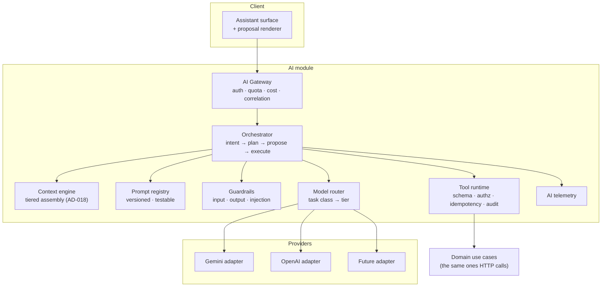
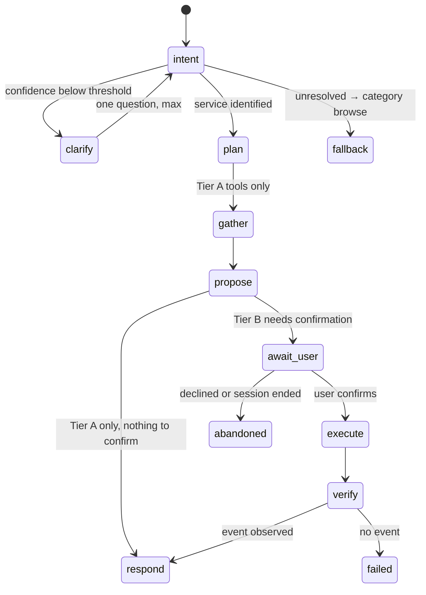

# IMAP 2.0 — AI Architecture

**Status:** PROPOSED · **Phase:** 2 · **Date:** 2026-08-09
**Product law:** Constitution §P3, §P4, §4 · D-002, D-007, D-008 · **Decision:** AD-015, AD-018

---

## 1. Position

IMAP is **AI-native**, meaning the AI reaches real execution through the same authorization and transaction path as every other caller. It is not an assistant bolted onto a CRUD application, and it is not the application.

**Current state.** Two real LLM endpoints (Gemini 2.5 Flash Lite / Flash, OpenAI `gpt-4o-mini` fallback) plus eight deterministic scorers labelled "AI". Three inline `fetch` calls with hardcoded model names and no timeouts. AI cannot perform any action. Until Phase 0.5 the keyword fallback told every user who typed "loan" that their credit score was 82/100.

---

## 2. Layers



**The tool runtime is the only path from AI to state.** The model never receives a database handle, a repository, or a privileged credential. It emits tool calls; the runtime decides whether they may run.

---

## 3. The AI action chain (D-002)

```
AI → Tool → Authentication → Authorization → Business Rules
   → Transaction → Database → Domain Event → User-visible confirmation
```

| Link | Implementation | Failure behaviour |
|---|---|---|
| **Tool** | Declared, schema-typed, tier-partitioned (`TOOL-CATALOG.md`) | Unknown tool → refused, logged |
| **Authentication** | The acting principal's session. **Never a service account** | No principal → no tools |
| **Authorization** | The same kernel HTTP uses, at proposal **and** at execution | Denied → `Failed` with a reason |
| **Business rules** | The domain layer. AI does not restate them | Violated → `Failed` |
| **Transaction** | The use case's own boundary | Rolled back |
| **Domain event** | Outbox, in-transaction | No event ⇒ no confirmation |
| **Confirmation** | Rendered **from the event** | No event → the assistant says **Unknown**, never Completed |

Authorization runs twice deliberately: a permission revoked between proposal and confirmation must cause the execution to fail.

---

## 4. Orchestrator

Not an autonomous agent loop. A bounded, inspectable pipeline.



| Stage | Bound |
|---|---|
| Clarification | **At most one question** (R-103). Then fall back |
| Tool calls per turn | Hard cap (default 8). Exceeded → degrade to a structured answer |
| Plan depth | Single-level. No recursive planning at MVP |
| Wall clock | Budgeted; exceeded → partial result labelled honestly |
| Autonomy | **None.** No background execution, no self-triggered runs |

**Why no agent loop at MVP.** Unbounded loops are hard to cost, hard to evaluate and hard to explain to a user waiting for an answer. Every capability in `PRD.md` is reachable with a bounded pipeline. Loops are revisited only when a requirement genuinely needs them.

---

## 5. Agents — which are justified

An "agent" here means a distinct prompt, tool set, permission scope and evaluation suite. Anything that does not need all four is a function.

| Candidate | Verdict | Reason |
|---|---|---|
| **Intent agent** | ✅ **Build (Gate 2)** | Distinct task, cheap model, its own eval set, no write tools. The highest-value AI component |
| **Assistant (discovery + booking)** | ✅ **Build (Gate 2)** | The user-facing surface. Tier A tools + Tier B proposals |
| Planning agent | ❌ Not separate | The orchestrator's plan stage is sufficient at single-level depth |
| Discovery agent | ❌ Not separate | Ranking is deterministic (`DOMAIN-ARCHITECTURE.md` §5). An LLM ranker would be slower, costlier and unexplainable |
| Matching agent | ❌ Not separate | Same |
| Recommendation agent | ❌ Not separate | Graph edges + history. Deterministic and inspectable |
| **Support agent** | ⏳ Phase F | Needs the dispute workflow to exist before it can do anything useful |
| **Provider copilot** | ⏳ Phase G | Needs demand data. Distinct permissions (provider-scoped) and its own evals |
| Business copilot | ⏳ Later | Needs the business workspace |
| Trust/safety agent | ❌ **Never as an adjudicator** | Trust decisions are Tier C. May summarise a case for a human reviewer — that is a summarisation tool, not an agent |

### 5.1 Agent specification (required for every agent)

| Field | Intent agent | Assistant |
|---|---|---|
| **Purpose** | Need text → candidate services | Help a user resolve a need end to end |
| **Inputs** | Raw text, locale, area | Conversation, Open context, optional Guarded (declared) |
| **Outputs** | Ranked `service_id` candidates + confidence | Structured proposal or answer |
| **Tools** | None (classification only) | Tier A read tools; Tier B proposal tools |
| **Permissions** | None | The acting user's, never more |
| **Memory** | None (stateless per call) | Conversation + Open context |
| **Model tier** | Cheap, fast | Mid; escalates only on ambiguity |
| **Failure modes** | Wrong service; over-confidence on ambiguous input | Hallucinated availability or price; premature confirmation |
| **Human approval** | N/A (read) | **Required for every Tier B action** |
| **Evidence** | Must classify into an existing `service_id` | Every factual claim traces to a tool result |
| **Eval gate** | ≥85% top-3 (R-101) | ≥90% tool selection; zero unevidenced Completed (R-710) |

---

## 6. Provider abstraction (AD-015)

```
LLMClient
  ├─ complete(request) → response
  ├─ stream(request)   → chunks
  └─ capabilities: { tools, streaming, json_mode, context_window, languages }
```

| Rule | Detail |
|---|---|
| No provider SDK outside `infrastructure/ai/` | Lint-enforced |
| Capability-declared, not lowest-common-denominator | A task needing native tool calling declares it and cannot route to a model without it |
| Model names are **configuration**, never literals | Today `gemini-2.5-flash-lite` and `gemini-2.5-flash` are hardcoded — and differ between the streaming and non-streaming paths for the same conversation |
| API keys in headers, never URL query strings | Currently interpolated into the URL, so they land in any proxy or client log |
| Timeouts, retries with jitter, and a circuit breaker on every call | None exist today |
| Streaming parity | If a task streams on one provider it must degrade cleanly on one that does not |

---

## 7. Model routing

Task class → model tier. This is the primary cost and latency lever.

| Task class | Tier | Rationale |
|---|---|---|
| Intent classification | **Cheap** | Short input, closed label set, high volume |
| Disambiguation question | **Cheap** | Templated |
| Summarisation (booking, review) | **Cheap** | Bounded input |
| Assistant conversation | **Mid** | Needs tool calling and reasoning |
| Proposal synthesis | **Mid** | Structured output, correctness-critical |
| Complex multi-service reasoning (LATER) | **Premium** | Rare |
| Ranking, pricing, fraud, trust | **No model** | Deterministic. Using an LLM here would be slower, costlier and unexplainable |

**Policy-driven, not code-driven.** Routing rules are configuration, versioned and audit-logged, so a model change is a config change with a recorded reason.

**Escalation.** A cheap-tier task may escalate once on low confidence. Escalation is counted and budgeted; a rising escalation rate is a signal that the cheap tier is mis-chosen.

---

## 8. Guardrails

### 8.1 Input

| Guard | Purpose |
|---|---|
| Length and turn caps | Cost and abuse |
| Untrusted-content delimiting | User text, provider bios and message content are **data**, never instructions |
| Injection detection on retrieved content | Provider-authored text reaches prompts; it must not be able to issue instructions (R-711) |
| PII minimisation | Only what the declared purpose requires (`D-08`) |
| **Sealed context never loaded** | Not filtered at the prompt — never assembled (Constitution §5.3) |

### 8.2 Output

| Guard | Purpose |
|---|---|
| Schema validation on structured output | A malformed proposal is rejected, not rendered |
| **Evidence binding** | Every factual claim maps to a tool result. Unbound claims are stripped and the response degrades to Unknown |
| **Nine-state vocabulary enforcement** (D-008) | Tool results carry a state; the renderer will not display a state without evidence |
| Money/price claims | Only from a `Quote`; always labelled **Estimated** unless a quote exists |
| Refusal | Medical, legal and financial advice → route to a human or a real source |
| Emergency detection | Any emergency signal → surface 999 and the capability statement immediately, **never** an AI answer |

### 8.3 The specific failures being prevented

| Historic failure | Guard |
|---|---|
| "Your IMAP credit score is 82/100 — eligible for ৳50,000" | Evidence binding — no tool result, no claim |
| "45+ verified electricians" | Same |
| "Refunds processed in 3–5 business days" | Policy claims must cite a real policy record |
| "SOS sent to admin & call center" | Capability declaration (`EMERGENCY-ARCHITECTURE.md` §3) |
| Simulated streaming of a canned string | Prohibited (`UX-CONSTITUTION.md` §10) |

---

## 9. Cost architecture

Inference is a per-session cost that scales with usage and is currently unmeasured and uncapped.

| Lever | Design |
|---|---|
| **Model routing** | §7 — the largest lever |
| **Prompt caching** | Stable system prompt + catalogue context cached at the provider where supported |
| **Context compression** | Only what the task needs. Never the whole conversation |
| **Task classification before invocation** | Deterministic paths (ranking, pricing) never call a model |
| **Structured path is the default** | AI accelerates; it is not on the critical path for every request (D-007) |
| **Result caching** | Intent classifications for identical normalised text, short TTL |
| **Async for non-interactive work** | Batch and background tasks use cheaper tiers and job queues |
| **Per-user and per-tier quotas** (R-709) | Enforced at the gateway; exceeded → degrade to the structured path, never a hard error mid-task |
| **Cost per resolved need** | The metric that matters (`KPI.md` §6). Must stay well below contribution per booking |

**Rule.** Cost controls degrade capability gracefully; they never fabricate an answer to save money. A quota-exhausted user gets the structured path with an honest message.

---

## 10. Failure architecture

| Failure | Behaviour |
|---|---|
| Model unavailable / timeout | Fall back to the next tier, then to the structured path. **Never to a fabricating keyword table** |
| Tool unavailable | State **Unavailable** for that capability; continue with what is available |
| Authorization denied at execution | **Failed**, with the reason, and what the user can do |
| Transaction failed | **Failed**, explicitly stating nothing was charged |
| Event not observed after execution | **Unknown** — "I couldn't confirm this. Check your bookings." Never Completed |
| Low confidence | One question, then category fallback (R-104) |
| Stale context | Timestamped; the model states data is as of a time |
| Conflicting information | Server state wins, always. The conflict is logged as an eval signal |
| Injection detected | Request refused; logged; the user sees a neutral message |
| Quota exhausted | Structured path with an explanation |
| Gateway down entirely | The entire product still works (D-007) — this is the reason for that decision |

---

## 11. Observability (detail in `docs/engineering/OBSERVABILITY.md` §6)

Per invocation: correlation id · task class · model + tier · prompt version · context tiers used · tool calls with outcomes · tokens in/out · cost · latency (first token and total) · guardrail triggers · outcome · user correction.

**Never logged:** raw prompts containing Sensitive or Sealed data · identity documents · emergency content · full conversation bodies by default. Content is stored redacted and access-controlled; the telemetry record carries hashes and metadata.

---

## 12. Anti-patterns forbidden

| Anti-pattern | Why |
|---|---|
| AI with database access | The model is not a caller with credentials |
| AI service account with elevated rights | Every injection becomes privilege escalation |
| A second write path for AI | Guarantees divergence from the HTTP path |
| Tier C tools existing at all | Absence of capability, not policy |
| Claiming an outcome without an event | Constitution §P4 |
| Fabricating figures in a fallback | The audited defect |
| Simulated streaming | Presents a canned answer as live generation |
| Unbounded agent loops | Uncostable, unevaluable, unexplainable |
| One hardcoded model for every task | Wrong on cost, latency and capability |
| Sealed context in a prompt | Structurally excluded |
| Provider-authored text treated as instructions | Injection vector |
| An LLM ranking providers | Slower, costlier, unexplainable — and R-302 requires the basis be shown |
| AI adjudicating trust | Tier C |
| Auto-advancing a confirmation | Constitution §4 |
