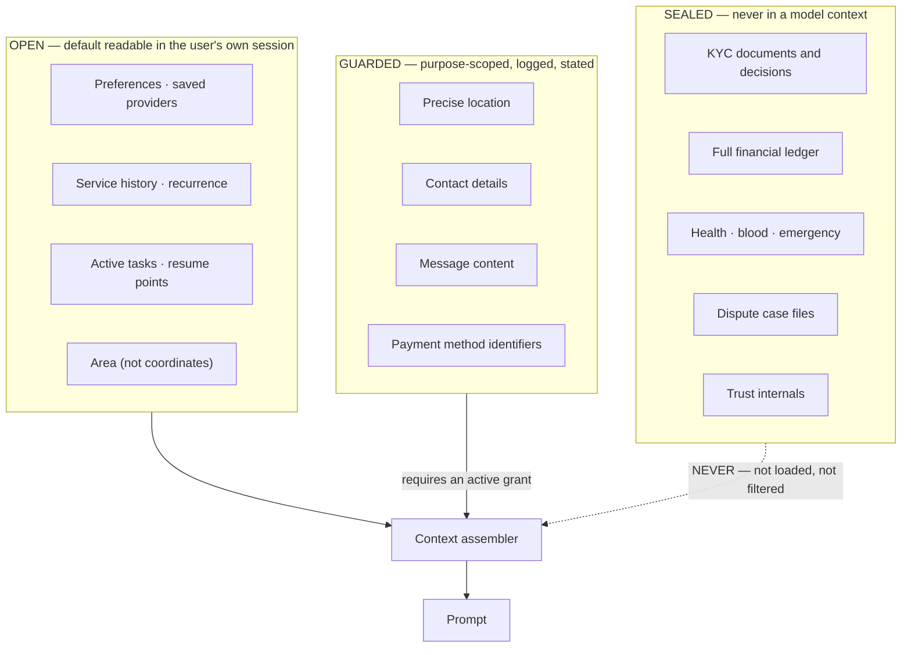
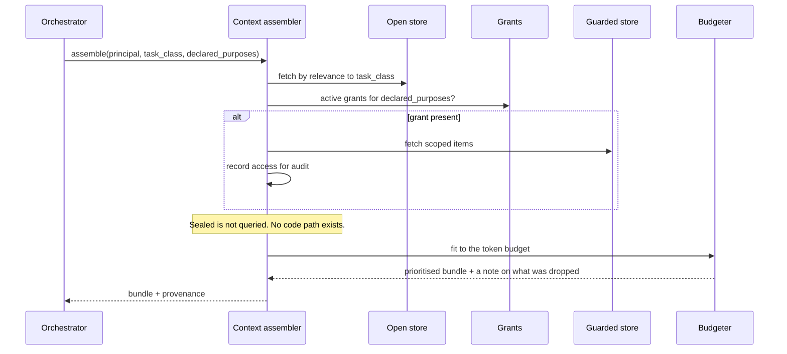

# IMAP 2.0 — Context & Memory Architecture

**Status:** PROPOSED · **Phase:** 2 · **Date:** 2026-08-09
**Product law:** Constitution §5, §P9 · `PRD.md` R-801…R-808 · **Decision:** AD-018

---

## 1. Position

Personal context is what makes IMAP useful the second time. It is also the component most capable of harming users. The architecture treats it as a **boundary with tiers**, not a setting.

**Current state.** No context store exists. `users.settings` holds five notification booleans that are written and never read. Conversation history lives only in browser state, capped at the last 20 client-sent messages, and is lost on reload.

---

## 2. The five context kinds

| Kind | Lifetime | Contains | Tier | Written by |
|---|---|---|---|---|
| **Session context** | Current conversation | Turns, the current task, disambiguation state | Open | AI |
| **Task context** | Until the need resolves + 30 days | Active need, candidate providers, in-flight booking, resume point | Open | Domain events |
| **Preference context** | Until changed | Language, budget band, preferred times, saved providers, area | Open | User action, inferred with notice |
| **Behavioural context** | Rolling window | Service history, repeat providers, recurrence patterns | Open | Domain events |
| **Sensitive context** | Per policy | KYC, ledger, health/blood/emergency, disputes, trust internals | **Sealed** | Domain; **never AI-readable** |

---

## 3. Access tiers (Constitution §5.3)



### 3.1 Why "never loaded" rather than "filtered"

A filter is a runtime check that can be bypassed by a new code path, a debug flag, or a developer adding a field. **The assembler has no query capable of reading Sealed rows** — the repository it uses does not expose them. A prompt-injection attack cannot reach data the assembler cannot fetch.

AI may learn a *boolean outcome* about Sealed data through a tool (`kyc_status = verified`) but never the underlying record (R-706).

### 3.2 Guarded access

```
grant = { principal, purpose, scope, granted_at, expires_at }
```

| Rule | Detail |
|---|---|
| A purpose is declared before access | `"share location with provider for booking X"` — not "personalisation" |
| Time-bounded and revocable | Location grants expire with the booking (`D-04`) |
| Logged | Actor, purpose, scope, timestamp |
| Stated to the user | "I'm using your saved address for this booking" |
| No blanket grants | A grant covers one purpose and one scope |

---

## 4. Assembly



**Provenance is mandatory.** Every context item carries where it came from and when, so the assistant can say *"based on your booking in March"* rather than producing unexplained personalisation (`BEHAVIORAL-DESIGN.md` §3.2).

**Budgeting priority** when context exceeds the window:
1. Current task state (never dropped)
2. Explicit preferences
3. Directly relevant history (same service or provider)
4. General history
5. Weak inferences

What was dropped is recorded in telemetry — silently truncated context is a debugging trap.

---

## 5. Storage (AD-018)

Relational, not vector.

```
context_item(id, principal_id, tier, kind, key, value_json,
             source, source_event_id, confidence,
             created_at, updated_at, expires_at)

context_grant(id, principal_id, purpose, scope, granted_at, expires_at, revoked_at)
```

| Property | Reason |
|---|---|
| **Structured, not embedded** | R-804 requires rendering "what IMAP remembers" as a plain-language list. That needs structure |
| `tier` on every row | The assembler filters at the query, and Sealed rows are not in this table at all |
| `source` + `source_event_id` | Provenance, and it makes deletion verifiable |
| `expires_at` | TTL by kind (§6) |
| Upsert by `(principal_id, kind, key)` | Idempotent under at-least-once event delivery |

**No vector store at MVP.** Semantic recall over past conversations is not an MVP requirement, and a third-party embedding store would put personal data in someone else's retention policy — incompatible with `D-08` and with deletion being verifiable (R-805).

---

## 6. Retention

| Kind | TTL | On expiry |
|---|---|---|
| Session context | 30 days rolling | Deleted |
| Task context | Until resolved + 30 days | Deleted |
| Preferences | Until changed or account closed | — |
| Behavioural | 12 months rolling | Deleted |
| Conversation content | 30 days by default, redacted at rest | Deleted |
| Grants | Per grant, ≤ purpose duration | Revoked |
| Sealed | Domain-specific; emergency is short | Per domain policy |

---

## 7. User control (R-804, R-805, R-807)

`GET /me/context` returns a plain-language list:

```
What IMAP remembers about you

Preferences
  · You prefer Bangla                                  [Remove]
  · Usual area: Mirpur                                 [Remove]
Providers you have used
  · Karim Hossain — AC servicing, March 2026           [Remove]
Services you have booked
  · AC servicing (2), Electrical repair (1)            [Remove]
Active
  · Booking with Karim, Thursday 3 PM                  (kept while active)

Not shown here: identity documents, payment records and emergency
information. IMAP's assistant cannot read those.
```

| Control | Behaviour |
|---|---|
| **View** | Every Open and Guarded item, in the user's language, with its source |
| **Delete** | Any item. Takes effect within one session boundary (Constitution §5.3 rule 2) |
| **Disable personalisation** | One switch. The product still works — neutral ordering, no history-based suggestions |
| **Export** | Machine-readable, with the rest of the user's data (R-807) |
| **Account closure** | Context deleted; audit and statutory financial records retained (`DATA-ARCHITECTURE.md` §7) |

**Deletion is real.** The row is removed, and the assembler cannot resurrect it from an event replay — replay is idempotent by `(principal, kind, key)` and skips keys with a deletion tombstone.

---

## 8. Writing context

| Source | Tier | Notice |
|---|---|---|
| Explicit user statement ("I prefer mornings") | Open | Confirmed in the reply |
| Domain event (`booking.completed`) | Open | None needed — it is the user's own record |
| Inference (recurrence detected) | Open, with `confidence` | Stated when used, never asserted as fact |
| AI-written | Open only | Visible in `/me/context` |
| **Sealed** | Domain only | **AI can never write here** |

**Inference rules:**
* Inferences carry a confidence and are labelled as inferences when surfaced.
* A user correction overrides an inference permanently.
* No inference on sensitive attributes — never gender, religion, income or health (`BEHAVIORAL-DESIGN.md` §3.2 rule 4).
* Cross-user inference is aggregate-only and never re-identifiable (Constitution §5.3 rule 4).

---

## 9. Continuity (R-801)

Task context is the mechanism behind `BEHAVIORAL-DESIGN.md` §2.

| Property | Detail |
|---|---|
| **Server-held** | Survives reload, device change and session expiry — the current app loses booking-modal progress on close |
| Resume points are structured | `{ flow, step, entity_refs }`, not a serialised UI blob |
| Dismissible | Permanently, per item |
| Silent expiry | A stale task disappears; it does not generate a "you forgot" message |
| **Never auto-resumes past approval** | A resumed booking returns to the approval step (`BEHAVIORAL-DESIGN.md` §2.2 rule 4) |

---

## 10. Privacy properties

| Property | How it holds |
|---|---|
| Sealed never reaches a third party | Not assembled, so not in any prompt (`D-08`) |
| Guarded access is accountable | Grant + access log, per purpose |
| Deletion is verifiable | Row removed; replay tombstoned; provenance shows what existed |
| Minimisation | Assembly fetches by relevance to the task class, not the whole profile |
| No commercial use of sensitive context | Sealed is not readable by ranking, pricing or notification (P7, R-808) |
| Cross-user isolation | Every query is principal-scoped; no tool returns another user's context |

---

## 11. Anti-patterns forbidden

| Anti-pattern | Why |
|---|---|
| Loading the whole user profile into a prompt | Minimisation; cost; injection surface |
| Filtering Sealed data at the prompt | A filter can be bypassed; absence cannot |
| Third-party-hosted memory | Deletion becomes unverifiable; retention becomes someone else's policy |
| Unbounded memory growth | TTLs exist per kind |
| Inferring sensitive attributes | Prohibited outright |
| Personalisation the user cannot see or turn off | R-804, R-805 |
| Storing conversation content unredacted by default | Minimisation |
| Deriving context from another user's data | Isolation |
| Auto-resuming past an approval step | Constitution §4 |
| Blanket grants | Purpose-scoped only |
