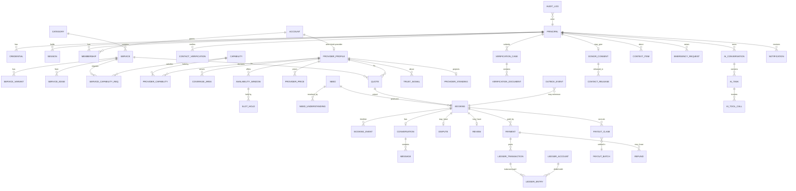

# IMAP 2.0 — Data Architecture

**Status:** PROPOSED · **Phase:** 2 · **Date:** 2026-08-09
**Decisions:** AD-002 (MySQL/TiDB), AD-007 (ledger), AD-008 (minor units), AD-009 (audit), AD-011 (object storage), AD-017 (accounts)

Designed from `DOMAIN-ARCHITECTURE.md`, **not** from the current `schema.sql`.

---

## 1. Modelling rules

| # | Rule | Why |
|---|---|---|
| **1** | One authoritative owner per fact (`DOMAIN-ARCHITECTURE.md` §4) | Duplicated authority is how `users.balance` became unreconcilable |
| **2** | Money is `BIGINT` minor units + `CHAR(3)` currency (AD-008) | Removes rounding and implicit-currency error |
| **3** | Ledger entries and audit records are append-only | Corrections are new rows |
| **4** | No binary or base64 in the primary database (AD-011) | Identity documents are up to ~5 MB each today, four per case |
| **5** | Enums are lookup tables or generated from one shared definition | Three enum mismatches shipped silently |
| **6** | Every table: `created_at`, and `updated_at` where mutable | Audit and debugging |
| **7** | Soft delete only where history matters; otherwise hard delete | Blanket soft delete makes uniqueness constraints unenforceable |
| **8** | Every foreign key is declared | Runtime-created tables currently have none |
| **9** | Every table declares a privacy class (§6) | Drives encryption, logging, retention |
| **10** | Time is UTC; display timezone is a presentation concern | `timezone: "+06:00"` is currently baked into the pool |
| **11** | Ids are UUIDv7 (time-ordered) | Sortable, index-friendly, non-enumerable |
| **12** | Schema changes only via migrations | Already true since Phase 0.5 |

---

## 2. Conceptual ERD



---

## 3. Entity register

`R` required (MVP) · `P` required (post-MVP) · `F` future · `X` rejected.

### Identity

| Entity | | Key fields | Notes |
|---|:--:|---|---|
| `principal` | R | id, status, created_at | Replaces the identity half of `users` |
| `credential` | R | principal_id, kind(`password`\|`otp`\|`oauth`), secret_hash, provider_subject | **A null hash cannot authenticate** — Phase 0.5 rule, now a schema-level concept: no credential row means no password login |
| `session` | R | principal_id, issued_at, expires_at, revoked_at, device | Replaces the unused `refresh_tokens` table |
| `account` | R | id, kind(`consumer`\|`provider`\|`organisation`), display_name | AD-017 |
| `membership` | R | principal_id, account_id, role, granted_by, granted_at | Replaces `users.role` |
| `contact_verification` | R | principal_id, channel, value_hash, verified_at | Phone/email proof |
| `verification_case` | R | principal_id, kind, state, decided_by, decision_reason | KYC. **Sealed** |
| `verification_document` | R | case_id, object_key, mime, uploaded_at | **Reference only** — no bytes (AD-011) |

### Catalog / Service Graph

| Entity | | Key fields | Notes |
|---|:--:|---|---|
| `category` | R | id, slug, name_bn, name_en, sort | One taxonomy, replacing three |
| `service` | R | id, category_id, slug, name_bn, name_en, description, price_model, state | The entity that does not exist today |
| `service_variant` | P | service_id, name, price_delta | E.g. "1.5 ton" vs "2 ton" AC |
| `service_edge` | R | from_service_id, to_service_id, kind, weight | `related` \| `precedes` \| `alternative_to` \| `part_of` |
| `service_edge_closure` | R | from, to, depth | Materialised projection (AD-004) |
| `capability` | R | id, slug, name, requires_certification | What a provider must hold |
| `service_capability_req` | R | service_id, capability_id | |
| `service_synonym` | R | service_id, term, locale | Compensates for the absence of search infrastructure (AD-005) |
| `service_attribute` | P | service_id, key, type | Structured question inputs |
| `goal` / `goal_service` | F | | LATER |

### Provider

| Entity | | Key fields | Notes |
|---|:--:|---|---|
| `provider_profile` | R | account_id, state, bio_bn, bio_en, experience_years | Replaces `providers`; **`is_approved` becomes a Trust-owned state** |
| `provider_capability` | R | provider_id, capability_id, evidence_ref, verified | Replaces one free-text string |
| `coverage_area` | R | provider_id, area_id | Replaces free text; enables geo filtering |
| `area` | R | id, parent_id, kind(division\|district\|upazila\|area), name_bn, name_en, centroid | Bangladesh hierarchy (§8) |
| `provider_price` | R | provider_id, service_id, model, amount_minor, currency | Server-authoritative price input |
| `availability_window` | R | provider_id, starts_at, ends_at, capacity, recurrence_id | **Dated**, with capacity |
| `slot_hold` | R | window_id, booking_id, held_until, state | Makes double-booking impossible |
| `provider_media` | P | provider_id, object_key, kind, caption | Proof of work (R-409, NEXT) |

### Discovery

| Entity | | Key fields | Notes |
|---|:--:|---|---|
| `need` | R | id, principal_id?, raw_text, locale, channel, area_id, created_at | **R-1108** — the North Star depends on this |
| `need_understanding` | R | need_id, service_id, confidence, method(`ai`\|`category`\|`search`), accepted | Records whether the user accepted it |
| `need_outcome` | R | need_id, outcome, reason | `booked` \| `abandoned(reason)` \| `expired` |
| `search_query` | P | need_id, filters_json, result_count | |
| `ranking_explanation` | R | need_id, provider_id, factors_json | R-302 — the basis is stored, not recomputed |

### Booking

| Entity | | Key fields | Notes |
|---|:--:|---|---|
| `quote` | R | id, need_id, service_id, provider_id, amount_minor, fee_minor, total_minor, currency, expires_at, state | **Immutable.** Bookings reference a quote; requests never carry a price |
| `quote_component` | R | quote_id, kind, amount_minor | base / area / time / promo / commission — makes the price explainable |
| `booking` | R | id, quote_id, customer_account_id, provider_id, service_id, state, scheduled_start, address_ref, otp_hash | `otp_hash`, not plaintext |
| `booking_event` | R | booking_id, from_state, to_state, actor_principal_id, reason, at | Timeline + the state-transition record |
| `conversation` / `message` | R | booking-scoped | Participation verified on both transports |
| `dispute` / `dispute_evidence` | P | booking_id, state, outcome, resolved_by, reason | Gate 1: manual, same records |
| `review` | R | booking_id, rating, comment, tags, state | Eligibility already correct today |

### Finance

| Entity | | Key fields | Notes |
|---|:--:|---|---|
| `ledger_account` | R | id, owner_type, owner_id, kind, currency | Kinds in `FINANCIAL-ARCHITECTURE.md` §3 |
| `ledger_transaction` | R | id, reference, kind, occurred_at | `reference` is **UNIQUE** — the idempotency backbone |
| `ledger_entry` | R | transaction_id, account_id, direction, amount_minor, currency | **Immutable.** Per transaction, debits = credits |
| `balance_projection` | R | account_id, balance_minor, as_of_entry_id | **Derived.** Rebuildable from entries alone |
| `payment` | R | id, booking_id?, account_id, amount_minor, currency, state, gateway_ref | |
| `payment_attempt` | R | payment_id, gateway_session, state, raw_ref | Gateway payloads referenced, not stored wholesale |
| `refund` | R | payment_id, amount_minor, state, reason, reference | |
| `payout_claim` | R | provider_account_id, booking_id, amount_minor, state | The entity with the lifecycle (C-01) |
| `payout_batch` | R | id, state, executed_at, executed_by | |
| `commission_accrual` | R | booking_id, amount_minor, settlement_mode | `settlement_mode` covers cash accrual |
| `idempotency_key` | R | key, scope, principal_id, request_hash, response, expires_at | AD-010 |

### Trust

| Entity | | Key fields | Notes |
|---|:--:|---|---|
| `trust_signal` | R | subject_type, subject_id, kind, value, source_event_id, at | **Append-only observations** |
| `provider_standing` | R | provider_id, facts_json, eligibility, computed_at | Derived projection; facts are what users see |
| `appeal` | P | subject_type, subject_id, state, decided_by, reason | |

### AI

| Entity | | Key fields | Notes |
|---|:--:|---|---|
| `ai_conversation` | R | principal_id, started_at, locale | |
| `ai_message` | R | conversation_id, role, content_ref, tokens | Content may be stored redacted (§6) |
| `ai_task` | R | conversation_id, state, intent, proposal_json | State machine §13 |
| `ai_tool_call` | R | task_id, tool, tier, input_hash, outcome, latency_ms, cost_minor | R-705 audit input |
| `context_item` | R | principal_id, tier, kind, value_json, source, expires_at | AD-018; `tier` ∈ Open\|Guarded\|Sealed-excluded |
| `context_grant` | R | principal_id, purpose, scope, granted_at, expires_at | Guarded access is purpose-scoped |
| `eval_case` / `eval_run` / `eval_result` | R | | CI gate (R-710) |

### Emergency — isolated (AD-020)

| Entity | | Key fields | Notes |
|---|:--:|---|---|
| `emergency_request` | R | principal_id, kind, description, location_ref, booking_id?, state | **Sealed.** No `dispatched` state |
| `emergency_ack` | R | request_id, admin_principal_id, at | Who actually saw it |
| `donor_consent` | R | principal_id, blood_group, area_id, contact_ref, consented_at, revoked_at | Opt-in; instantly revocable |
| `contact_release` | R | consent_id, requester_principal_id, at, purpose | Every release logged (D-013) |
| `verified_source` | R | name, authority, url, verified_at, verified_by, expires_at | D-012 — nothing is presented as information without one |
| `hotline` | R | label, number, authority, verified_at | R-1009 — currently unverified, an open risk |

### Platform

| Entity | | Key fields | Notes |
|---|:--:|---|---|
| `audit_log` | R | actor_principal_id, actor_role, action, resource_type, resource_id, before_json, after_json, reason, correlation_id, at | AD-009; in-transaction |
| `outbox_event` | R | id, aggregate, type, payload_json, occurred_at, published_at, attempts | AD-006 |
| `job` | R | id, kind, payload_json, run_after, attempts, state, last_error | AD-016 |
| `notification` | R | principal_id, channel, template, state, suppressed_reason, sent_at | Suppression is recorded |
| `notification_preference` | R | principal_id, category, channel, enabled | Currently written and never read |
| `analytics_event` | R | name, principal_id?, need_id?, properties_json, at | Separate from application logs |
| `feature_availability` | R | capability, state, message_bn, message_en | Feeds the nine-state vocabulary |
| `schema_migrations` | R | — | Exists (Phase 0.5) |

### Rejected / future

| Entity | | Reason |
|---|:--:|---|
| `wallet_account` (customer stored value) | X | D-010. Only an account *kind* in the taxonomy; none issuable (AD-019) |
| `loan`, `loan_schedule`, `loan_repayment` | X | D-011. No lending entities at all |
| `disaster_alert` (first-party) | X | D-012. Replaced by `verified_source` |
| `donor_notification` | X | D-013 |
| `feed_item`, `feed_ranking` | X | D-006 |
| `business`, `business_member`, `workspace` | F | LATER. Accommodated by `account.kind = organisation` |
| `provider_team_member` | F | LATER |
| `embedding` / vector store | F | AD-018 |

---

## 4. Key constraints

| Constraint | Prevents |
|---|---|
| `ledger_transaction.reference` UNIQUE | Double payout, double disbursement, double capture (P0-5, P0-6) |
| Per transaction: Σ debits = Σ credits | Half-applied money movement |
| `ledger_entry.amount_minor > 0` (direction carries sign) | Negative-amount ambiguity (P0-4) |
| `slot_hold` unique on (window_id) while active | Double-booking (R-207) |
| `review` unique on `booking_id` | Duplicate reviews |
| `provider_capability` unique on (provider_id, capability_id) | Duplicate declarations |
| `provider_profile` unique on `account_id` | Duplicate provider rows — possible today |
| `membership` unique on (principal_id, account_id) | Duplicate roles |
| `idempotency_key` unique on (key, scope) | Duplicate mutations (AD-010) |
| `contact_release` FK → `donor_consent` | Releasing contact without consent |
| `quote.expires_at` NOT NULL | Indefinitely valid prices |
| `booking.quote_id` NOT NULL | A booking with a client-supplied price |
| FK on every relationship, `ON DELETE RESTRICT` on financial rows | Orphaned money |

**Note (AD-002).** TiDB `CHECK` support varies by version. Money non-negativity and balance rules are therefore enforced in the domain layer as the primary control, with database checks added where available as defence in depth. This is stated so nobody assumes the database is the only guard.

---

## 5. Indexing

Driven by the actual read paths, not guessed.

| Query | Index |
|---|---|
| Discovery: available providers for a service in an area | `(service_id, area_id, state)` on a `provider_service_area` projection |
| Availability lookup | `availability_window(provider_id, starts_at)`; `slot_hold(window_id, state)` |
| Booking lists | `booking(customer_account_id, state, created_at)`; `booking(provider_id, state, scheduled_start)` |
| Ledger balance rebuild | `ledger_entry(account_id, id)` |
| Idempotency lookup | unique `(key, scope)` |
| Audit investigation | `audit_log(resource_type, resource_id, at)`; `audit_log(actor_principal_id, at)`; `audit_log(correlation_id)` |
| Outbox dispatch | `outbox_event(published_at NULL, id)` |
| Funnel | `need(created_at)`; `need_outcome(outcome, at)` |
| Service graph traversal | `service_edge_closure(from_service_id, depth)` |
| Free-text fallback | `service_synonym(term)` |

**Removed.** The current `LIKE '%q%'` across five columns, which no index can serve.

---

## 6. Privacy classification

Every table carries one class. Drives encryption, logging, retention and AI access.

| Class | Contains | Storage | AI access | Logging | Retention |
|---|---|---|---|---|---|
| **Public** | Categories, services, published reviews, public provider facts | Standard | Full | Free | Indefinite |
| **Internal** | Ranking config, feature availability, aggregate metrics | Standard | Read via tools | Free | Indefinite |
| **Private** | Bookings, needs, preferences, saved providers, notifications | Standard | **Open tier** — own data only | Ids only | Account life + defined window |
| **Sensitive** | Precise location, message content, contact details, payment method identifiers | Standard, access-controlled | **Guarded** — purpose-scoped, logged | Never in payloads | Purpose-bound; location for the booking duration only (`D-04`) |
| **Highly sensitive** | Identity documents, verification decisions, dispute case files, trust internals | Object storage; encrypted; access logged with reason | **Sealed — never** | Access event only, never content | Legal minimum, then deleted |
| **Financial** | Ledger, payments, payouts, commission | Standard, restricted role | Sealed; boolean outcomes via tools only | Amount + reference; never full records | Statutory retention |
| **Emergency** | Emergency requests, donor consent, contact releases | Isolated context | **Sealed — never** (R-1005) | Occurrence only | Short, defined; consent revocation is immediate |
| **Identity** | Credentials, session material | Hashed / encrypted; never returned by any query | Never | Never | Life of credential |

---

## 7. Cross-cutting data concerns

**Soft delete.** Used only where history has meaning: `service` (via `retired`), `provider_profile` (via `removed`), `review` (via `removed`). Everywhere else, deletion is real. Blanket soft delete breaks uniqueness constraints and quietly retains data users asked to be removed.

**Right to erasure (R-807).** Deletion is *tiered*: identity and contact data are erased; financial records are retained under statutory obligation but de-identified to an account reference; audit records retain the actor id because an audit trail that can be erased by its subject is not an audit trail. This distinction must be stated in the privacy notice.

**Multi-tenancy.** Not multi-tenant in the SaaS sense. Isolation is by `account`, enforced by resource-ownership authorization, not by schema separation. `account.kind = organisation` is the seam for the business workspace (LATER) — organisation-scoped rows carry `account_id` from day one so the workspace does not require a data migration.

**JSON columns.** Used deliberately and sparingly: `ranking_explanation.factors_json`, `audit_log.before/after`, `context_item.value_json`, `outbox_event.payload_json`. Never for anything queried by value. AD-002 costs us `jsonb` operators here; accepted, because none of these are query targets.

**Time.** UTC in storage. The current pool sets `timezone: "+06:00"` globally, which is a display decision embedded in the data layer.

---

## 8. Bangladesh location model

```
Division → District → Upazila/Thana → Area/Ward → landmark text
```

* `area` is a self-referencing hierarchy with a `kind` discriminator, so a second country is a data change, not a schema change (`I-05`).
* **Landmark-based addressing is normal in Bangladesh.** `address` carries structured fields *and* free-text landmark directions; the free text is not a fallback, it is expected content.
* Coverage is expressed as a set of `area` references, not a radius — matching how providers actually describe where they work.
* Precise coordinates are collected only for an active booking and retained only for its duration (`D-04`); `area` is the persistent granularity.

---

## 9. What is deliberately not in the data model

| Not modelled | Why |
|---|---|
| Customer wallet balance | D-010 / AD-019 |
| Loans, schedules, repayments | D-011 |
| First-party disaster alerts | D-012 |
| Donor notification queue | D-013 |
| Feed items and feed ranking | D-006 |
| A composite public trust score | D-004 — users see facts, not a number |
| `users.role` | AD-017 |
| Any `LONGTEXT` image column | AD-011 |
| A mutable balance column | AD-007 |

---

# Phase 2.75 amendment — binding corrections

**Date:** 2026-08-09 · **Closes:** V-03, O-02 · **Scope frozen by:** `GATE-1-ARCHITECTURE.md`
Where this section conflicts with anything above it, **this section wins.**

## E1 — `booking_clearing` account kind

The account taxonomy gains a tenth kind, `booking_clearing` (Platform, credit balance),
replacing the undefined `customer_settlement` used in the worked flows. It must never be
merged with `customer_liability`, which stays defined and non-issuable under AD-019.
Reasoning in `FINANCIAL-ARCHITECTURE.md` Phase 2.75 amendment A1.

## E2 — `booking.payment_status` is a read model

Not authoritative, not written by a booking use case, rebuildable from Payment state,
reconciled nightly. Payment wins on divergence.

## E3 — entity scope for Gate 1

`PHASE-2.5-SIMPLIFICATION.md` recommended 3 removals, 2 collapses and 4 deferrals against
the ~70-entity Phase 2 model. The **binding** Gate-1 entity list is
`GATE-1-ARCHITECTURE.md` §4 — approximately 38 entities. Entities specified in this
document but absent from that list are deferred, not deleted: they remain designed, and
they are not built at Gate 1.
