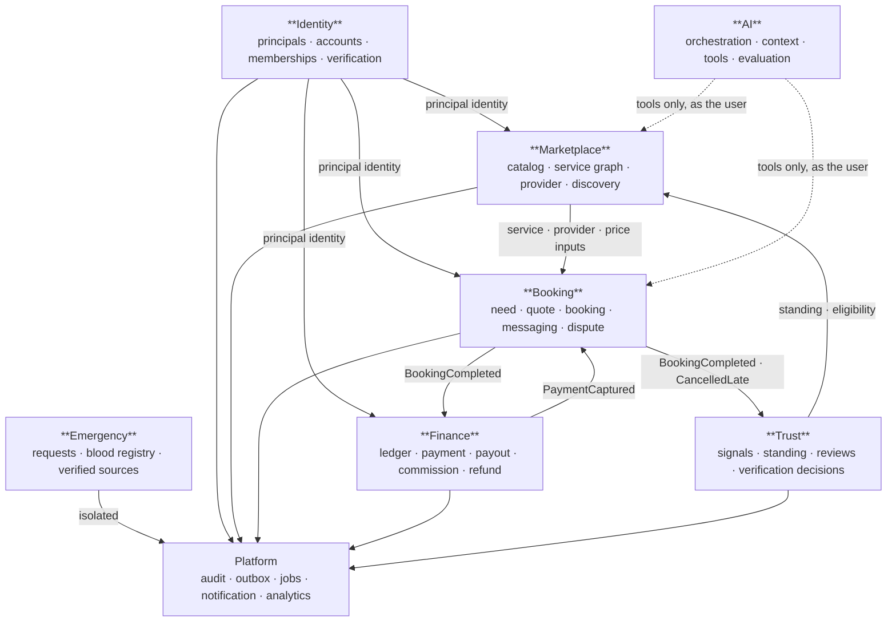

# IMAP 2.0 — Domain Architecture

**Status:** PROPOSED · **Phase:** 2 · **Date:** 2026-08-09
**Decisions:** `ARCHITECTURE-DECISIONS.md` (AD-001, AD-017, AD-019, AD-020)

---

## 1. Bounded contexts

Seven contexts. A context is a consistency and ownership boundary: inside it, invariants hold synchronously; across it, communication is by published event or by an explicit query interface.



**AI has no context of its own that other contexts depend on.** It is a consumer, never a producer of authoritative state. Emergency is deliberately isolated (AD-020) — nothing depends on it, and it depends only on Identity for actor resolution.

### 1.1 Context contracts

| Context | Owns | Consumes | Publishes | Cannot directly modify |
|---|---|---|---|---|
| **Identity** | Principal, credential, session, account, membership, role, contact verification | — | `PrincipalRegistered`, `ContactVerified`, `MembershipGranted`, `MembershipRevoked`, `AccountClosed` | Anything outside Identity |
| **Marketplace** | Service, category, service edge, capability, provider profile, coverage area, availability, need record, ranking config | Identity (principal), Trust (standing, eligibility) | `ServicePublished`, `ProviderListed`, `ProviderPaused`, `AvailabilityChanged`, `NeedExpressed`, `NeedUnderstood` | Bookings, money, trust standing |
| **Booking** | Quote, booking, booking state, participation, message, dispute | Marketplace (service, provider, availability, price), Identity, Finance (payment state) | `QuoteIssued`, `BookingRequested`, `BookingConfirmed`, `ProviderArrived`, `BookingCompleted`, `BookingCancelled`, `DisputeRaised`, `DisputeResolved` | Ledger entries, provider standing, availability records (it *requests* a hold) |
| **Finance** | Ledger account, ledger entry, payment, refund, payout claim, commission, reconciliation | Booking (completion, cancellation, dispute), Identity | `PaymentInitiated`, `PaymentCaptured`, `PaymentFailed`, `RefundIssued`, `EarningsAccrued`, `CommissionAccrued`, `PayoutPaid` | Booking state, trust standing |
| **Trust** | Trust signal, provider standing, review, verification decision, appeal | Booking, Finance (dispute outcomes), Identity | `ReviewPublished`, `StandingChanged`, `ProviderVerified`, `ProviderSuspended`, `AppealResolved` | Bookings, money, listings (it *publishes eligibility*; Marketplace applies it) |
| **AI** | Conversation, AI task, tool call record, context item, evaluation run | Everything — **read-only, through tools, as the acting user** | `AITaskProposed`, `AIToolInvoked`, `AITaskCompleted`, `AITaskFailed` | **Anything.** Writes only by invoking another context's use case through the tool runtime |
| **Emergency** | Emergency request, blood donor consent record, verified source, hotline | Identity (actor), Booking (reference only, for R-1010) | `EmergencyRequestReceived`, `EmergencyAcknowledged`, `DonorContactReleased` | Anything outside Emergency |

---

## 2. Domains

Thirty-two domains from the brief, assessed. Each is **Required (MVP)** · **Required (post-MVP)** · **Future** · **Rejected**.

### 2.1 Identity context

#### Identity — Required (MVP)
*Purpose.* Establish who is acting and what they may act as.
*Entities.* `Principal` (an authenticated human), `Credential` (password / OTP / OAuth binding), `Session`, `ContactVerification`.
*Owned data.* Authentication material, verification state, session lifecycle.
*Commands.* `RegisterPrincipal`, `AuthenticatePassword`, `AuthenticateOtp`, `AuthenticateOAuth`, `VerifyContact`, `RevokeSession`.
*Queries.* `getPrincipal`, `getVerificationLevel`.
*Events.* `PrincipalRegistered`, `ContactVerified`, `SessionRevoked`.
*Dependencies.* None.
*Security boundary.* Credentials are never readable outside this domain — no query returns a hash. Phase 0.5 established that a null hash cannot authenticate; that rule lives here.

#### Account & Membership — Required (MVP) · AD-017
*Purpose.* Separate *who you are* from *what you are acting as*.
*Entities.* `Account` (kind: `consumer` | `provider` | `organisation`), `Membership` (principal ↔ account + role), `Role`.
*Why.* One person is legitimately a customer, a provider, and a member of a business. `users.role ENUM(...)` cannot express that, and every workaround pushes role assumptions into domain code.
*Commands.* `OpenAccount`, `GrantMembership`, `RevokeMembership`, `SwitchActiveAccount`.
*Events.* `AccountOpened`, `MembershipGranted`, `MembershipRevoked`.
*Security boundary.* Membership changes are Tier C (never AI) and always audited.

#### KYC / Verification — Required (MVP, provider only)
*Purpose.* Establish that a person is who they claim.
*Entities.* `VerificationCase`, `VerificationDocument` (object-storage reference only — AD-011), `VerificationDecision`.
*Owned data.* Document references, decision, reviewer, reason. **Classified Sealed.**
*Commands.* `SubmitVerification`, `RecordDecision` (human only), `ExpireVerification`.
*Events.* `VerificationSubmitted`, `VerificationApproved`, `VerificationRejected`.
*Security boundary.* Documents never enter the primary database, never enter AI context, and every access is logged with actor and reason (`D-02`, `D-03`, R-706).

---

### 2.2 Marketplace context

#### Catalog (Service Graph) — Required (MVP) · D-003
*Purpose.* The vocabulary of the entire product. Nothing intelligent is possible without it.
*Entities.* `Category`, `Service`, `ServiceVariant`, `ServiceEdge`, `Capability`, `ServiceAttribute`.
*Owned data.* The single authoritative taxonomy. Replaces three conflicting ones.
*Commands.* `CreateService`, `PublishService`, `DeprecateService`, `LinkServices`, `DefineCapability`.
*Queries.* `resolveService`, `relatedServices`, `servicesForCapability`, `searchServices`.
*Events.* `ServicePublished`, `ServiceDeprecated`, `ServiceGraphChanged` (triggers adjacency rebuild — AD-004).
*Security boundary.* Staff-edited only. No user or AI write path.

#### Provider — Required (MVP)
*Purpose.* Who can do what, where, at what price, when.
*Entities.* `ProviderProfile`, `ProviderCapability`, `CoverageArea`, `ProviderMedia`.
*Commands.* `ApplyAsProvider`, `DeclareCapability`, `SetCoverage`, `SetPricing`, `PauseListing`, `ResumeListing`.
*Events.* `ProviderApplied`, `ProviderListed`, `ProviderPaused`.
*Dependencies.* Trust (listing eligibility — D-005), Catalog (capabilities).
*Security boundary.* A provider edits only their own profile. **Listing eligibility is not self-asserted** — it is granted by Trust.

#### Availability — Required (MVP)
*Purpose.* Make double-booking structurally impossible.
*Entities.* `AvailabilityWindow` (dated, with capacity), `SlotHold`, `RecurrenceRule`.
*Commands.* `DefineAvailability`, `HoldSlot`, `ReleaseHold`, `CommitHold`.
*Events.* `AvailabilityChanged`, `SlotHeld`, `SlotReleased`.
*Invariant.* A hold is atomic — concurrent holds on the same slot: exactly one succeeds (R-207).
*Note.* Replaces free-text dateless slot strings that booking never read.

#### Discovery — Required (MVP)
*Purpose.* Turn a need into a ranked, explainable candidate set.
*Entities.* `NeedRecord` (R-1108 — the entity the North Star depends on), `SearchQuery`, `RankingExplanation`.
*Commands.* `RecordNeed`, `RecordUnderstanding`, `RecordAbandonment` (with reason — `KPI.md` §2).
*Queries.* `findProviders(service, area, window, constraints)`, `rankCandidates`.
*Events.* `NeedExpressed`, `NeedUnderstood`, `NeedAbandoned`, `SearchPerformed`.
*Security boundary.* Read-only over Marketplace. Ranking inputs must be returnable to the user (R-302).

#### Matching / Recommendation — Required (MVP, simple form)
*Purpose.* Select and order candidates for a specific need.
*Note.* Not a separate service. A domain service inside Discovery with a pure, testable ranking function. See §5 for how the four discovery concepts differ.

---

### 2.3 Booking context

#### Booking — Required (MVP)
*Purpose.* The commitment between a customer and a provider, and its lifecycle.
*Entities.* `Booking`, `BookingParticipant`, `BookingTimeline`.
*Commands.* `RequestBooking`, `AcceptBooking`, `DeclineBooking`, `StartWork`, `MarkArrived`, `MarkWorkDone`, `ConfirmCompletion`, `CancelBooking`, `RescheduleBooking`.
*Events.* See §1.1.
*Invariants.* Terminal states are final; only the customer confirms completion (R-505); every financial effect fires exactly once, keyed on a deterministic reference.
*Security boundary.* Participants and admins only. Transitions are role-guarded server-side.

#### Quote & Pricing — Required (MVP)
*Purpose.* Make price server-authoritative and time-bounded.
*Entities.* `Quote` (immutable, expiring), `PriceComponent`, `PriceModel`, `Promotion`, `Discount`.
*Commands.* `IssueQuote`, `ReviseQuote` (inspection-then-quote, R-306), `ExpireQuote`, `ApplyPromotion`.
*Queries.* `estimate` (labelled **Estimated**, never Confirmed).
*Events.* `QuoteIssued`, `QuoteRevised`, `QuoteExpired`.
*Invariant.* A booking references a `quoteId`. **A request never carries a price** — this is where the audit's P0-3 is made structurally impossible.
*Owns (C-03 resolution).* Discounts, including loyalty-point discounts. Loyalty owns points; Pricing owns their monetary effect.

#### Messaging — Required (MVP)
*Purpose.* Communication scoped to a booking.
*Entities.* `Conversation` (booking-scoped), `Message`.
*Security boundary.* Participants only, verified server-side on both REST and socket paths. Message content is **Guarded** context — AI reads it only for a declared purpose.

#### Dispute — Required (post-MVP; manual process at Gate 1)
*Purpose.* Resolve a failed booking with money held.
*Entities.* `Dispute`, `Evidence`, `Resolution`.
*Commands.* `RaiseDispute`, `SubmitEvidence`, `ResolveDispute` (human only), `AppealResolution`.
*Events.* `DisputeRaised`, `FundsHeld`, `DisputeResolved`.
*Note.* At Gate 1 this is an audit-logged manual admin process (`BUSINESS-MODEL.md` §3.1). The domain model exists from the start so the manual process writes to the same records.

---

### 2.4 Finance context

#### Ledger — Required (MVP) · AD-007
*Purpose.* The authoritative record of every money movement.
*Entities.* `LedgerAccount`, `LedgerTransaction`, `LedgerEntry` (immutable), `BalanceProjection` (derived).
*Commands.* `PostTransaction` (balanced, idempotent).
*Invariant.* Every transaction's entries sum to zero. Entries are never updated or deleted; a correction is a new reversing transaction.

#### Payment — Required (MVP)
*Entities.* `Payment`, `PaymentAttempt`, `GatewaySession`.
*Invariant.* Only a verified gateway callback settles. Amount is reconciled against the stored amount before any ledger movement.

#### Payout — Required (MVP)
*Entities.* `PayoutClaim` (this is the entity with the lifecycle — C-01), `PayoutBatch`.
*Purpose.* Provider earnings owed by the platform (D-010).

#### Commission — Required (MVP)
*Purpose.* Platform revenue on completed bookings (D-009).
*Note.* Includes accrual against cash bookings (`BUSINESS-MODEL.md` §3.2 option B), which is the unsolved commercial area.

#### Refund — Required (MVP)
*Invariant.* Refunds return to the original payment method through the gateway (D-010 consequence). No refund-to-balance.

#### Wallet / stored value — **Rejected for MVP** (D-010, AD-019)
Modelled only as an account *type* in the ledger taxonomy. No customer liability account is issuable in code. Reversal after legal sign-off is a data and policy change, not a redesign.

#### Loan / financial services — **Rejected** (D-011, AD-019)
Entirely outside the domain model. A documented integration seam exists for a licensed partner referral; no lending entity, no rate, no schedule.

---

### 2.5 Trust context

#### Trust — Required (MVP, reduced form)
*Purpose.* Compute and explain standing; gate listing eligibility.
*Entities.* `TrustSignal` (append-only observations), `ProviderStanding` (derived projection), `Appeal`.
*Commands.* `RecordSignal`, `RecomputeStanding`, `GrantListingEligibility`, `SuspendProvider` (human only), `ResolveAppeal` (human only).
*Events.* `StandingChanged`, `ProviderVerified`, `ProviderSuspended`.
*Security boundary.* **Every punitive decision is Tier C** (D-004). AI may compute a signal; it may never apply a penalty.

#### Review — Required (MVP)
*Purpose.* Customer-reported outcome quality.
*Invariant.* Only the paying customer of a completed, unrated booking (already correctly enforced today — the best-implemented flow in the current codebase).
*Entities.* `Review`, `ReviewModeration`.

#### Fraud / abuse — Required (post-MVP)
*Purpose.* Detect and flag; never auto-penalise.
*Note.* The existing heuristic scorers move here from `routes/ai.js` and stop being called AI. They must run **server-side on the write path** — currently they are client-invoked and dismissable.

---

### 2.6 AI context

#### AI Orchestration — Required (MVP, Gate 2)
*Entities.* `AIConversation`, `AITask`, `ToolCallRecord`, `Proposal`.
*Security boundary.* Acts as the user, never elevated. Cannot write outside the tool runtime.

#### AI Context / Memory — Required (Gate 2 minimal; expanded at Phase F)
*Entities.* `ContextItem` (tiered Open / Guarded / Sealed), `ContextGrant` (purpose-scoped, expiring).
*Security boundary.* Sealed is structurally excluded — not filtered at the prompt, but never loaded.

#### AI Evaluation — Required (MVP, Gate 2)
*Entities.* `EvalCase`, `EvalRun`, `EvalResult`.
*Note.* A CI gate, not a runtime component (R-710).

---

### 2.7 Emergency context — AD-020

#### Emergency Request — Required (MVP)
*Entities.* `EmergencyRequest`, `EmergencyAcknowledgement`.
*Invariant.* No `dispatched` state exists. The capability statement is data, not copy (`EMERGENCY-ARCHITECTURE.md` §3).
*Security boundary.* **Sealed.** Never in AI context (R-1005). Routed only to a database-verified admin room.

#### Blood Registry — Required (MVP, frozen scope) · D-013
*Entities.* `DonorConsent`, `ContactRelease` (each release logged).
*Invariant.* No automated notification exists or is implied. Consent is revocable instantly.

#### Verified Source — Required (MVP, signposting only) · D-012
*Entities.* `VerifiedSource` (name, authority, URL, verified-at, verified-by), `Hotline`.
*Invariant.* Nothing without a verified source may be presented as information. Community reports are stored but never styled as warnings.

---

### 2.8 Platform

| Domain | Status | Note |
|---|---|---|
| **Audit** | Required (MVP) | Append-only, in-transaction (AD-009). Write-only from other contexts; readable only by authorized operations roles |
| **Notification** | Required (MVP) | Channels, preferences, dedup, quiet hours, emergency override. Caps from `BEHAVIORAL-DESIGN.md` §4.2 are domain rules, not UI copy |
| **Analytics** | Required (MVP) | Consumes events; owns the funnel and North Star computation. Never a source of truth |
| **Administration** | Required (MVP) | Queues and case records. Six distinct permission sets (§6), not one `admin` flag |
| **Promotion** | Required (post-MVP) | Currently validated and never applied to a price. Rebuilt inside Pricing when discounting is a real requirement |
| **Loyalty** | Required (post-MVP) | Owns points only; monetary effect belongs to Pricing (C-03) |
| **Business / SME workspace** | Future | LATER. The one constraint: a booking must not assume payer = requester = beneficiary |
| **Goal** | Future | Depends on a proven Service Graph |
| **Disaster** | Reduced to `VerifiedSource` | D-012 |
| **Search infrastructure** | Rejected for MVP | AD-005 |

---

## 3. Domain classification summary

| Required (MVP) | Required (post-MVP) | Future | Rejected |
|---|---|---|---|
| Identity · Account/Membership · KYC · Catalog · Provider · Availability · Discovery · Matching · Booking · Quote/Pricing · Messaging · Ledger · Payment · Payout · Commission · Refund · Trust · Review · AI Orchestration · AI Context · AI Evaluation · Emergency Request · Blood Registry · Verified Source · Audit · Notification · Analytics · Administration | Dispute · Fraud/Abuse · Promotion · Loyalty | Business workspace · Goal · Provider teams · Semantic retrieval · Lender referral | Wallet/stored value (D-010) · Loans (D-011) · First-party disaster alerts (D-012) · Automated donor notification (D-013) · Short-form feed (D-006) · Search infrastructure (AD-005) |

---

## 4. State ownership register

**One owner per piece of state.** A context that needs another's state queries it or subscribes to its events; it never writes it. This table is the Domain quality gate (`SYSTEM-ARCHITECTURE.md` §11).

| State | Authoritative owner | Read by | Common wrong answer |
|---|---|---|---|
| Principal identity, credentials | Identity | All | Duplicating a "user" row per context |
| Account membership and role | Identity | All | Caching a role in a JWT and trusting it — Phase 0.5 found the socket layer doing this |
| Contact verification level | Identity | Booking, Trust, Marketplace | Providers asserting their own verification |
| Service definition and taxonomy | Catalog | All | The client owning a category list — the current defect |
| Service relationships | Catalog | Discovery, AI | Deriving relationships in the AI layer |
| Provider capability, coverage | Provider | Discovery, Booking | Trust inferring capability from reviews |
| Availability and slot holds | Availability | Booking | Booking writing availability directly |
| Listing eligibility | **Trust** | Marketplace | Provider self-listing (the audited defect) |
| Provider standing | Trust | Marketplace, Discovery | Discovery computing its own quality score |
| Need record | Discovery | Analytics, AI | AI owning the need |
| Quote and price | Pricing | Booking, Finance | The client sending an amount (P0-3) |
| Booking state | Booking | All | Realtime or AI asserting a state |
| Payment state | Payment | Booking, Finance | Booking marking itself paid |
| Ledger entries | Ledger | Finance | Any context writing a balance |
| Balance | **Derived from Ledger** | Finance | A mutable `users.balance` column (the audited defect) |
| Commission owed | Commission | Payout, Analytics | Computing take-rate in a report |
| Review content | Review | Trust, Marketplace | Trust editing a review |
| Trust signals | Trust | — | Booking writing a penalty |
| Emergency request | Emergency | Administration | AI reading it (R-1005) |
| Donor consent | Emergency | — | Any context outside Emergency |
| AI conversation, proposals | AI | — | Any context depending on AI state |
| AI context items | AI Context | AI only | Marketplace personalising from raw context |
| Audit records | Audit | Administration (read) | Any context editing an audit record |
| Notification preferences | Notification | — | Each channel keeping its own |

---

## 5. Discovery: four distinct concepts

Frequently conflated; they have different inputs, outputs and failure modes.

| Concept | User's state | Input | Output | Failure mode |
|---|---|---|---|---|
| **Search** | Knows what they want | Query string or service id + filters | Matching set | Recall — the right provider is missing |
| **Discovery** | Exploring | Category, area, browse context | Coherent set worth exploring | Relevance — the set is generic |
| **Recommendation** | Has context, not a specific request | User history, area, time | Ordered suggestions with a reason | Manipulation — ordering serves the platform, not the user (P7) |
| **Matching** | Has a specific need | Structured need + constraints | Best candidates + explanation | Wrong match — the single most damaging failure |

**Ranking basis (MVP), inspectable per R-302:**

```
score = availability_fit    (can they actually come when needed?)
      + capability_fit      (do they do exactly this service?)
      + proximity           (coverage area, then distance)
      + trust_standing      (from Trust, not computed here)
      + price_fit           (against the user's stated band, if any)
      + relationship_bonus  (has this user used them before?)
```

**Cold start.** A new provider has no jobs, reviews or repeat customers and would rank last permanently. A bounded share of matched requests is reserved for approved-but-unrated providers, disclosed as "new to IMAP · ID verified" (R-408). Bounded, disclosed, never presented as a top pick.

**Objective.** Ranking optimises for the probability that this need is *resolved*, never for engagement, session length or platform margin (P7, `KPI.md` §8).

---

## 6. Administration roles

Six distinct permission sets, not one `admin` flag (brief §60).

| Role | May | May not |
|---|---|---|
| **Platform owner** | Configure commission, roles, policy | Read identity documents; act inside a case they raised |
| **Trust & safety** | Verification decisions, suspensions, appeals | Move money; read the full ledger |
| **Finance** | Reconciliation, payouts, refunds | Change trust standing; read identity documents |
| **Support** | Read a booking, message participants, raise a case | Read identity documents; move money; change standing |
| **Operations** | Catalog editing, provider approval queue | Move money; make verification decisions |
| **Emergency responder** | Emergency queue, release donor contact | Anything in Marketplace or Finance |

Every one of these actions is audited with actor and reason (R-1103). No role may grant itself another role (Tier C).

---

# Phase 2.75 amendment — binding corrections

**Date:** 2026-08-09 · **Closes:** O-01, O-02, O-03, V-08
Where this section conflicts with anything above it, **this section wins.**

## D1 — O-01: capability verification has exactly one owner

Three contexts touched `provider_capability.verified` and none was named as the
authority. That flag decides whether someone may be booked for a refrigerant-handling or
electrical job, so an unowned flag is a safety defect, not a modelling one.

| State | Owner | Rule |
|---|---|---|
| `provider_capability` — the **declaration** | **Provider** | a provider says what they do |
| `capability_verification` — the **decision** | **Identity / KYC** | same human-review workflow as identity, same Sealed evidence handling, same Tier-C constraint |
| capability folded into eligibility | **Trust** | **reads the decision; never makes it** |

`provider_capability.verified` becomes a **projection** of the KYC decision, not an
independently writable column. A provider can therefore declare a regulated capability
and still not be bookable for it — which is the entire point of D-005.

## D2 — O-02: booking payment status

**Payment is authoritative.** `booking.payment_status` is a read-model column written
only by event handlers. Cash settlement produces a `Payment` record with `method = cash`.
Full statement in `FINANCIAL-ARCHITECTURE.md` Phase 2.75 amendment A3.

## D3 — O-03: dispute versus held funds

Booking owns the dispute and publishes `booking.disputed`; Finance owns the hold and
applies it on the event; payout clearance re-reads dispute state at batch time. Full
statement in `FINANCIAL-ARCHITECTURE.md` Phase 2.75 amendment A4.

## D4 — V-08: the Booking ↔ Finance cycle

Both write directions are **event-only**; synchronous reads are permitted. A synchronous
write in either direction is an architecture violation. Table in `EVENT-ARCHITECTURE.md`
Phase 2.75 amendment B2.
