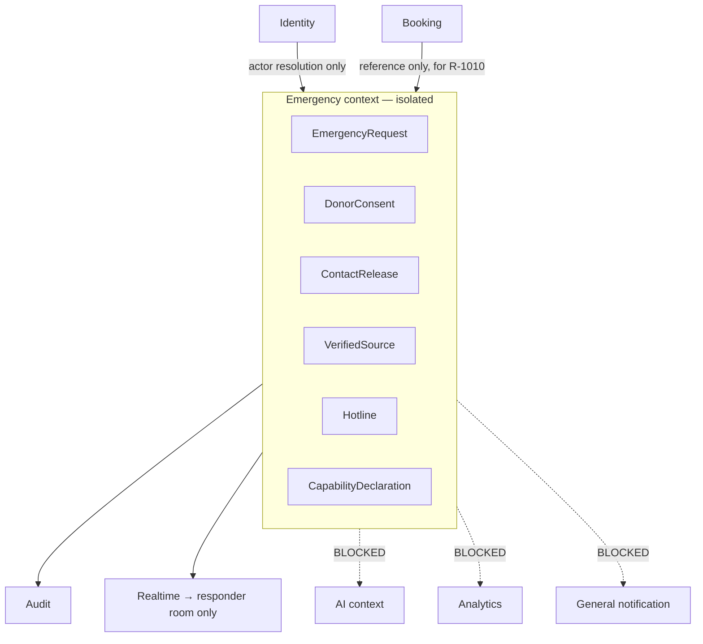
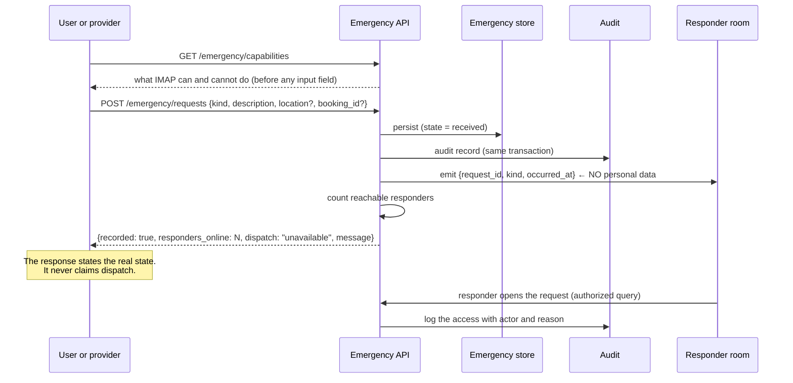
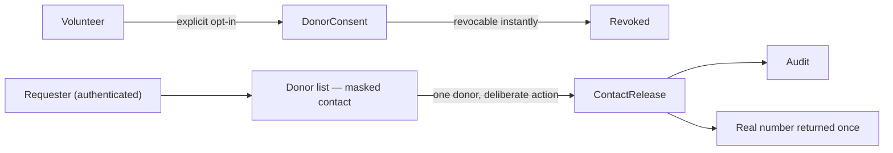

# IMAP 2.0 — Emergency Architecture

**Status:** PROPOSED · **Phase:** 2 · **Date:** 2026-08-09
**Product basis:** D-012, D-013, Constitution §P8, `PRD.md` §3.10 · **Decision:** AD-020

---

## 1. The governing constraint

> **IMAP has no emergency dispatch capability. The architecture must make it impossible to claim otherwise.**

This is not a stylistic preference. The Phase 0 audit found:

* four fabricated disaster alerts seeded into the production database, including a "critical" cyclone warning for Cox's Bazar, served publicly as live information;
* three more hardcoded in the client carrying instructions such as *"Evacuate coastal areas immediately"*;
* eight fabricated blood donors with phone numbers and GPS coordinates seeded as real volunteers;
* `POST /api/blood/request` writing a log line and replying *"Request sent to available donors"*;
* `POST /api/sos` replying *"SOS alert sent to admin & call center"* with no call centre in existence, while broadcasting the victim's name, phone number, GPS position and emergency type to **every connected socket including unauthenticated guests**.

Phase 0.5 contained all five. This architecture makes the class of defect structurally unreachable.

**The people most likely to act on a fabricated emergency claim are the most vulnerable users of the product.** That asymmetry is why this context gets stricter rules than anything else in the system.

---

## 2. Isolation (AD-020)

Emergency is a bounded context with its own storage, its own access rules and no dependencies flowing out of it.



| Rule | Enforcement |
|---|---|
| Nothing outside Emergency depends on Emergency state | No other module imports it |
| Emergency data is **Sealed** (`DATA-ARCHITECTURE.md` §6) | Never in AI context (R-1005), never in analytics, never in general notification payloads |
| Blocked subscriptions are enforced at registration | Not by handler discipline — a handler cannot subscribe to an emergency event unless it is in the responder allow-list |
| Emergency never blocks or alters a marketplace transition | A booking dispute and an emergency request are independent |

---

## 3. Capability declaration — data, not copy

The single most important structural idea in this document.

What IMAP can and cannot do in an emergency is **stored as data**, served by `GET /emergency/capabilities`, and rendered by the UI. It is not a string in a component that a redesign can quietly drop.

```
capability: emergency.dispatch
  state:        unavailable
  message_bn:   "IMAP জরুরি সেবা পাঠাতে পারে না।"
  message_en:   "IMAP cannot dispatch emergency services."

capability: emergency.record_request
  state:        available
  message_en:   "Your request is recorded and sent to the on-duty admin team."

capability: emergency.donor_notification
  state:        unavailable
  message_en:   "Automatic donor alerts are not available yet."

capability: emergency.official_alerts
  state:        unavailable
  message_en:   "IMAP does not publish official alerts. See the sources below."
```

**Consequences:**

1. A capability whose state is `unavailable` **has no state machine transition, no tool, and no API path that could claim it happened.** `dispatched` does not exist as a booking-side or emergency-side state (`STATE-MACHINES.md` §11).
2. The nine-state vocabulary (D-008) is fed from this table, so copy and behaviour cannot diverge.
3. Turning a capability on requires building it, not editing a string.

---

## 4. Emergency request flow



### 4.1 Response contract

```json
{
  "request_id": "01J8Z...",
  "state": "received",
  "recorded": true,
  "responders_online": 2,
  "dispatch": "unavailable",
  "message": { "bn": "...", "en": "Emergency request recorded and sent to the on-duty admin team." },
  "emergency_number": "999"
}
```

| Field | Why it exists |
|---|---|
| `responders_online` | The truthful answer to "did anyone see this?". Zero is reported honestly, with a prompt to call 999 |
| `dispatch` | Always `"unavailable"` while §3 says so. A client cannot render a dispatch claim |
| `emergency_number` | Present on every emergency response so the real route is never more than one tap away (R-1001) |

### 4.2 Provider in-booking emergency (R-1010)

A Gate-1 requirement and the strongest justification for the surface existing at all (`PERSONAS.md` P2 — providers, often women, working alone in strangers' homes).

| Aspect | Design |
|---|---|
| Trigger | One deliberate action from any provider surface during an `active`/`arrived` booking |
| Attached | `booking_id`, the customer's identity **as known to the platform**, current location |
| Routing | Responder room, with the booking reference so the responder can act |
| Location release | Permitted for the duration of the emergency; **every release is audit-logged with actor and reason** |
| Booking impact | **None automatically.** The booking is not cancelled by an emergency — that is a human decision |

---

## 5. Blood registry (D-013)

Designed as a **verified resource registry**, not a dispatch service.



| Rule | Detail |
|---|---|
| **Opt-in only** | A donor record exists only from an explicit consent action |
| **Revocable instantly** | `DELETE /emergency/blood/consent` takes effect immediately; no soft delete |
| **Contact is masked in listings** | `017••••••01`. Bulk harvesting is not possible |
| **Release is one donor at a time** | Authenticated, deliberate, and audit-logged with requester and purpose |
| **No automated notification exists or is implied** | The `donor_notification` entity is deliberately absent from the data model (D-013) |
| **A blood request is recorded, not dispatched** | Response reports `donors_notified: 0` — the true number — and directs the user to a hospital blood bank and 999 |
| **Demo data is impossible in production** | Seeding is gated to non-production and flagged `is_demo`; production reads exclude it |
| Classification | **Sealed.** Health-adjacent personal data belonging to volunteers |

---

## 6. Verified sources (D-012)

IMAP does not publish alerts. It signposts.

```
verified_source
  name           "Bangladesh Meteorological Department"
  authority      government
  url            ...
  verified_at    timestamp
  verified_by    principal (a named human)
  expires_at     re-verification due
```

| Rule | Detail |
|---|---|
| **Nothing is presented as information without a verified source** | A row with no `verified_at` cannot be served |
| Sources expire | Re-verification is scheduled; an expired source is shown as unverified, not silently trusted |
| Community reports may be stored | They are **never styled as warnings** — no red banner, no severity colour, no instruction language |
| Hotlines carry the same requirement (R-1009) | The numbers currently shipped (999, 10941, 16321) are plausible but **were never verified against an official source** — this remains an open risk carried from Phase 0.5 and is a Phase A task |
| First-party alerts | **Not modelled.** `disaster_alert` does not exist as an entity |
| Future | An official feed integration (D-012 alternative 1) would populate `verified_source`-backed alerts. Until then, signposting only |

---

## 7. Data handling

| Concern | Rule |
|---|---|
| Classification | **Emergency** — the strictest class (`DATA-ARCHITECTURE.md` §6) |
| AI access | **None, ever.** Not filtered at the prompt — never loaded (R-1005, R-706) |
| Analytics | Occurrence counts only. No content, no identity, no location |
| Logging | The fact of a request; never its content |
| Retention | Short and defined. Consent revocation deletes immediately |
| Location | Released only for an active emergency; every release logged |
| Access | Emergency-responder role only; each access logged with actor and reason |

---

## 8. Escalation limits — stated, not implied

IMAP's honest position, which the product surface must reflect:

| IMAP can | IMAP cannot |
|---|---|
| Record an emergency request with a timestamp | Dispatch police, fire or ambulance |
| Alert on-duty admins and report how many are reachable | Guarantee a response or a response time |
| Show verified emergency numbers | Verify the urgency of a request |
| Attach a booking and location for a provider in danger | Contact next of kin |
| Maintain an opt-in donor registry | Notify donors automatically |
| Signpost official disaster sources | Issue or relay official warnings |

**999 is the real emergency service.** It is the most prominent element on every emergency surface, before any input field (R-1001).

---

## 9. Anti-patterns forbidden

| Anti-pattern | Why |
|---|---|
| A `dispatched` state anywhere | It would be a lie in the schema |
| Claiming an outcome without server evidence | Constitution §P4 |
| `io.emit` for emergency alerts | The audited P0-8 defect: victim PII to every connected socket |
| Personal data in an emergency event payload | Payloads travel further than intended |
| Emergency data in AI context | R-1005 |
| Seeded demo donors or alerts reachable in production | The audited P0-10 defect |
| Community reports styled as warnings | A disclaimer does not undo a red CRITICAL banner |
| Unverified hotline numbers | R-1009 — currently an open risk |
| Automated blocking of repeated emergency requests | The false-positive cost is someone unable to get help. Rate-limit and flag for human review; never auto-block |
| Bulk donor contact exposure | The audited P1-2 defect |
| Capability statements as component copy | They must be data, so a redesign cannot drop them |

---

## 10. Quality gate

The Emergency gate in `SYSTEM-ARCHITECTURE.md` §11 passes only when all hold:

1. `GET /emergency/capabilities` is the source of every capability claim in the UI.
2. No state, tool or endpoint exists that could assert dispatch.
3. Emergency events carry no personal data.
4. Emergency data is structurally excluded from AI context — verified by test, not by review.
5. Every donor contact release is audit-logged with requester and purpose.
6. Every hotline and source has a `verified_at` and a named verifier.
7. Demo data cannot exist in production, verified by test.
8. 999 appears on every emergency surface before any input field.
