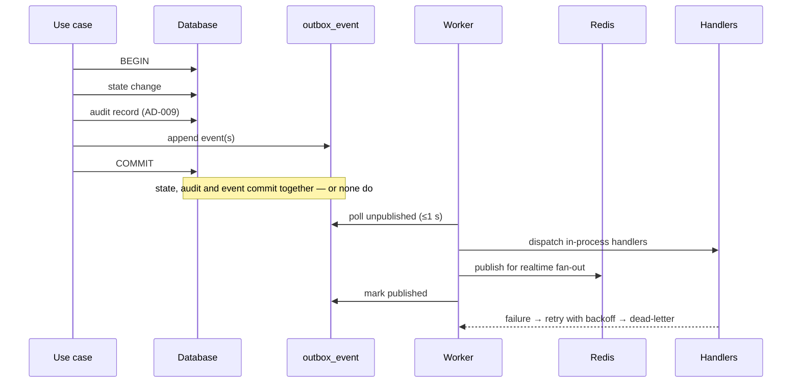
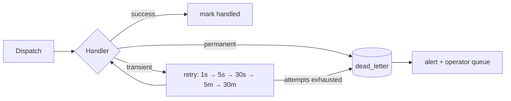

# IMAP 2.0 — Event Architecture

**Status:** PROPOSED · **Phase:** 2 · **Date:** 2026-08-09
**Decision:** AD-006 (transactional outbox), AD-016 (jobs)

---

## 1. Why events

Today, realtime is a side effect inside HTTP handlers (`req.app.get("io")` called from route code), so nothing else can react to a state change. Notifications, analytics, trust signals, AI context and the discovery projection all need to — and each one added as a direct call would deepen the coupling that the Phase 0 audit identified.

Events invert that: the domain records **what happened**; interested parties subscribe.

---

## 2. Transactional outbox (AD-006)



**The property that matters:** if the transaction commits, the event exists. If it rolls back, it does not. Dual-writing to a broker inside a transaction — the obvious-looking alternative — reproduces the audit's "balance credited, ledger row rejected" defect class in a new place.

**Delivery is at-least-once.** Every consumer must be idempotent. This is a hard requirement, not a recommendation.

---

## 3. Event envelope

```
event_id        UUIDv7          unique; the consumer dedup key
event_type      string          "booking.completed" — namespaced, versioned by suffix
event_version   int             1
occurred_at     timestamp       when the fact happened, not when it was published
aggregate_type  string          "booking"
aggregate_id    uuid
actor_principal uuid | null     who caused it; null for system-initiated
actor_via       enum            "http" | "ai" | "job" | "system"
correlation_id  uuid            end-to-end tracing (OBSERVABILITY.md §3)
causation_id    uuid | null     the event or command that caused this one
payload         json            minimal — ids and changed values only
```

**Payload rules:**

| Rule | Reason |
|---|---|
| Ids and changed values only — never whole rows | Payloads become an uncontrolled second copy of the model |
| **No Sensitive, Highly Sensitive, Financial or Emergency data** (`DATA-ARCHITECTURE.md` §6) | Events travel to analytics, logs and AI context; sensitive values must not go with them |
| No money amounts in non-financial events | A consumer needing the amount reads the ledger |
| Additive schema changes only within a version | Consumers must tolerate unknown fields |
| Breaking change ⇒ new event type (`booking.completed.v2`) | Both published during migration |

---

## 4. Event catalogue

`RT` realtime · `NT` notification · `TR` trust · `AN` analytics · `CX` AI context · `FN` finance · `DS` discovery projection

### Identity

| Event | Producer | Payload | Consumers | Notes |
|---|---|---|---|---|
| `identity.principal_registered` | Identity | principal_id, channel | AN, CX | |
| `identity.contact_verified` | Identity | principal_id, channel | TR, AN | Feeds R-410 |
| `identity.membership_granted` | Identity | principal_id, account_id, role, granted_by | AN, audit | Always audited |
| `identity.session_revoked` | Identity | principal_id, session_id, reason | RT | Disconnects sockets |
| `identity.account_closed` | Identity | principal_id | all | Triggers retention workflow |

### Catalog

| Event | Producer | Payload | Consumers | Notes |
|---|---|---|---|---|
| `catalog.service_published` | Catalog | service_id, category_id | DS, AN | |
| `catalog.service_deprecated` | Catalog | service_id | DS | Removes from new discovery |
| `catalog.graph_changed` | Catalog | changed_service_ids | DS | Rebuilds adjacency (AD-004) |

### Provider / Marketplace

| Event | Producer | Payload | Consumers | Notes |
|---|---|---|---|---|
| `provider.applied` | Provider | provider_id | NT (ops queue), AN | |
| `provider.listed` | Provider | provider_id, service_ids, area_ids | DS, AN | |
| `provider.paused` / `provider.resumed` | Provider | provider_id | DS | |
| `provider.capability_changed` | Provider | provider_id, capability_ids | DS, TR | |
| `provider.coverage_changed` | Provider | provider_id, area_ids | DS | |
| `provider.price_changed` | Provider | provider_id, service_id | DS | No amount in payload |
| `availability.changed` | Availability | provider_id, window_id | DS | |

### Discovery

| Event | Producer | Payload | Consumers | Notes |
|---|---|---|---|---|
| `need.expressed` | Discovery | need_id, channel, locale, area_id | AN, CX | Funnel entry (R-1108) |
| `need.understood` | Discovery | need_id, service_id, confidence, method, accepted | AN, CX | Intent accuracy measurement |
| `need.abandoned` | Discovery | need_id, reason | AN | **The most actionable dataset** (`KPI.md` §2) |

### Booking

| Event | Producer | Payload | Consumers | Ordering |
|---|---|---|---|---|
| `booking.quote_issued` | Pricing | quote_id, need_id, service_id, provider_id, expires_at | AN | |
| `booking.requested` | Booking | booking_id, quote_id, customer, provider, scheduled_start | RT, NT, DS, AN | **Per aggregate** |
| `booking.confirmed` | Booking | booking_id | RT, NT, AN, CX | Per aggregate |
| `booking.started` | Booking | booking_id | RT, NT | Per aggregate |
| `booking.provider_arrived` | Booking | booking_id | RT, NT | Per aggregate |
| `booking.work_reported_done` | Booking | booking_id, auto_confirm_at | RT, NT | Per aggregate |
| `booking.completed` | Booking | booking_id, service_id, provider_id, customer | **FN**, TR, NT, AN, CX, RT | **Per aggregate. Financially significant** |
| `booking.cancelled` | Booking | booking_id, cancelled_by, reason, stage | FN, TR, NT, AN, RT | Per aggregate |
| `booking.disputed` | Booking | booking_id, raised_by | FN (hold funds), NT, TR | Per aggregate |
| `booking.dispute_resolved` | Booking | booking_id, outcome | FN, TR, NT | Per aggregate |
| `message.sent` | Messaging | conversation_id, booking_id, sender | RT, NT | **Content is never in the payload** |

### Finance

| Event | Producer | Payload | Consumers | Notes |
|---|---|---|---|---|
| `payment.initiated` | Payment | payment_id, booking_id | AN | |
| `payment.captured` | Payment | payment_id, booking_id, reference | Booking, AN, NT | Booking marks itself paid **on this event**, not on a redirect |
| `payment.failed` | Payment | payment_id, reason_code | NT, AN | |
| `refund.issued` | Refund | refund_id, payment_id, reference | NT, AN, TR | |
| `finance.earnings_accrued` | Payout | claim_id, provider, booking_id | NT, AN | |
| `finance.commission_accrued` | Commission | booking_id, settlement_mode | AN | |
| `finance.payout_paid` | Payout | batch_id, claim_ids | NT, AN | |
| `finance.reconciliation_mismatch` | Reconciliation | kind, detail_ref | **Alert** | Pages finance |

### Trust

| Event | Producer | Payload | Consumers | Notes |
|---|---|---|---|---|
| `trust.review_published` | Review | review_id, booking_id, provider_id, rating | TR, DS, AN | |
| `trust.standing_changed` | Trust | provider_id, eligibility | DS, NT | Marketplace applies eligibility |
| `trust.provider_verified` | Trust | provider_id, level | DS, NT, AN | |
| `trust.provider_suspended` | Trust | provider_id, case_id | DS, NT, RT | Human-decided |
| `trust.appeal_resolved` | Trust | case_id, outcome | NT, AN | |

### AI

| Event | Producer | Payload | Consumers | Notes |
|---|---|---|---|---|
| `ai.task_proposed` | AI | task_id, intent, tool_names | AN | |
| `ai.tool_invoked` | AI | task_id, tool, tier, outcome, latency, cost | AN, audit | R-705 |
| `ai.task_completed` | AI | task_id, resulting_event_id | AN | **References the domain event that proves it** |
| `ai.task_failed` | AI | task_id, stage, reason_code | AN, alert | |

### Emergency — isolated (AD-020)

| Event | Producer | Payload | Consumers | Notes |
|---|---|---|---|---|
| `emergency.request_received` | Emergency | request_id, kind | **admin RT only** | **No personal data in the payload.** Recipients fetch details through an authorized query |
| `emergency.acknowledged` | Emergency | request_id, admin_id | RT | |
| `emergency.donor_contact_released` | Emergency | consent_id, requester_id | audit | Never to analytics |

**Emergency events do not reach AI context, analytics or general notification handlers.** The isolation is enforced at subscription registration, not by handler discipline.

---

## 5. Consumers

| Consumer | Subscribes to | Responsibility | Idempotency |
|---|---|---|---|
| **Realtime fan-out** | booking.*, message.*, emergency.* (admin) | Publish to authorized rooms | Natural — last write wins |
| **Notification** | booking.*, payment.*, trust.*, finance.* | Apply preferences, caps, quiet hours, dedup | `(event_id, principal_id, channel)` unique |
| **Trust signals** | booking.completed/cancelled/disputed, review.* | Append signals; trigger recompute | `source_event_id` unique |
| **Analytics** | Everything | Funnel and metric computation | `event_id` unique |
| **AI context** | booking.*, need.*, provider.* | Update Open-tier context | Upsert by (principal, kind) |
| **Discovery projection** | provider.*, catalog.*, availability.*, trust.standing_changed | Maintain `provider_service_area` | Upsert |
| **Finance** | booking.completed/cancelled/disputed | Post ledger transactions | **Deterministic reference under a unique constraint** |

---

## 6. Ordering

| Guarantee | Where |
|---|---|
| **Per-aggregate ordering** | Booking, payment and payout events are dispatched in `event_id` (UUIDv7, time-ordered) order per `aggregate_id` |
| **No global ordering** | Not needed; not provided |
| **Cross-aggregate** | Consumers must tolerate arrival order. `booking.completed` may arrive before `payment.captured` |
| **Causation** | `causation_id` reconstructs the chain for debugging |

Per-aggregate ordering is achieved by the dispatcher processing one aggregate's backlog serially. At MVP volume a single dispatcher suffices; at scale, partitioning by `aggregate_id` preserves the guarantee.

---

## 7. Retry and dead-letter



| Rule | Detail |
|---|---|
| Per-consumer retry state | One failing consumer never blocks another |
| Errors classified | Transient (retry) vs permanent (dead-letter immediately) |
| Dead-lettered events are **replayable** after a fix | With the same idempotency guarantees |
| **Financial consumer failures alert immediately** | They do not wait for retry exhaustion |
| Dead-letter depth is a monitored metric | A non-zero steady state is a defect |

---

## 8. Event vs job (AD-016)

Different concepts, one durable mechanism.

| | Event | Job |
|---|---|---|
| Means | "This happened" | "Do this" |
| Producer | Domain, in-transaction | Anything |
| Consumers | Many, unknown to the producer | One |
| Failure | Retried per consumer | Retried, then dead-lettered |
| Example | `booking.completed` | `send_push(notification_id)` |

An event handler that needs to do slow or external work **enqueues a job**; it does not perform the work inline. This is what prevents a slow SMS gateway from delaying trust-signal processing.

---

## 9. Anti-patterns forbidden

| Anti-pattern | Why |
|---|---|
| Publishing outside the transaction | Loses the atomicity that justifies the pattern |
| Dual-write to a broker inside a transaction | Not atomic; produces exactly the audit's defect class |
| Fat payloads carrying whole entities | An uncontrolled second copy of the model |
| Sensitive data in payloads | Events reach analytics, logs and AI context |
| Non-idempotent consumers | Delivery is at-least-once |
| Events as an RPC substitute | Needing a reply means calling a query, not emitting an event |
| Consumer chains 3+ deep | Untraceable; use `causation_id` and keep chains shallow |
| Silent handler failure | `.catch(() => {})` — the current behaviour at 20+ sites |
| Emergency events on general channels | AD-020 isolation |

---

## 10. Evolution

| Trigger | Change |
|---|---|
| Dispatch latency exceeds `N-05` (3 s p95) | Multiple dispatchers partitioned by `aggregate_id` |
| Analytics volume affects primary DB writes | Analytics consumer moves to its own store first, then its own process |
| A consumer needs independent scaling | Extract that consumer only — producers unchanged |
| Cross-service consumers appear | Swap the dispatcher transport to a broker; producers and consumers unchanged (the point of AD-006) |
| Event volume outgrows a polled table | Change detection or a log-based approach; the envelope is unchanged |
