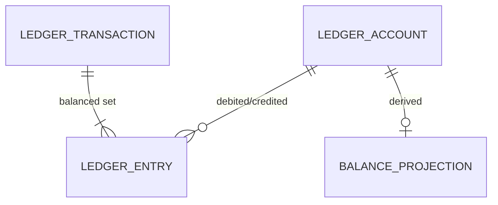
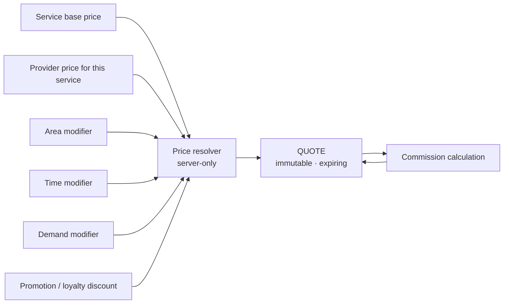

# IMAP 2.0 — Financial Architecture

**Status:** PROPOSED · **Phase:** 2 · **Date:** 2026-08-09
**Decisions:** AD-007 (double-entry ledger), AD-008 (minor units), AD-010 (idempotency), AD-019 (legally-gated)
**Product basis:** D-009, D-010, D-011 · `docs/product/BUSINESS-MODEL.md`

---

## 1. The rule this architecture exists to enforce

> **The server computes every money value. The client expresses intent and nothing else.**

The Phase 0 audit found the opposite everywhere: booking `amount` and `platform_fee` read from the request body; a negative fee turning an "atomic deduction" into a credit; repeat completion paying a provider unboundedly; an unconfigured gateway crediting wallets for free; a mutable `users.balance` column written from seven code paths with a side log that could not reconstruct it.

Phase 0.5 contained those defects. This architecture makes them **structurally impossible** rather than individually patched.

---

## 2. Money representation (AD-008)

```
Money = { amount_minor: BIGINT, currency: CHAR(3) }
```

* BDT minor unit is poisha (1/100). `৳850.00` is `{ amount_minor: 85000, currency: "BDT" }`.
* No floating point anywhere in a money path.
* No implicit currency. `৳` is a *display* decision made by the locale layer, never embedded in data or logic.
* API money fields are always the object form. A bare number is never a money value.
* Arithmetic is integer-only; allocation uses largest-remainder so split amounts always re-sum exactly.

**Migration.** `DECIMAL(12,2)` → `BIGINT` minor units in a single migration with a verification query proving the round-trip. Detailed in `MIGRATION-STRATEGY.md` §6.

---

## 3. Ledger model (AD-007)

Double-entry, append-only. Every movement has balanced debits and credits.

### 3.1 Account types

| Account kind | Owner | Normal balance | Meaning |
|---|---|---|---|
| `customer_receivable` | Customer account | Debit | Owed by a customer (unpaid cash booking) |
| `gateway_clearing` | Platform | Debit | Funds with the gateway, not yet settled |
| `platform_cash` | Platform | Debit | Settled platform funds |
| `provider_payable` | Provider account | **Credit** | **Earnings owed to a provider by the platform** — this is what `users.balance` becomes (D-010, R-607) |
| `commission_revenue` | Platform | Credit | Platform revenue (D-009) |
| `provider_receivable` | Provider account | Debit | Commission owed *by* a provider on a cash booking |
| `refund_liability` | Platform | Credit | Refunds owed but not yet executed |
| `promotional_expense` | Platform | Debit | Discounts and goodwill credits funded by the platform |
| `customer_liability` | — | Credit | **Defined in the taxonomy; NOT issuable in code** (AD-019, D-010). Exists so that a licensed stored-value product is a data change, not a redesign |

### 3.2 Structure



| Field | Notes |
|---|---|
| `ledger_transaction.reference` | **UNIQUE.** Deterministic, e.g. `booking:<id>:payout`. The idempotency backbone |
| `ledger_transaction.kind` | `capture`, `payout`, `commission`, `refund`, `adjustment`, `reversal` |
| `ledger_entry.direction` | `debit` \| `credit`. `amount_minor` is always positive; direction carries meaning |
| `ledger_entry` | **Immutable.** No update, no delete |

### 3.3 Invariants

1. Σ debits = Σ credits, per transaction. Enforced in the domain before the write.
2. All entries in a transaction share one currency.
3. `amount_minor > 0` on every entry.
4. Corrections are **new reversing transactions** referencing the original, never edits.
5. A transaction is written whole, inside one database transaction, or not at all.

---

## 4. Worked flows

### 4.1 Digital payment for a booking

```
1. QuoteIssued           service 800.00 · commission 10% = 80.00 · total 880.00
2. PaymentCaptured       DR gateway_clearing        88000
                         CR customer_settlement*    88000
3. BookingCompleted      DR customer_settlement*    88000
                         CR provider_payable         80000
                         CR commission_revenue        8000
4. Settlement            DR platform_cash           88000
                         CR gateway_clearing        88000
5. PayoutPaid            DR provider_payable        80000
                         CR platform_cash           80000
```

`customer_settlement` is a transient platform holding account, not customer stored value — it holds funds only between capture and completion.

### 4.2 Cash-on-completion (`BUSINESS-MODEL.md` §3.2 option B)

The commercially hard case, and the one that must not be fudged.

```
1. BookingCompleted (cash)   DR provider_receivable     8000   (commission owed BY the provider)
                             CR commission_revenue      8000
2. Later digital booking     ... provider_payable credited as usual ...
3. Payout netting            DR provider_payable        8000
                             CR provider_receivable     8000
```

**Requirements:**
* An accrued-debt cap per provider; exceeding it pauses new cash bookings, not the provider's listing.
* A settlement path for providers who only ever take cash — otherwise the debt grows unrecoverable.
* The provider's earnings surface shows the accrued commission explicitly (R-904). It must never appear as an unexplained deduction.

### 4.3 Refund

```
RefundIssued   DR refund_liability   40000
               CR gateway_clearing   40000
(and reversing the original allocation)
DR provider_payable   36000
DR commission_revenue  4000
CR refund_liability   40000
```

Reference `booking:<id>:refund:1` — a second attempt with the same reference violates the unique constraint and rolls back.

### 4.4 Balance projection

`balance_projection(account_id, balance_minor, as_of_entry_id)`.

* **Derived, never authoritative.** Rebuildable from `ledger_entry` alone.
* Updated in the same transaction as the entries.
* A nightly reconciliation job recomputes every projection from entries and alerts on any divergence — the check that `users.balance` could never pass.

---

## 5. Pricing architecture



### 5.1 Resolution order

```
1. provider_price for (provider, service)   ← primary
2. service.base_price                       ← fallback
3. FAIL CLOSED (409)                        ← never a client value
```

Step 3 is the Phase 0.5 behaviour, retained: a booking with no resolvable server price is refused, not priced by the caller.

### 5.2 Price models (R-305)

| Model | Behaviour | Quote |
|---|---|---|
| **Fixed** | Scope fully defined | Total known before booking |
| **From-price** | "From ৳500" — final depends on findings | Minimum shown; revision permitted with approval |
| **Inspection-then-quote** | Inspection fee upfront, quote after diagnosis | Two quotes; work does not proceed until the second is approved (R-306) |

### 5.3 Quote

| Property | Rule |
|---|---|
| Immutable | A change produces a new quote |
| Expiring | `expires_at` mandatory; an expired quote cannot be booked |
| Itemised | `quote_component` rows make the total explainable (`base`, `area`, `time`, `promotion`, `commission`) |
| Referenced | A booking carries `quote_id`. **The request carries no amount** — this is where P0-3 becomes impossible |
| Server-issued | Only the pricing domain writes quotes |

### 5.4 The nine-state vocabulary applied to money (D-008)

| Label | Means | Evidence |
|---|---|---|
| **Estimated** | Indicative range; nothing reserved | Model or heuristic output |
| **Quoted** | A specific server-issued price, valid until a stated time | `quote` row |
| **Confirmed** | The customer approved this quote | Booking references it |
| **Paid** | Gateway confirmed and the ledger posted | `PaymentCaptured` |
| **Refunded** | Reversal executed and confirmed | `RefundIssued` |
| **Pending** | Awaiting a gateway or party outcome | Payment state |
| **Failed** | Attempted, did not succeed, nothing charged | Payment state + explicit copy |

An AI price estimate is **Estimated** and can never be labelled Confirmed (Constitution §4, Tier A).

---

## 6. Idempotency (AD-010)

Two independent layers. Either would help; both are cheap; together they cover different failures.

### Layer 1 — client idempotency keys

| Aspect | Rule |
|---|---|
| Scope | All mutating endpoints; **mandatory** for payment, booking creation, refund, payout |
| Key | Client-generated UUID in `Idempotency-Key` |
| Storage | `idempotency_key(key, scope, principal_id, request_hash, response, expires_at)` |
| TTL | 24 h for booking; 7 days for financial operations |
| Replay | Same key + same request hash → stored response returned, side effects not repeated |
| Conflict | Same key + different hash → `409 IDEMPOTENCY_KEY_REUSED` |
| In flight | Same key while processing → `409 REQUEST_IN_PROGRESS` |

### Layer 2 — deterministic domain references

| Effect | Reference |
|---|---|
| Provider payout | `booking:<id>:payout` |
| Commission accrual | `booking:<id>:commission` |
| Payment capture | `payment:<id>:capture` |
| Refund | `booking:<id>:refund:<seq>` |
| Cancellation refund | `booking:<id>:cancel-refund` |

Under a unique constraint. A duplicate insert fails the transaction rather than double-crediting — even if the caller is buggy and even if the state guard were somehow bypassed.

### Layer 3 — guarded state transitions

Every financial effect is triggered by a conditional update on the state machine (`STATE-MACHINES.md`), with `affectedRows` checked. Three independent mechanisms protect the same defect class, because it is the defect class that cost the most in Phase 0.

---

## 7. Reconciliation

| Reconciliation | Frequency | Compares | Action on mismatch |
|---|---|---|---|
| **Balance integrity** | Nightly | `balance_projection` vs recomputed from entries | Alert; projection rebuilt from entries |
| **Transaction balance** | Continuous | Σ debits = Σ credits per transaction | Reject at write; alert if found at rest |
| **Gateway settlement** | Daily | Gateway settlement report vs `gateway_clearing` | Finance queue; never auto-adjusted |
| **Booking ↔ ledger** | Daily | Completed bookings vs payout + commission entries | Alert on any completed booking with no financial effect |
| **Commission owed vs collected** | Weekly | Accruals vs collections, including cash | Feeds `KPI.md` §5 collection rate |
| **Payout execution** | Per batch | Batch total vs sum of claims | Batch held; never partially executed |

**Every reconciliation writes a record.** A reconciliation that runs and reports nothing must still leave evidence it ran.

---

## 8. Payment integration

| Rule | Detail |
|---|---|
| **The gateway is not the source of truth** (brief §44) | The gateway confirms; IMAP's ledger records. Divergence is a reconciliation item, not an overwrite |
| **Server-to-server validation only** | A callback is validated with the gateway before any state change |
| **Amount reconciliation** | Gateway-reported vs stored; mismatch ⇒ refuse, alert, no ledger movement |
| **IPN is the only crediting path** | Redirect endpoints redirect; they are public and unauthenticated |
| **Unconfigured gateway in production ⇒ 503** | Never a mock settlement (P0-12) |
| **Adapter behind a port** | `PaymentGateway` interface; SSLCommerz is one adapter. A second market or provider is a new adapter |
| **No raw gateway payloads stored wholesale** | Reference + the fields needed for reconciliation |

---

## 9. Commission (D-009)

| Aspect | Design |
|---|---|
| Basis | Percentage of the service amount on **completed** bookings |
| Configuration | Server-side, versioned, audit-logged. Currently `PLATFORM_FEE_PCT`, default `0` — **launching with this unset means launching with no revenue** |
| Rate changes | Never retroactive. A quote locks the rate at issue time; `quote_component` records the rate applied |
| Visibility | Shown to the customer in the itemised total (`M3`) and to the provider as gross/commission/net (R-904) |
| Cash bookings | Accrued as `provider_receivable` (§4.2) |
| Refunds | Commission is reversed proportionally |
| Changing the rate | Tier C — never AI (Constitution §4) |

---

## 10. Legally-gated capabilities (AD-019)

| Capability | Status | Architectural treatment |
|---|---|---|
| **Customer stored value** | D-010 — withdrawn, **legal sign-off outstanding** | `customer_liability` exists as an account *kind* in the taxonomy. **No code path issues one.** No top-up endpoint, no balance-spend path. Activation after licensing = new account instances + a use case, not a redesign |
| **Own-book lending** | D-011 — withdrawn, **legal sign-off outstanding** | **No lending entities at all.** No loan, schedule, repayment or rate in the model. Deliberately absent so nobody can wire it up |
| **Licensed-partner referral** | FUTURE | The only IMAP-side artefact would be a `referral` record. IMAP never models the loan. Underwriting, disbursement and collection stay with the partner |
| **Promotional credit** | FUTURE, legal-dependent | Would use `promotional_expense` → a non-withdrawable, non-transferable credit. Requires the same legal review as D-010 |

**Neither D-010 nor D-011 is behind a feature flag.** A flag implies the code is safe to enable, and flag-gated unsafe behaviour is precisely how mock payment settlement reached production in Phase 0.

---

## 11. Failure and recovery

| Failure | Behaviour |
|---|---|
| Gateway timeout on initiate | Payment stays `initiated`; a reconciliation job resolves against the gateway; the customer sees **Pending**, never Failed |
| Callback arrives twice | Unique reference on the ledger transaction; second is a no-op returning the prior result |
| Callback never arrives | Poller queries the gateway for pending payments older than a threshold |
| Amount mismatch | Refuse; alert; finance queue. **Never auto-adjust** |
| Ledger write fails mid-transaction | Whole transaction rolls back — nothing partially applied |
| Payout transfer fails | Claim returns to `payable`; reversing entry posted; retried in the next batch |
| Refund rejected by gateway | `refund_failed` → bounded retry → `manual` with a finance case |
| Balance projection drifts | Rebuilt from entries; entries are never adjusted to match a projection |
| Double-spend attempt | Guarded conditional update loses the race; unique reference fails the insert |

---

## 12. Money-path security

| Control | Rule |
|---|---|
| Client authority | **None.** A request may carry a `quoteId`, never an amount |
| Validation | Every money input parsed as a bounded non-negative integer; `NaN`, `Infinity`, negatives and over-cap values rejected at the boundary (the Phase 0.5 `money.js` rule, generalised) |
| Authorization | Every financial use case declares an explicit policy; a use case with no policy fails at startup |
| AI | Tier B may *prepare* a payment proposal; it can never commit. Moving platform funds and changing fee configuration are Tier C — no tool exists |
| Audit | Every financial operation writes an audit record in the same transaction (AD-009) |
| Separation of duties | The role that approves a refund is not the role that executes a payout batch (`DOMAIN-ARCHITECTURE.md` §6) |
| Rate limiting | Payment initiation is rate-limited per principal, independently of the general limiter |

---

## 13. What the architecture does not do

| Not built | Why |
|---|---|
| Multi-currency settlement | BDT only at launch; the model carries currency so it is not blocked (`I-01`) |
| Escrow as a regulated product | Held funds are a platform liability under the marketplace model, not a licensed escrow service. **Legal review required if ever marketed as escrow** |
| Instant payouts | Requires working capital and a fraud model |
| Tax computation | No VAT/tax obligation is modelled. **Flagged for legal review** — marketplace VAT treatment in Bangladesh is not something to assume |
| Provider invoicing | FUTURE (R-909) |
| Chargeback handling | Card chargebacks need a defined process before card payments scale |

---

# Phase 2.75 amendment — binding corrections

**Date:** 2026-08-09 · **Closes:** V-03, V-04, O-02, O-03
Where this section conflicts with anything above it, **this section wins.**

## A1 — V-03: the tenth account kind

`§4.1` steps 2–3 post to `customer_settlement`, which does not appear in the `§3.1`
taxonomy. An implementer would have to invent it. Before adding an account, the
question asked in Phase 2.75 §20 was whether an existing one could carry the flow:

| Candidate | Verdict |
|---|---|
| Post capture straight to `provider_payable` + `commission_revenue` | **No.** The provider has not earned it until completion. This makes unearned funds withdrawable and recognises revenue early — the same defect class as the free-balance-at-signup finding |
| `refund_liability` | **No.** That account means *refunds decided and owed*. Overloading it destroys the only signal finance has |
| `platform_cash` | **No.** Implies the funds are the platform's own. They are not, until completion |
| `customer_liability` | **No, and dangerous.** That kind is the non-issuable stored-value placeholder held for D-010 (AD-019). Routing every booking payment through it means the platform issues customer stored value on every transaction — the exact regulated activity D-010 withdraws pending legal sign-off |
| `gateway_clearing` | **No.** Tracks funds *at the gateway*. After capture the obligation exists regardless of settlement timing; conflating them hides settlement lag |

A distinct account is genuinely required. **Renamed** on adoption:

| Account kind | Owner | Normal balance | Meaning |
|---|---|---|---|
| `booking_clearing` | Platform (Finance) | **Credit** | Funds captured for a specific booking, not yet allocated. Released to `provider_payable` + `commission_revenue` on completion, or to `refund_liability` on cancellation |

The name `customer_settlement` is withdrawn. The word "customer" invited precisely
the confusion this finding is about: **these are not customer funds in any spendable
sense.** They cannot be withdrawn, transferred, or applied to another booking. They
are platform-held funds earmarked to one booking. Replace `customer_settlement` with
`booking_clearing` in `§4.1`.

Constraints:
* balance per `booking_clearing` sub-account is zero once the booking reaches a terminal state — a non-zero balance on a terminal booking is a reconciliation alert (`§7`);
* it is never presented to a customer as a balance;
* `customer_liability` remains defined and non-issuable. **The two must never be merged.** Merging them silently enables a legally gated capability.

## A2 — V-04: refund entry ordering

`§4.3` shows the settlement leg before the recognition leg, so `refund_liability` is
debited before anything credits it. The obligation must be recognised before it is
discharged. Corrected order:

```
1. RefundApproved   — recognise the obligation, reverse the allocation
                      DR provider_payable      36000
                      DR commission_revenue     4000
                      CR refund_liability      40000
                      reference: booking:<id>:refund:1:recognition

2. RefundExecuted   — discharge it, once the gateway confirms
                      DR refund_liability      40000
                      CR gateway_clearing      40000
                      reference: booking:<id>:refund:1:settlement
```

Two references, not one: approval and execution are separated in time and can fail
independently. A refund approved but not yet executed is a real, reportable liability,
and with a single reference it was invisible. `refund_failed` (`§11`) returns to state
1 having already recognised the obligation, which is correct.

## A3 — O-02: booking payment status has one owner

**Payment is authoritative.** `booking.payment_status` is a **read-model column**,
written only by the `payment.captured` / `payment.failed` / `refund.issued` handlers
and never by a booking use case. It is rebuildable from Payment state, and `§7`
reconciliation compares the two; divergence is an alert, and Payment wins.

**Cash settlement produces a `Payment` record** with `method = cash`, state `captured`,
at completion. Without this, cash bookings would have no Payment row to derive from and
Booking would need its own authority — reintroducing the duplicate-authority defect by
a side door. One payment concept, one owner.

## A4 — O-03: dispute state and held funds

* **Booking owns the dispute.** It transitions to `disputed` and publishes `booking.disputed`.
* **Finance owns the hold.** It applies the hold on that event. A Booking use case never writes a payout claim.
* **The race is closed by re-reading, not by ordering.** Payout batch clearance re-reads dispute state at batch time rather than trusting the claim's `held` flag alone — the same belt-and-braces reasoning as the three-layer idempotency in `§6`.
