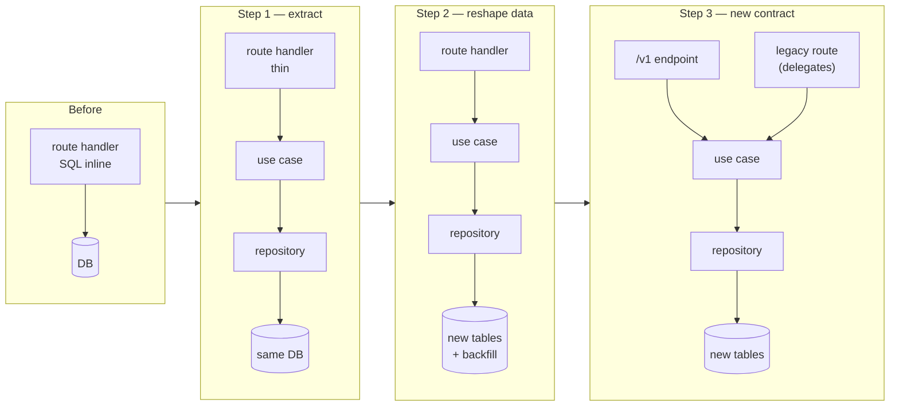
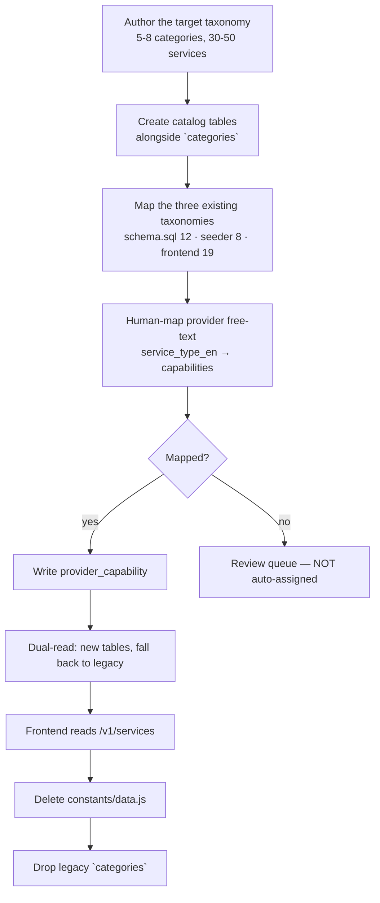
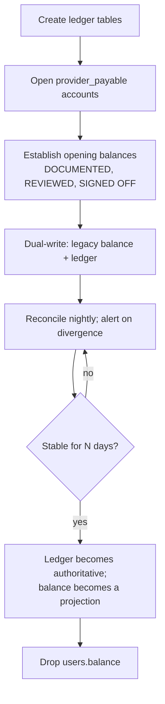

# IMAP 2.0 — Migration Strategy

**Status:** PROPOSED · **Phase:** 2 · **Date:** 2026-08-09
**Mapping:** `CURRENT-TO-TARGET.md` · **Sequencing:** `docs/product/ROADMAP.md`

---

## 1. Principle

> **Never rewrite everything. Strangle the old system route by route, behind an unchanged contract, with the ability to stop at any point.**

The system is deployed and has users. A big-bang rewrite would mean a long period with no shippable state and no way to attribute a regression — on a codebase whose safety net is 31 tests.

**Every step below satisfies four conditions:**

1. **Shippable** — the system works at the end of it.
2. **Reversible** — a feature flag, a revert, or a documented rollback.
3. **Observable** — a measurable signal proves it worked.
4. **Bounded** — days, not months.

---

## 2. The strangler pattern applied



**The legacy route keeps working until its last caller is gone.** It becomes a thin delegate to the same use case, so both paths share one implementation — which is the property that makes divergence impossible.

---

## 3. Sequencing

Follows `ROADMAP.md` phases. Each migration step names its **stop condition** — the point at which it can be abandoned without leaving the system broken.

### Step 0 — Guardrails (before any migration)

| Action | Why |
|---|---|
| Backend CI running the existing 31 tests, gating deploy (R-1105) | Today the backend autodeploys untested |
| Boundary lint rules (AD-001 §4.2) | Boundaries decay without tooling — the observed failure mode |
| Config validation at boot | Five env-var mismatches silently degraded features |
| Error tracking (R-1106) | Migration failures must be visible |
| Bundle-size budget in CI | Prevents the consumer bundle regressing during frontend work |

**Stop condition:** none — this is preparation. **Nothing else starts until it is done.**

---

### Step 1 — Platform foundation (Roadmap Phase B)

| Sub-step | Approach | Reversible? |
|---|---|---|
| **Audit log** | New table; `withTransaction` already exists (Phase 0.5). Write from each use case as it is extracted | Yes — additive |
| **Outbox** | New table + dispatcher in the worker. Existing `io.emit` calls stay until their event has a consumer | Yes — additive |
| **Worker process** | New process, same codebase. Starts with zero jobs | Yes |
| **Redis** | Cache and OTP behind an interface with a dual-read window: write both, read Redis, compare, then drop the `Map` | Yes |
| **Object storage** | New uploads go to R2; existing base64 rows backfilled by a job; read path tries the reference first, falls back to the column, then the column is dropped | Yes |
| **Idempotency** | New table + middleware. Applied endpoint by endpoint | Yes |
| **Authorization kernel** | New kernel; each route opts in as it is extracted. `requireRole` remains until the last caller migrates | Yes |

**Stop condition:** the audit log and outbox exist and are populated. Everything downstream depends on them; nothing downstream should start before they do.

---

### Step 2 — Service Graph (Roadmap Phase C)

The highest-risk data migration, because three conflicting taxonomies must become one.



| Rule | Reason |
|---|---|
| **Providers are mapped by a human, never auto-assigned** | An auto-mapped capability is a false claim about what someone can do |
| Unmapped providers go to a review queue and stay listed under their existing free-text description until resolved | Do not empty the directory |
| `constants/data.js` is deleted only after every consumer has a real empty state | Deleting it first turns a fallback into a crash |
| Availability is rebuilt, not migrated | Free-text dateless slots contain nothing worth preserving; providers re-enter availability during onboarding to the new model |

**Stop condition:** the new catalogue serves discovery and the frontend no longer imports `constants/data.js`. If the project stopped here, IMAP would have one real taxonomy — already a large improvement.

---

### Step 3 — Ledger (Roadmap Phase B/D)

The most delicate migration, because the existing data cannot fully justify itself.



**The honest problem.** `wallet_transactions` cannot reconstruct `users.balance`: the audit found a ৳500 signup default with no ledger row, credits lost to an enum mismatch, and money moved outside transactions. **Opening balances are therefore an accepted, documented, human-signed-off exercise — not a computation.** Pretending they can be derived would be exactly the kind of fabrication this project is correcting.

| Rule | Detail |
|---|---|
| Opening balance entries carry a distinct `kind = "opening_balance"` and a reference to the sign-off | Permanently distinguishable from earned money |
| Customer balances are settled or refunded, not migrated | D-010 removes customer stored value |
| Dual-write runs until nightly reconciliation is clean for a stated period | Divergence must go to zero before cutover |
| The projection is rebuilt from entries; entries are **never** adjusted to match a projection | AD-007 |

**Stop condition:** ledger is authoritative and reconciles. Rollback during dual-write is trivial; after cutover it is not — which is why the dual-write window is not shortened.

---

### Step 4 — Route extraction (Roadmap Phase D)

Per route, in dependency order. The mechanical pattern:

```
1. Write a use case with the handler's logic — no behaviour change
2. Handler delegates to it; tests still pass
3. Add the authorization policy declaration
4. Add audit + outbox writes inside the transaction
5. Add idempotency where mutating
6. Move SQL into a repository
7. Add a /v1 endpoint calling the same use case
8. Migrate frontend callers
9. Delete the legacy route when its last caller is gone
```

**Order** (dependency-driven, not by size):

`identity` → `catalog` → `provider` → `availability` → `pricing` → `booking` → `finance` → `trust` → `messaging` → `notification` → `admin`

`ai`, `emergency`, `promos` and `loans` are handled separately (§7).

**Stop condition after each route:** the system works with a mix of migrated and legacy routes. This is the property that makes the migration abandonable at any point.

---

### Step 5 — Frontend decomposition (Roadmap Phase D)

The largest single item, and the one most likely to be underestimated.

| Sub-step | Approach | Reversible? |
|---|---|---|
| **Introduce routing** | Add a router around the existing `page`-key switch; each key becomes a route. **Behaviour unchanged** | Yes |
| **Extract route by route** | One route → one feature module. `App.jsx` shrinks monotonically | Yes, per route |
| **Real empty/error states** | Added *before* the corresponding fallback constant is deleted | Yes |
| **Delete fallbacks** | Only after empty states exist and are verified | Yes, per constant |
| **Split admin** | `apps/admin` as a separate build; Ant Design leaves the consumer bundle | Yes |
| **Design system** | `packages/ui` grows as components are extracted; inline styles are replaced where touched, not globally | Yes |

**Rule:** `App.jsx` never grows. Every change to it removes lines. A pull request that adds to it is rejected.

**Stop condition:** each extracted route works. A half-migrated frontend is a normal state, not a broken one.

---

### Step 6 — AI layer (Roadmap Phase E)

Built new alongside the existing endpoints; it does not migrate them.

| Sub-step | Reversible? |
|---|---|
| `LLMClient` abstraction; existing chat routes move behind it | Yes |
| Tool runtime with Tier A read tools only | Yes |
| Intent understanding, shadow-mode: computed and logged, **not shown**, measured against the labelled set | Yes — nothing user-visible |
| Intent shown once accuracy ≥85% | Yes — flag |
| Tier B proposal + confirmation | Yes |
| Rule-based scorers relocated to `discovery/ranking` and `trust/risk`, invoked server-side | Yes |
| Legacy `/api/ai/*` endpoints removed after clients migrate | Yes |

**Shadow mode is the key technique.** The intent layer runs against real traffic and is measured before it is trusted with a user-visible decision.

**Stop condition:** the structured path is unaffected throughout (D-007), so the AI layer can be abandoned at any point without touching the core loop.

---

## 4. Data migration principles

| Principle | Detail |
|---|---|
| **Expand → migrate → contract** | Add new structure; dual-write; backfill; verify; switch reads; remove old |
| **Never destructive in one step** | A column is dropped in a later migration than the one that stops using it |
| **Every backfill is idempotent and resumable** | Re-runnable after a failure |
| **Every migration has a verification query** | Row counts, sums, referential integrity — run and recorded |
| **Reversible where practical, and named where not** | Dropping a column is not reversible; that step is called out and gated |
| **Backup before every destructive step** | Stated in the runbook, not assumed |
| **Migration 002 has still not run against a live database** | Carried open risk from Phase 0.5. `npm run db:migrate:status` before anything else |

---

## 5. Taxonomy reconciliation

The three sources and their fate:

| Source | Rows | Fate |
|---|---|---|
| `schema.sql` seed | 12 categories, INT ids, slugs `electrician`, `plumber`… | Mapped into the new catalogue where a real service exists behind it |
| Seeder (`server.js` / `scripts/seedDemo.js`) | 8, string ids, slugs `electrical`, `plumbing`… | **Never inserted** — string ids into an `INT AUTO_INCREMENT` PK, error swallowed. Discarded |
| `frontend/src/constants/data.js` | 19, numeric ids, fabricated counts summing to 2,142 | **This is what users see.** Names are input to the new taxonomy; counts are discarded as fabricated |

Bookings referencing a legacy category keep a `legacy_category_ref` so historical reporting stays coherent.

---

## 6. Money representation migration (AD-008)

`DECIMAL(12,2)` → `BIGINT` minor units.

```
1. Add *_minor columns alongside
2. Backfill: amount_minor = ROUND(amount * 100)
3. Verify: SUM(amount)*100 = SUM(amount_minor) exactly, for every table
4. Dual-write both for one release
5. Switch reads to *_minor
6. Drop the DECIMAL columns
```

Step 3 must be **exact**. A single-poisha discrepancy means a rounding assumption is wrong and the migration stops.

---

## 7. Feature-specific handling

| Feature | Handling |
|---|---|
| **`loans`** (D-011) | Endpoints return 410; UI removed. **Existing applications and any disbursed amounts need a business-owned wind-down plan** — engineering cannot decide what happens to outstanding balances. Data retained under statutory retention; no new applications |
| **Customer wallet** (D-010) | Top-up disabled first; existing customer balances **settled or refunded**, not migrated into the ledger as liabilities. Requires a communication plan |
| **`promos`** | Frozen. Seeded fabricated `used_count` values (up to 1,890) are not migrated |
| **`blood`** | Consent records migrate; **demo donors are deleted, not migrated** |
| **`disaster`** | Seeded fabricated alerts are deleted. `verified_source` starts empty and is populated only with verified entries |
| **`sos`** | Migrates as-is; gains R-1010 |
| **Loyalty points** | Earning paused at cutover; existing balances honoured when R-611 lands. **This gap must be communicated, not silently dropped** (`PRD.md` R-611) |

---

## 8. Risk register

| Risk | Likelihood | Impact | Mitigation |
|---|---|---|---|
| Ledger opening balances are wrong | **High** | **High** | Documented, human-reviewed, signed-off; distinct entry kind; dual-write and reconciliation before cutover |
| Provider capability mapping is wrong | Medium | High | Human mapping; review queue; providers confirm their own capabilities during onboarding |
| Frontend decomposition stalls half-done | **High** | Medium | Route-by-route with a monotonic-shrink rule on `App.jsx`; each route independently shippable |
| Deleting fallback constants breaks surfaces | Medium | Medium | Empty states land first; deletion is per-constant |
| Migration 002 fails on live TiDB | Medium | High | Untested against production. Status check + backup + rehearsal on a restored copy |
| Legacy and new routes diverge | Medium | High | The legacy route delegates to the same use case — there is only one implementation |
| Dual-write windows never close | Medium | Medium | Each has an explicit exit criterion and an owner |
| Availability rebuild loses provider setup | Low | Medium | Providers re-enter availability during onboarding; the old data is not worth preserving |
| Business decisions block engineering (loans wind-down, commission rate) | **High** | Medium | Named as business-owned in §7 and escalated now, not discovered later |

---

## 9. What is explicitly not migrated

| Not migrated | Reason |
|---|---|
| Fabricated provider counts, landing counters, schema.org ratings | Fabricated |
| Seeded demo donors and disaster alerts | Fabricated |
| Seeded promo redemption counts | Fabricated |
| `refresh_tokens` rows | The table was never read or written |
| Free-text availability slots | No useful content |
| `trust_score` values | Written once, read never, meaning undefined |
| Customer wallet balances | D-010 — settled or refunded instead |
| Microloan applications | D-011 — retained for statutory purposes, not migrated into a live product |

---

## 10. Rollback

| Stage | Rollback |
|---|---|
| Guardrails | Revert commit |
| Additive tables (audit, outbox, idempotency) | Leave them; unused tables are harmless |
| Redis cutover | Flip the interface back to the in-process implementation |
| Object storage | Base64 columns retained until the backfill is verified |
| Ledger dual-write | Revert reads to the legacy balance |
| **Ledger cutover** | **Not cleanly reversible.** Gated on clean reconciliation for a stated period |
| Route extraction | Legacy route still present; revert the delegation |
| Frontend routes | Revert per route |
| AI layer | Disable the flag; the structured path is unaffected (D-007) |
| **Column drops** | **Not reversible.** Backup + explicit gate |

Two steps are one-way: the ledger cutover and any column drop. Both are named, both are gated, and neither is scheduled early.

---

# Phase 2.75 amendment — rehearsal plans and executed findings

**Date:** 2026-08-09 · **Closes:** part of V-02 · **Evidence:** `docs/audit/PHASE-2.75-DATABASE-REHEARSAL.md`

## G0 — A rehearsal environment now exists

Phase 2.5 rated every step in this document one level higher because none of its stop
conditions or rollbacks could be exercised. An isolated, disposable MySQL-family engine
has since been used to rehearse migrations `001` and `002` end to end, including failure
and recovery paths.

That closes the "no environment at all" objection. It does **not** close TiDB
verification: MariaDB is not TiDB, and what the rehearsal does and does not establish is
enumerated in `PHASE-2.75-DATABASE-REHEARSAL.md` §5. Steps 2 and 3 below additionally
need a **restored copy of production**, because their risk is in the data, not the DDL.

## G1 — Findings from executing rather than reading

| # | Finding | Status |
|---|---|---|
| 1 | `migrate.js --status` executed `CREATE TABLE` before branching — the documented read-only command wrote DDL | **fixed**; pinned by an integration test |
| 2 | `schema.sql` opened with `USE imap_db`, so every table landed in a database named `imap_db` regardless of `DB_NAME` or of the selected database | **fixed**; pinned by an integration test |
| 3 | `002` aborts on duplicate non-NULL `ref_id` and destroys nothing — correct, and a **production pre-check** | pre-check added to the procedure below |
| 4 | A failed migration leaves partial state; DDL does not roll back on MySQL-family engines | inherent — mitigated by the mandatory pre-migration snapshot |

### Production pre-check for `002`

Read-only. Any row returned is a pre-existing double-credit that must be reconciled by a
human before the migration can apply.

```sql
SELECT ref_id, COUNT(*) AS n
  FROM wallet_transactions
 WHERE ref_id IS NOT NULL
 GROUP BY ref_id HAVING COUNT(*) > 1;
```

## G2 — Step 2 (Service Graph) rehearsal plan — VERY HIGH

Three conflicting taxonomies reconciled into one, with human capability mapping.
**Irreversible in the sense that matters:** the mapping decisions are judgement, and
re-deriving them after the fact is not possible from the data alone.

| | |
|---|---|
| **Preconditions** | rehearsal environment restored from a production copy; taxonomy mapping table reviewed and signed off by a human; `platform` audit module live so every mapping decision is recorded; verified snapshot taken |
| **Input data** | `categories`, `providers.service_type_bn`, `providers.service_type_en`, and the free-text service descriptions — the three taxonomies |
| **Transformation** | build `service` and `service_category` from the reviewed mapping; write `service_edge` for the reviewed relationships; map each provider's declared service to one or more `provider_capability` rows; **every unmapped value goes to a review queue — none is dropped, none is guessed** |
| **Validation** | every provider has ≥1 capability, or appears in the review queue; no capability references a non-existent service; the count of distinct source values equals mapped + queued; a sample of 30 providers is checked by a human against their profile text |
| **Rollback** | restore the snapshot. The old columns are **retained, not dropped**, for one full release cycle — this is what makes rollback real rather than theoretical |
| **Reconciliation** | for two weeks, a daily job compares the legacy `service_type_*` values against derived capabilities and reports drift |
| **Stop condition** | more than 5% of providers land in the review queue, **or any provider loses a regulated capability they previously advertised** |
| **Human approval** | required before the mapping table is applied, and again before the old columns are dropped |

The stop condition's second clause is the important one. A silently lost capability means
a provider stops receiving work with no explanation, and nobody finds out from a metric.

## G3 — Step 3 (Ledger) rehearsal plan — VERY HIGH

Opening balances **cannot be derived** from existing data. `users.balance` was a mutable
column with no entries behind it, and some of it was the 500.00 credited free at signup.

| | |
|---|---|
| **Preconditions** | restored production copy; `booking_clearing` and the other nine account kinds created; audit module live; verified snapshot; **a documented, signed opening-balance decision** |
| **Input data** | `users.balance`, `wallet_transactions` (partial and known-inconsistent), `payments`, completed `bookings` |
| **Transformation** | create a `ledger_account` per account holder; post a single dated **opening-balance transaction** per account, against `platform_opening_equity`; migrate `wallet_transactions` rows that have a resolvable counterparty into ledger transactions; everything else stays in the opening balance and is **stated as such**, not spread across invented entries |
| **Validation** | Σ debits = Σ credits globally **and per transaction**; every derived balance equals the source `users.balance` to the minor unit; no negative provider payable; the total of all opening balances is reported as one number to the person signing it off |
| **Rollback** | restore the snapshot. `users.balance` is **retained read-only** for one release cycle and reconciled daily against the derived projection |
| **Reconciliation** | nightly recomputation of every projection from entries, alerting on any divergence — the check `users.balance` could never pass |
| **Stop condition** | **any** imbalance, at any scale. Not "0.1% variance" — a double-entry ledger that does not balance is not a ledger |
| **Human approval** | **mandatory and non-delegable.** Opening balances assert what the platform owes real people. Engineering can compute the number; it cannot decide it |

### The part that is not a technical problem

Some portion of the current `users.balance` total is money that was never paid in — the
signup credit. Converting it to a ledger opening balance converts it into a **stated
liability of the platform**. Writing it off converts it into a **balance some users lose**.

Both are business decisions with customer-facing consequences. Neither may be made by
the migration. The decision must be recorded, with its amount, before Step 3 runs.

## G4 — Ordering

`GATE-1-ARCHITECTURE.md` §11 puts `platform` (audit) first and `finance` (ledger) third,
before anything depends on either. Step 2 lands with `marketplace` (fourth) and Step 3
with `finance` (third). Migration execution against production is step 8 — **after** the
full sequence is green on staging, never interleaved with it.
