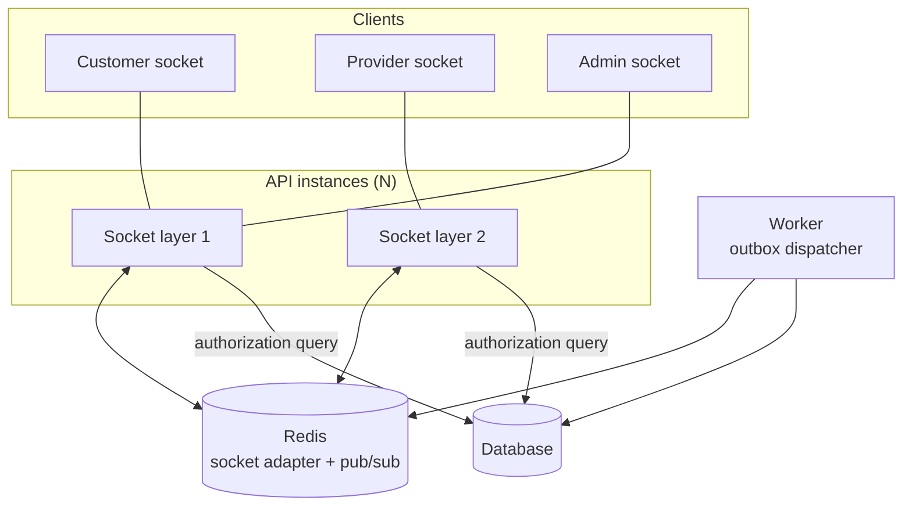
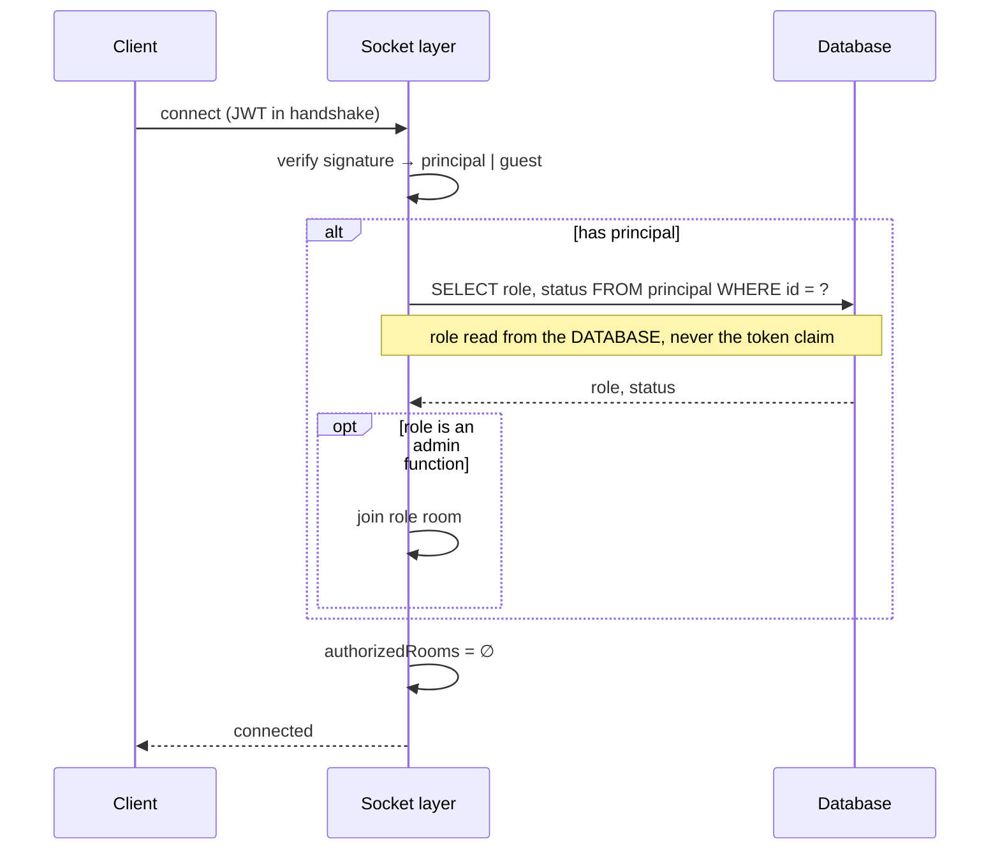

# IMAP 2.0 — Realtime Architecture

**Status:** PROPOSED · **Phase:** 2 · **Date:** 2026-08-09
**Decision:** AD-013 (Socket.io + Redis adapter) · **Events:** `EVENT-ARCHITECTURE.md`

---

## 1. Purpose and limits

Realtime exists to make **state true on the user's screen**, not to add motion.

| Realtime is for | Realtime is not for |
|---|---|
| Booking state changes the user is waiting on | Decorative animation |
| Provider location during an active booking | Presence indicators nobody acts on |
| In-booking messages | Engagement pings |
| Admin emergency alerts | Marketing pushes |

**Every realtime event corresponds to a committed domain event.** Nothing is broadcast that the database does not already assert (Constitution §P4).

---

## 2. Topology



Events reach sockets **only via the outbox dispatcher**. A request handler never calls `io.emit` directly — that is the current pattern and it is what makes realtime a side effect of HTTP rather than a consequence of a committed fact.

---

## 3. Authorization

The Phase 0 audit found `join_room` checking only that *some* valid JWT was present, so any authenticated user could read any booking's private chat and live GPS, and inject false coordinates into someone else's tracking. Phase 0.5 fixed it. This is that fix as permanent architecture.

### 3.1 Connection



**A tokenless socket may connect and may join nothing.** Connecting before sign-in is legitimate; acting is not.

**Admin room membership is re-read from the database on connect** — a stale or forged `role` claim in a JWT is not sufficient. This is what makes SOS routing safe (§5).

### 3.2 Joining a room

```mermaid
sequenceDiagram
    participant C as Client
    participant S as Socket layer
    participant Z as AuthZ kernel
    participant DB as Database

    C->>S: join_room(bookingId)
    S->>S: principal present? shape valid?
    S->>Z: authorize(principal, "booking.observe", bookingId)
    Z->>DB: participation lookup
    DB-->>Z: customer_id, provider_user_id
    alt not a participant and not admin
        Z-->>S: deny
        S-->>C: room_denied
    else permitted
        Z-->>S: permit(role)
        S->>S: authorizedRooms.add(bookingId); bookingRole = role
        S->>S: join("booking:" + bookingId)
        S-->>C: room_joined
    end
```

| Rule | Reason |
|---|---|
| **Membership is never inferred from a client-supplied id** (brief §29) | The audited defect |
| `authorizedRooms` is the record of what was *verified* | Socket.io room membership alone is not trusted — `join` is reachable from more than one place |
| The same authorization kernel as HTTP | One implementation; three existed before |
| Re-authorized on reconnect | A permission revoked while disconnected must take effect |

### 3.3 Emitting

Every inbound socket event carrying data requires prior verified membership.

| Event | Direction | Requires | Additional constraint |
|---|---|---|---|
| `join_room` | in | authenticated principal | Participation check |
| `leave_room` | in | — | Removes from `authorizedRooms` |
| `typing` / `stop_typing` | in | verified membership | — |
| `location_update` | in | verified membership | **`bookingRole == provider`**, and the booking is `active`/`arrived` |
| `booking_status` | in | verified membership | Advisory only — the database is changed by the HTTP use case |
| `new_message` | out | — | Content never in an event payload; delivered to the room |
| `booking_updated` | out | — | From the outbox |
| `provider_location` | out | — | Only within the active window |
| `sos_alert` | out | — | **Admin room only** |

---

## 4. Location privacy

Location is the most sensitive realtime data and is treated as **Guarded** (`DATA-ARCHITECTURE.md` §6).

| Control | Rule |
|---|---|
| **Who may publish** | Only the assigned provider, only for their own booking |
| **When** | Only while `active` or `arrived`. Publishing outside the window is dropped |
| **Who may receive** | Only the booking's customer (and admins during an emergency) |
| **Retention** | **Not persisted.** Transient pub/sub only. The last known point may be kept for the booking's duration and is deleted on completion (`D-04`) |
| **Revocation** | The customer can stop sharing; the provider is told sharing is off, not silently spoofed |
| **Accuracy** | Coordinates validated for range; nonsense values dropped |

**Emergency exception:** during an active emergency request (R-1010), location may be released to the emergency-responder role. Every such release is audit-logged with actor and reason.

---

## 5. Emergency alerts (AD-020)

The audit found `io.emit("sos_alert", { user_name, user_phone, lat, lng, description })` — a global broadcast to every connected socket including unauthenticated guests, carrying a victim's name, phone number, GPS position and the nature of their emergency.

**Architecture:**

| Rule | Detail |
|---|---|
| Delivered to the `role:emergency_responder` room only | Membership database-verified on connect |
| **The event payload carries no personal data** | `{ request_id, kind, occurred_at }`. Recipients fetch details through an authorized query, which is logged |
| The API response reports how many responders were actually reachable | Not a generic acknowledgement (P4) |
| `io.emit` is **forbidden by lint** anywhere in the codebase | The mistake must be impossible to repeat, not merely corrected |

---

## 6. Delivery semantics

Realtime is **best-effort**. It is never the only path to a state change.

| Guarantee | Provided? | Fallback |
|---|---|---|
| Delivery to a connected client | Best effort | Reconnect + refetch |
| Delivery to a disconnected client | **No** | State is fetched on reconnect; notifications cover material changes |
| Ordering within a room | Per-aggregate, from the outbox | Client reconciles against fetched state |
| Exactly-once | **No** | Events carry `event_id`; clients dedup |

**Client rule.** A screen never derives state solely from a socket message. Realtime updates a view whose source of truth is a fetched resource. On reconnect, the client refetches — it does not assume it missed nothing.

---

## 7. Scaling

| Stage | Shape |
|---|---|
| 1 instance | In-process rooms. Works today |
| N instances | Redis adapter for cross-instance fan-out; sticky sessions preferred, not required (fallback transport handles it) |
| High connection count | Extract a realtime gateway process (trigger in `SYSTEM-ARCHITECTURE.md` §9.1) |
| Very high | Partition rooms by aggregate hash across gateways |

**Connection budget.** Sockets hold memory per connection. When connection count materially affects API request latency, the gateway is extracted — that is the trigger, not a projected number.

---

## 8. Degradation

| Condition | Behaviour |
|---|---|
| Socket cannot connect | UI shows a connection banner; falls back to polling the active booking; state marked as of a time |
| Redis unavailable | Single-instance fan-out continues; cross-instance delivery degrades; **HTTP is unaffected** |
| Dispatcher stalled | Realtime silently stops. **This must alert** — a stalled dispatcher is invisible to users until something goes wrong |
| Client on a poor network | Socket.io's transport fallback (polling) applies — a real requirement on Bangladeshi mobile networks |
| Client backgrounded | Reconnect and refetch on resume; no replay queue |

---

## 9. Anti-patterns forbidden

| Anti-pattern | Why |
|---|---|
| Room membership from a client-supplied id | The audited P0-7 defect |
| `io.emit` anywhere | The audited P0-8 defect. Lint-enforced |
| Trusting a JWT role claim for admin rooms | Stale or forged claims |
| Realtime as the sole source of a state change | Delivery is best-effort |
| Emitting from an HTTP handler | Bypasses the outbox; emits facts that may not have committed |
| Personal data in a broadcast payload | Payloads reach more places than intended |
| Location outside the active window | `D-04` |
| A socket event that writes to the database | Writes go through HTTP or tool use cases, with idempotency and audit |
| Presence broadcasting by default | Surveillance-shaped, and nobody acts on it |

---

## 10. Client architecture

One socket client, not two. The current app has `socket.js` and `hooks/useSocket.js` as independent singletons, both connecting with the same token — duplicated connections per user.

`packages/realtime-client` provides:

* a single connection, shared across features
* typed event definitions from `packages/domain-types` (AD-014)
* automatic re-join of authorized rooms after reconnect
* explicit connection state exposed to the UI (so the banner in §8 is possible)
* subscription cleanup tied to component lifetime — the current code leaks handlers
