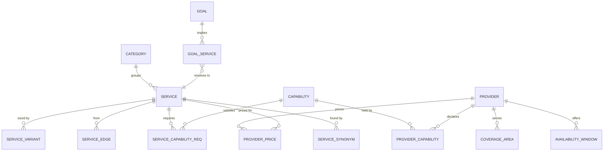

# IMAP 2.0 — Service Graph Architecture

**Status:** PROPOSED · **Phase:** 2 · **Date:** 2026-08-09
**Product basis:** D-003, Constitution §6.2 · **Decision:** AD-004

---

## 1. Why this exists

The Service Graph is the vocabulary of the entire product. Without it:

* an intent model has nothing to classify *into* (D-001)
* pricing has no unit to price
* matching has no capability to match against
* goal decomposition (LATER) is impossible
* related-service recommendation is a hardcoded map — which is exactly what `/ai/bundle-suggest` is today

**Current state.** There is no service entity. A "service" is a free-text string on `providers.service_type_en` and separately on `bookings.service_name_en`. Three incompatible taxonomies coexist: 12 rows in `schema.sql`, 8 in a seeder that silently fails to insert (string ids into an `INT AUTO_INCREMENT` primary key, error swallowed), and 19 hardcoded in `frontend/src/constants/data.js` — and it is the frontend's list that users actually see, with fabricated provider counts summing to 2,142.

D-003 makes this the first thing built after the platform foundation.

---

## 2. Model



### 2.1 The bookable offer

A provider is bookable for a service only when all five hold. This replaces "the provider typed some text into a field".

```
Bookable offer =
    SERVICE (active)
  ∧ PROVIDER holds every required CAPABILITY (verified where certification is required)
  ∧ PROVIDER covers the AREA
  ∧ PROVIDER has a PRICE for the service
  ∧ PROVIDER has AVAILABILITY in the requested window
```

### 2.2 Edge types

Four typed edges. Deliberately few — an edge type nobody queries is a maintenance cost.

| Edge | Meaning | Used by |
|---|---|---|
| `related` | Commonly needed alongside | Bundle suggestion, post-booking follow-up |
| `precedes` | Usually needed before | Inspection-then-quote flows; goal ordering |
| `alternative_to` | A different way to solve the same need | Fallback when no provider is available |
| `part_of` | A component of a larger service | Package composition |

Edges are directed and weighted (`0..1`). `related` and `alternative_to` are stored as two directed rows rather than being treated as symmetric — the strength is often asymmetric (drain-clearing → pipe-repair is a stronger link than the reverse).

### 2.3 Worked examples

```
AC servicing (category: appliance-care)
├── precedes ← ac.inspection            (0.7)
├── related  → ac.gas-refill            (0.6)  requires capability: refrigerant-handling
├── related  → electrical.socket-repair (0.3)
└── alternative_to → ac.deep-clean      (0.5)

Goal: moving-home                        (LATER)
├── implies cleaning.deep-clean          (0.9, order 1)
├── implies moving.transport             (0.9, order 2)
├── implies electrical.inspection        (0.5, order 3)
├── implies plumbing.inspection          (0.5, order 3)
└── implies pest.control                 (0.4, order 4)
```

`ac.gas-refill` requiring a certification-gated capability is the case that justifies capabilities existing separately from services: two providers may both offer "AC work" while only one may legally handle refrigerant.

---

## 3. Implementation choice (AD-004)

**Chosen: relational tables + a materialised adjacency/closure projection.**

| Option | Assessment |
|---|---|
| **Relational + materialised closure** | ✅ **Chosen.** Small, slow-changing, staff-edited data. Every query is one indexed join. No second data store. |
| Native graph database | Rejected. Adds an operational component, a second consistency domain and a second backup story to answer queries a join already answers, on ~10² nodes |
| Recursive CTE at query time | Rejected for the read path. Recomputing traversal on every discovery request is wasted work on data that changes weekly. Used only to *build* the projection |
| Graph in a search index | Rejected. AD-005 declines search infrastructure at MVP |
| Graph in application memory | Partially adopted — the projection is small enough to cache in-process with event-driven invalidation |

### 3.1 The projection

`service_edge_closure(from_service_id, to_service_id, kind, depth, weight)` — precomputed to **depth 2**.

* Depth 2 covers every MVP query: related services, related-of-related for fallback, and goal → services.
* Rebuilt **inside the same transaction** as any catalogue edit, so the projection can never drift from the edges. A `ServiceGraphChanged` event invalidates the in-process cache on every instance via Redis pub/sub.
* Rebuild cost at MVP scale is milliseconds. At 10⁴ services it remains sub-second; if it ever does not, the rebuild moves to a job and becomes eventually consistent — an acceptable degradation for catalogue data.

### 3.2 Why not deeper

Depth ≥3 in a service graph produces suggestions that feel arbitrary ("you booked AC servicing, consider tutoring"). The depth limit is a **product** constraint expressed structurally, not a performance compromise.

---

## 4. Discovery projection

Discovery's hot query — *available providers for service S in area A during window W* — should not join five tables per request.

`provider_service_area` is a denormalised projection:

```
(provider_id, service_id, area_id, price_minor, currency,
 standing_facts, listing_state, updated_at)
```

* Maintained by event handlers on `ProviderListed`, `ProviderPaused`, `CapabilityChanged`, `CoverageChanged`, `PriceChanged`, `StandingChanged`, `ServicePublished`, `ServiceDeprecated`.
* **Derived state, never authoritative** (`DOMAIN-ARCHITECTURE.md` §4). Rebuildable from the owning tables at any time.
* Availability is *not* in the projection — it changes too often and is queried by time range. It is joined at query time against `availability_window`.

This is the same architectural pattern as the ledger's balance projection: an append-only or slow-changing source of truth with a fast derived read model.

---

## 5. Taxonomy construction

The graph's content is the defensible asset (Constitution §13), not its schema.

| Principle | Detail |
|---|---|
| **Leaf services are bookable and priceable** | If you cannot quote it, it is a category, not a service |
| **Named as users name them** | Bangla first, authored not translated. `service_synonym` carries colloquial and regional variants |
| **Scope is explicit** | A service definition states what is included and excluded. This is what makes a fixed price possible and what a dispute is adjudicated against |
| **Start narrow** | 5–8 categories, 30–50 leaf services for MVP. The current 19 fabricated categories with 2,142 invented providers is the failure mode |
| **Staff-owned** | No user-generated services. No AI-generated services (AD-003 alt 2 rejected: a runtime-invented taxonomy is unpriceable, unmatchable and unreportable) |
| **Versioned** | Services are deprecated and retired, never deleted; history stays resolvable |

**Migration of the three existing taxonomies** is in `MIGRATION-STRATEGY.md` §5. Existing free-text `service_type_en` values are mapped to capabilities by a human, with unmapped providers held in a review queue — not auto-assigned.

---

## 6. Search without search infrastructure (AD-005)

The graph carries most of the retrieval burden, which is why no search cluster is needed at MVP.

```
Free text
  → normalise (Bangla + English)
  → exact/prefix match against service_synonym  ─┐
  → exact/prefix match against service names    ─┤→ candidate service ids
  → category name match                         ─┘
  → structured filter: area, availability, capability
  → rank in application code (inspectable, R-302)
```

**Known limitations, stated rather than hidden:**

* No stemming or typo tolerance in Bangla. Mitigated by curated synonyms.
* No semantic similarity. Mitigated by the intent layer (Phase E), which is the *primary* path — free-text search is the fallback (D-001).
* Recall depends on synonym coverage, which is manual work. Measured via `need_outcome.reason = intent_failed`.

The trigger for revisiting is in AD-005: >5,000 providers, >3 cities, or measured search abandonment above threshold.

---

## 7. How the graph serves each loop stage

| Stage | Graph's role |
|---|---|
| **UNDERSTAND** | Provides the closed label set the intent model classifies into. Without it the model classifies into unstable free text |
| **DISCOVER** | `service_id + area_id` → the provider projection (§4) |
| **RECOMMEND** | `related` edges supply genuine alternatives instead of the hardcoded `BUNDLES` map in `routes/ai.js` |
| **TRUST** | Capability requirements determine which verifications a provider actually needs |
| **APPROVE** | Service scope defines what the price covers — the thing a dispute is judged against |
| **EXECUTE** | The booking references a `service_id`, not a string, so reporting and history are coherent |
| **LEARN** | Outcomes attach to a stable service id, making per-service quality measurable |

---

## 8. Governance

| Aspect | Rule |
|---|---|
| Who edits | Operations role only, through the admin surface |
| Audit | Every catalogue change is audit-logged with actor and reason (R-1101) |
| Publishing | `draft → active` requires: both language names, a scope description, ≥1 price model, and ≥1 capability requirement |
| Deprecation | Never breaks existing bookings; removes the service from new discovery |
| Edge hygiene | An edge with weight below threshold and no observed co-booking is pruned in review |
| Evidence | `related` edge weights are seeded by staff judgement and **recalibrated from observed co-booking data** once volume allows — the graph learns, but only from outcomes, never from engagement |

---

## 9. Future extensions (not built now)

| Extension | Trigger |
|---|---|
| `goal` → services (LATER) | The graph is proven and multi-service resolution is measurably better than independent bookings |
| Learned edge weights from co-booking | Sufficient completed-booking volume |
| Per-area service availability (some services do not exist everywhere) | Second city |
| Regulatory capability rules per market (`I-09`) | Second country |
| Semantic retrieval over service descriptions | AD-005 / AD-018 triggers |
| Service packages (`part_of` composition into a single quote) | Demonstrated demand for bundles |

---

# Phase 2.75 amendment — binding corrections

**Date:** 2026-08-09 · **Closes:** O-04, S-01
Where this section conflicts with anything above it, **this section wins.**

## F1 — O-04: `provider_service_area.standing_facts` is derived

Trust owns provider standing. The copy carried in the discovery projection is
**derived, never authoritative, and rebuildable from Trust**. Nothing may write to it
except the projection's own event handlers.

## F2 — S-01: the closure table is deferred

`AD-004` materialises a `service_edge_closure` table while its own justification argues
that the service graph is "small and slow-changing". Both cannot be true. At Gate 1
the graph is a few hundred nodes and is held in memory, rebuilt on change.

Deferred, not deleted: the closure table returns when the graph outgrows memory or
multi-hop weighted traversal is required. Recorded as **AD-021**.

## F3 — the discovery projection is deferred

`PHASE-2.5-SIMPLIFICATION.md` S-03. Gate-1 discovery is a relational query over
`provider`, `provider_capability`, `provider_coverage` and `availability`. This removes
one table, eight event handlers, and defect O-04 with them. It returns when query latency
requires it — measured, not assumed. Recorded as **AD-022**.
