# IMAP 2.0 — State Machines

**Status:** PROPOSED · **Phase:** 2 · **Date:** 2026-08-09
**Source:** `docs/product/PRD.md` §4 · **Decisions:** `ARCHITECTURE-DECISIONS.md`

Every transition below is enforced **server-side, in the domain layer**, applied as a conditional update guarded on the observed prior state, with side effects inside the same transaction. This is the Phase 0.5 pattern generalised: `UPDATE … WHERE id = ? AND state = ?` with `affectedRows` checked, so a repeat loses the race and moves no money.

**Notation.** `actor` is the principal's role *relative to this resource*, not a global role.

---

## 1. Principal (user)

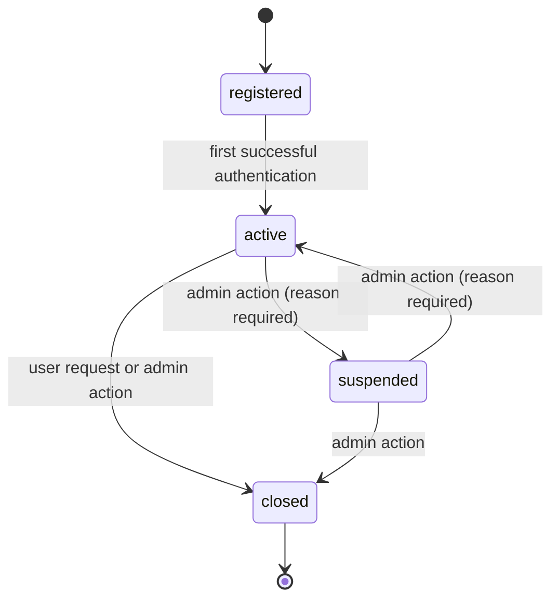

| From → To | Actor | Evidence | Side effects | Event |
|---|---|---|---|---|
| registered → active | system | successful auth | — | `PrincipalActivated` |
| active → suspended | trust&safety, platform owner | reason (mandatory) | sessions revoked; provider listings paused | `PrincipalSuspended` |
| suspended → active | trust&safety | reason | listings resumable by the provider | `PrincipalReinstated` |
| any → closed | principal (self) or platform owner | confirmation | sessions revoked; PII deletion scheduled (R-807) | `AccountClosed` |

**Forbidden.** `closed → *` (terminal — a returning user registers a new principal). AI may not trigger any transition here (Tier C).

**Verification is a separate axis**, not a state: `unverified → phone_verified → id_verified`. It never regresses except by explicit admin revocation with a reason.

---

## 2. Provider listing

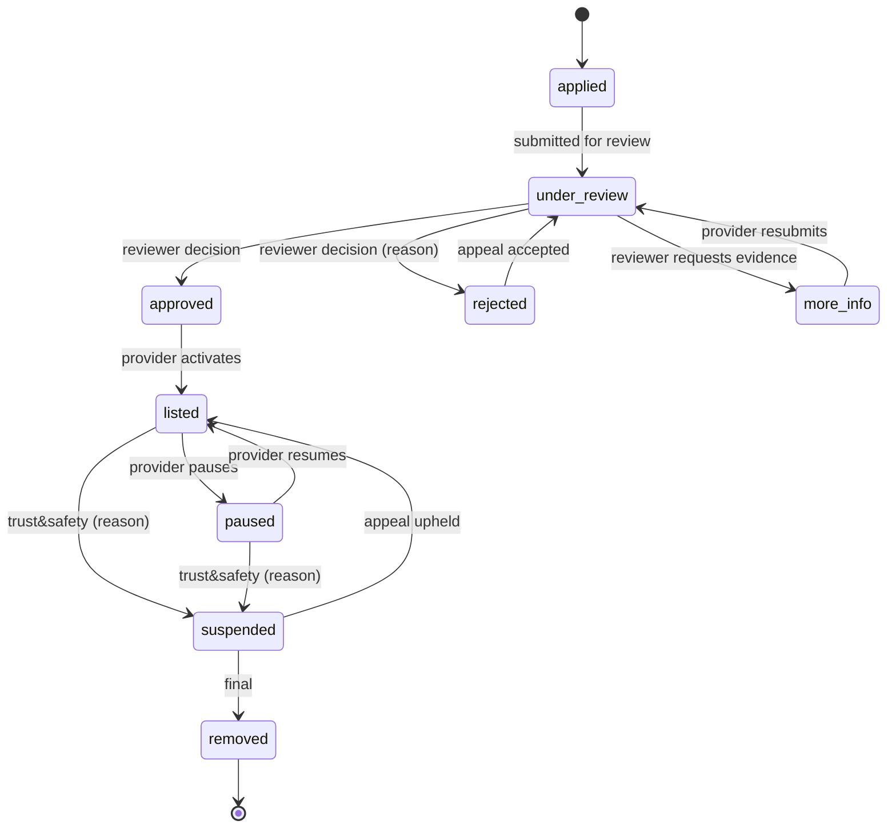

| From → To | Actor | Evidence | Side effects | Event |
|---|---|---|---|---|
| under_review → approved | operations, trust&safety | decision record | listing eligibility granted by **Trust** | `ProviderApproved` |
| under_review → rejected | operations, trust&safety | **reason mandatory** | appeal window opens | `ProviderRejected` |
| approved → listed | provider (self) | ≥1 capability, ≥1 coverage area, ≥1 price | appears in discovery | `ProviderListed` |
| listed ⇄ paused | provider (self) | — | removed from discovery; existing bookings unaffected | `ProviderPaused` / `ProviderResumed` |
| * → suspended | **trust&safety only** | reason + case reference | removed from discovery; **active bookings are NOT auto-cancelled** — they go to manual review | `ProviderSuspended` |

**Forbidden.** `applied → listed` (this was the audited defect: any authenticated user appeared publicly and immediately while being told review takes 24–48 hours). AI may not suspend, approve or reject — all Tier C (D-004).

---

## 3. Service (catalogue entity)

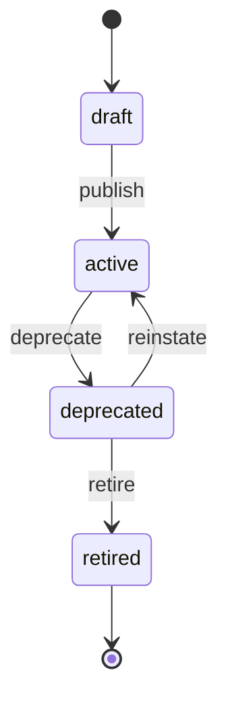

| Rule | Detail |
|---|---|
| `deprecated` | Not offered for new bookings; existing bookings and history unaffected |
| `retired` | Not bookable, not searchable; historical references remain resolvable |
| Forbidden | Deleting a service. History must stay readable |
| Actor | Operations only. No user or AI write path |
| Side effect | `ServiceGraphChanged` → adjacency projection rebuild (AD-004), in the same transaction |

---

## 4. Booking

The system's central machine.

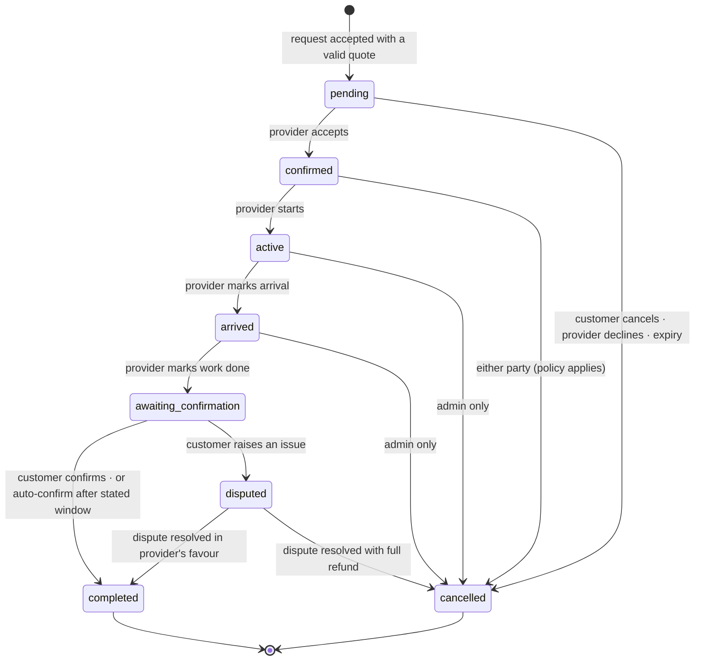

### 4.1 Transition table

| From → To | Actor | Evidence required | Side effects (same transaction) | Event |
|---|---|---|---|---|
| — → pending | customer | valid unexpired `quoteId`; slot hold acquired | slot held; payment intent created; audit | `BookingRequested` |
| pending → confirmed | provider, admin | — | slot committed; customer notified | `BookingConfirmed` |
| pending → cancelled | customer, provider, admin, system(expiry) | reason | slot released; payment intent voided; **nothing captured** | `BookingCancelled` |
| confirmed → active | provider, admin | — | location sharing window opens | `BookingStarted` |
| confirmed → cancelled | customer, provider, admin | reason; cancellation policy evaluated | slot released; refund per policy | `BookingCancelled` |
| active → arrived | provider, admin | — | customer notified | `ProviderArrived` |
| arrived → awaiting_confirmation | provider, admin | — | **auto-confirm deadline set and shown to the customer at this moment**, never retroactively | `WorkReportedDone` |
| awaiting_confirmation → completed | **customer**, admin(override, reason), system(deadline) | customer confirmation OR elapsed stated window | provider earnings accrued; commission accrued; location sharing closed; review eligibility created | `BookingCompleted` |
| awaiting_confirmation → disputed | customer, provider | reason | **funds held** — not settled | `DisputeRaised` |
| disputed → completed / cancelled | trust&safety, support | resolution record | funds released or refunded per outcome | `DisputeResolved` |
| active/arrived → cancelled | **admin only** | reason mandatory | manual settlement decision | `BookingCancelled` |

### 4.2 Forbidden transitions

| Forbidden | Why |
|---|---|
| `completed → *`, `cancelled → *` | Terminal. Repeat completion was the P0-5 money defect |
| provider → `completed` directly | R-505. Only the customer confirms |
| customer → `confirmed`, `active`, `arrived` | Not the customer's states to assert |
| any AI transition | All booking transitions are Tier B (proposal + confirmation) or Tier C |
| `pending → active` | Acceptance must be explicit and recorded |

### 4.3 Invariants

1. **Exactly-once financial effects.** Guarded conditional update + a deterministic ledger reference (`booking:<id>:payout`) under a unique constraint. Two independent mechanisms; either alone would suffice, both are cheap.
2. **Auto-confirm is disclosed at the moment the window starts**, never applied retroactively.
3. **A cancelled booking never settles.** Cancellation before capture voids the intent; after capture it triggers a refund.
4. **Slot holds expire.** An abandoned `pending` booking must not hold a slot forever.

---

## 5. Payment

**Conflict C-02 (`ARCHITECTURE-DECISIONS.md`).** `PRD.md` §4.5 specifies `initiated → authorised → captured → settled`. SSLCommerz is a hosted-checkout gateway with no authorise/capture split. The domain model keeps the four states because they are the correct abstraction and other gateways expose them; **for SSLCommerz, `authorised` and `captured` occur together on a single validated callback.** No product decision is changed.

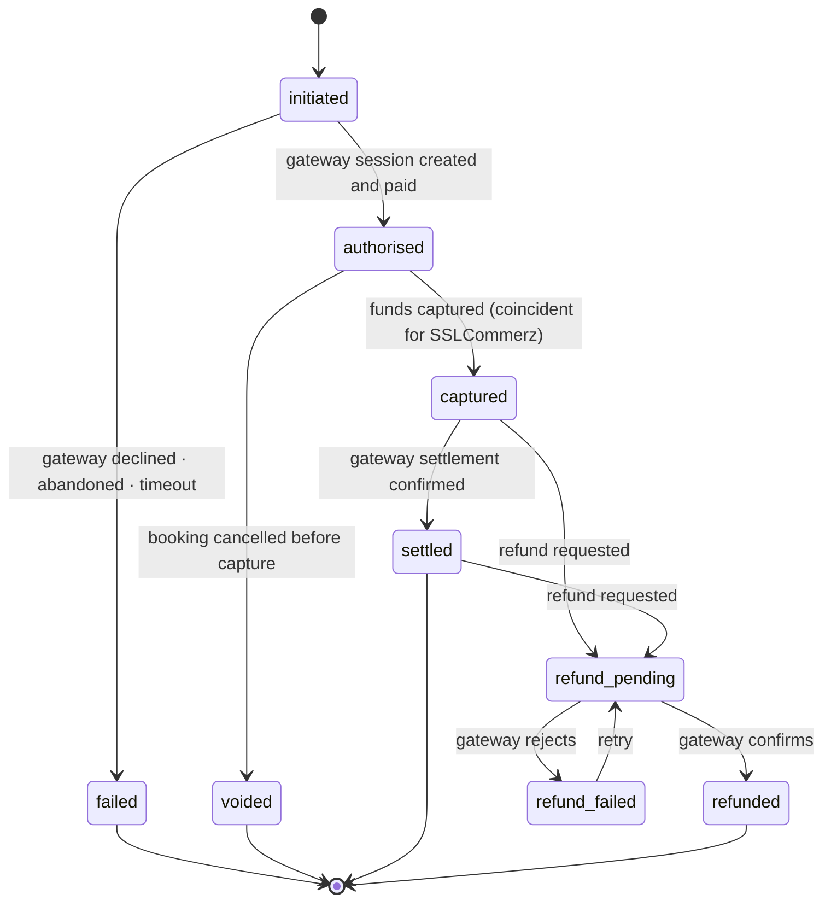

| Rule | Detail |
|---|---|
| **Only a verified callback advances state** | The server validates with the gateway server-to-server before any state change |
| **Amount reconciliation** | Gateway-reported amount vs stored amount; mismatch ⇒ refuse, alert, no ledger movement |
| **Redirect endpoints cannot settle** | They are public and unauthenticated; they redirect only |
| **Unconfigured gateway in production** | 503. Never a mock settlement (P0-12) |
| **Cash bookings** | Do not enter this machine. Settlement is recorded at completion; commission accrues as a provider debit (`BUSINESS-MODEL.md` §3.2 option B) |
| **Actor** | System only, driven by gateway callbacks. No user or admin sets a payment state directly; an admin issues a *refund command*, which the machine processes |

---

## 6. Refund

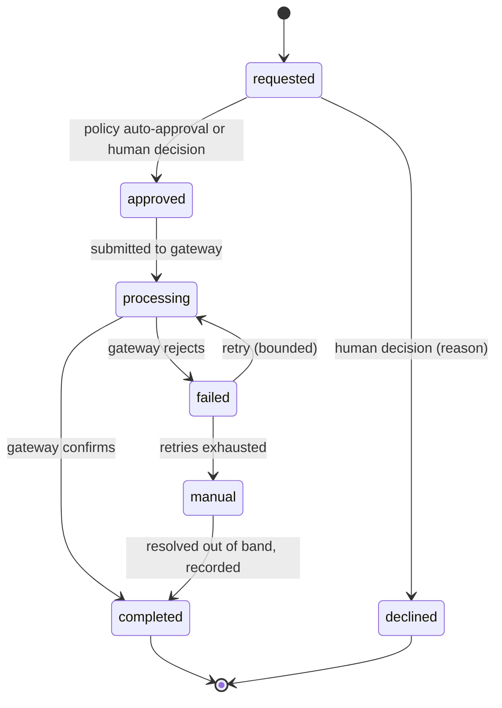

| Rule | Detail |
|---|---|
| Refunds go to the **original payment method** | D-010 — no refund-to-balance |
| Partial refunds allowed | Amount ≤ captured amount, enforced in the domain |
| Every refund posts a **reversing ledger transaction** | Never an edit of the original |
| Idempotent | Deterministic reference `booking:<id>:refund:<seq>` |
| Actor | Support/finance for discretionary; system for policy-driven |

---

## 7. Ledger entry — **no state machine**

A ledger entry is **immutable and has no lifecycle** (AD-007). It is created once and never changes. A correction is a new reversing transaction that references the original.

This resolves conflict **C-01**: the states named in `PRD.md` §4.6 (`accrued → payable → paid_out`, `held`, `reversed`) describe a **payout claim**, not a ledger entry. Modelled in §8.

---

## 8. Payout claim

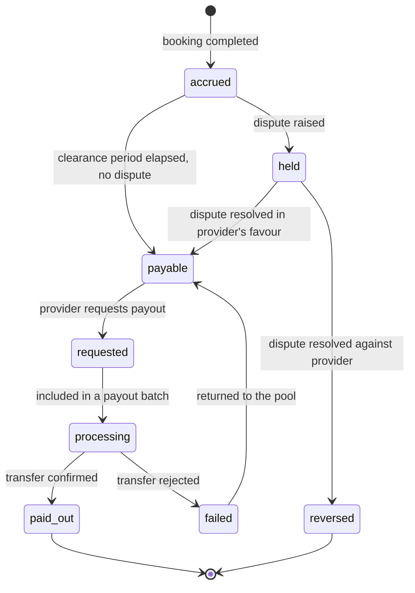

| Rule | Detail |
|---|---|
| Every transition posts ledger entries | The claim is a *view* over ledger state; the ledger remains the source of truth |
| Clearance period | Configurable; exists so a dispute can be raised before funds leave |
| `reversed` | Posts a reversing transaction; never deletes the accrual |
| Actor | System for accrual and clearance; provider for request; finance for batch execution |
| Forbidden | AI at any transition (Tier C — moving platform funds) |

---

## 9. Verification (KYC)

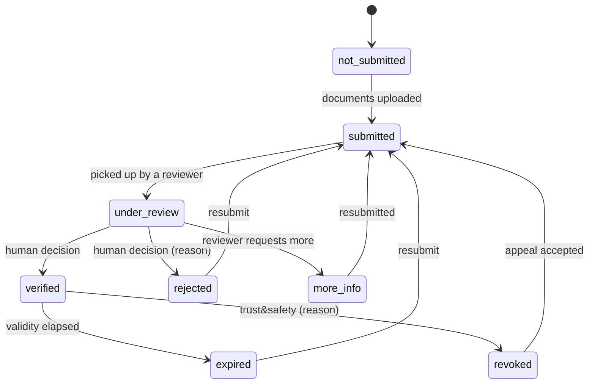

| Rule | Detail |
|---|---|
| **Decisions are Tier C** | Human only. AI may run a document-quality *pre-check* and flag; it may never decide |
| Every state change is audited with actor and reason | R-1103 |
| Documents live in object storage | AD-011. Every access logged with reason (`D-03`) |
| Sealed | Never enters AI context (R-706) |
| Expiry | Verification is time-bounded; expiry is not a penalty |

---

## 10. Review

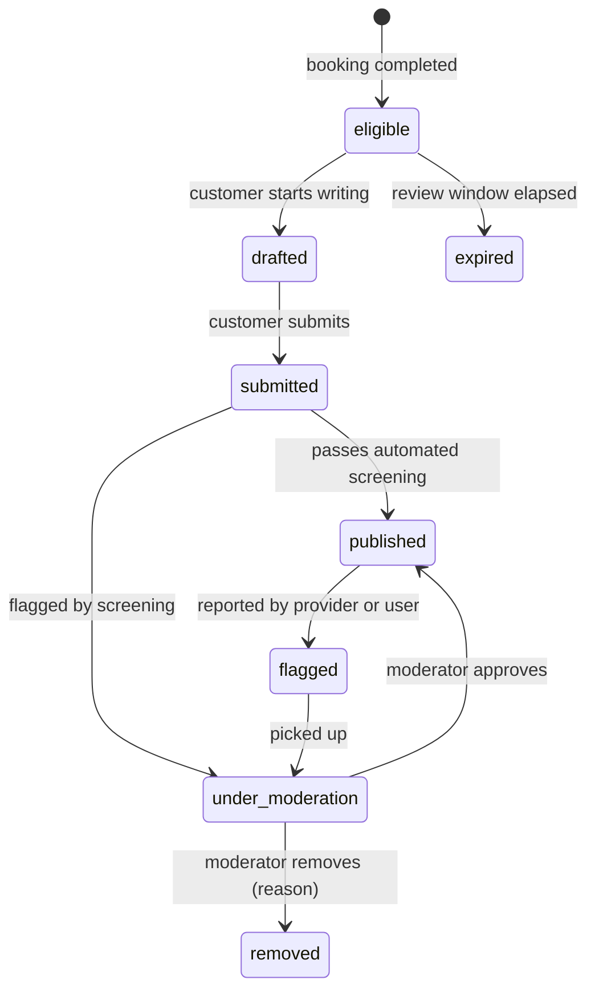

| Rule | Detail |
|---|---|
| Eligibility | Only the paying customer of a completed, unrated booking — **already correctly enforced today** |
| Screening may flag; only a human removes | Removal is punitive; Tier C |
| Provider response | Permitted, never edits the review |
| Publication emits `ReviewPublished` → Trust signal | |

---

## 11. Emergency request

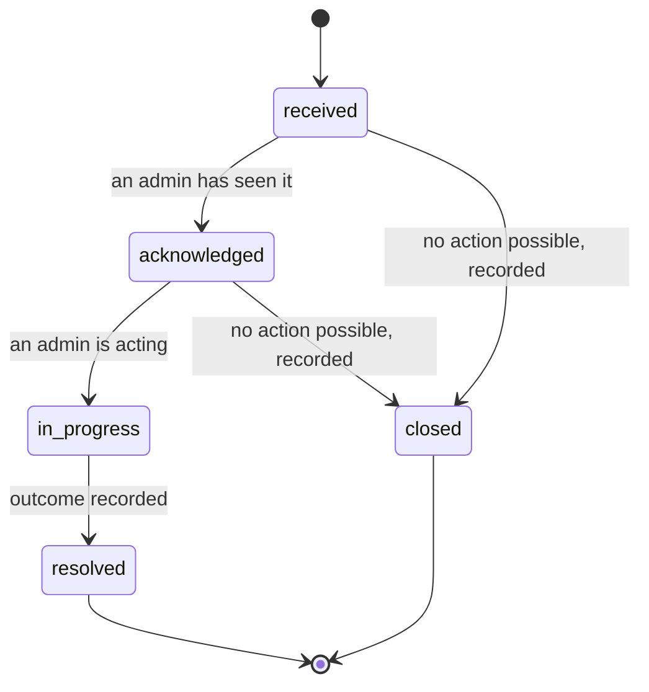

| Rule | Detail |
|---|---|
| **`dispatched` does not exist** | IMAP has no dispatch capability. Adding this state would be adding a lie to the schema (D-012, D-013) |
| The response reports how many admins were actually reachable | Not a generic acknowledgement |
| Sealed | Never in AI context (R-1005) |
| Actor | Requester creates; emergency-responder role transitions |
| A provider may raise one mid-booking | R-1010; booking reference and location attached |

---

## 12. Dispute

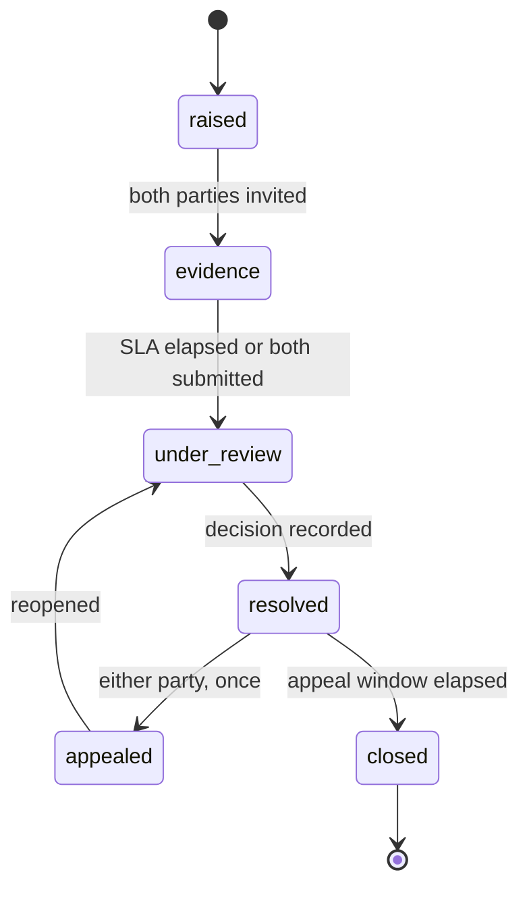

Outcomes: `refund_full` · `refund_partial` · `no_action` · `provider_penalty`.

| Rule | Detail |
|---|---|
| **Funds are held from `raised`** | Payout claim → `held` (§8) |
| Decision is human | Tier C |
| One appeal per party | Then terminal |
| Outcome feeds Trust | `DisputeResolved` → trust signal |
| At Gate 1 | Manual admin process writing to these same records |

---

## 13. AI task

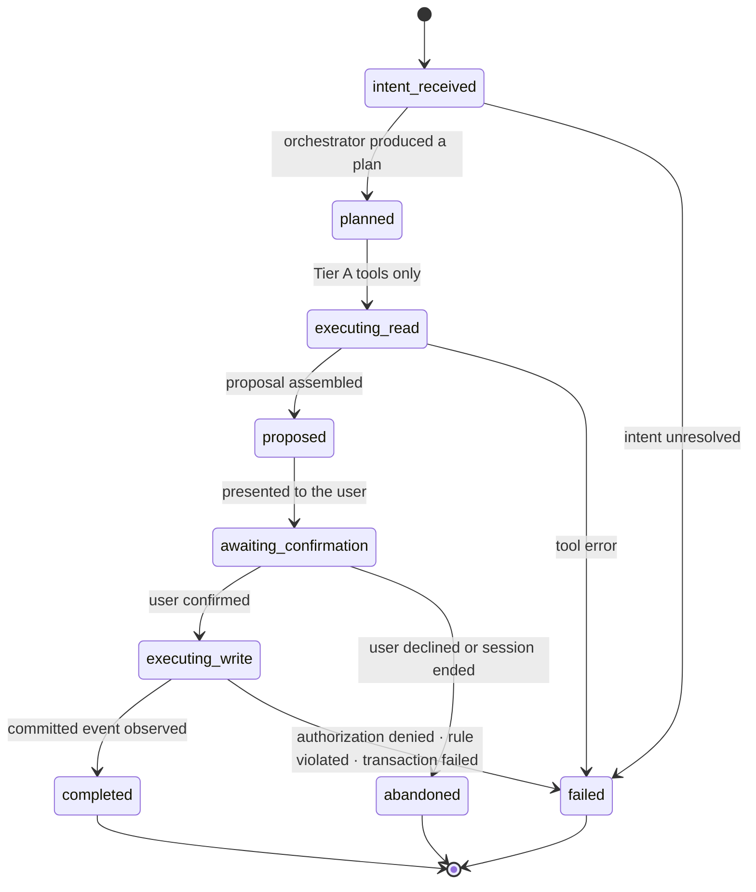

| Rule | Detail |
|---|---|
| **`awaiting_confirmation → executing_write` requires an explicit user action** | No timeout-into-acceptance, no pre-selected confirm (Constitution §4) |
| The proposal is immutable once presented | Any change returns to `proposed` and requires fresh confirmation |
| Authorization runs at proposal **and** at execution | A permission revoked in between fails the execution |
| `completed` requires an **observed committed event** | Never model output (P4) |
| Tier C tools have no representation here | They do not exist |
| Every transition writes a `ToolCallRecord` / task record | Audited (R-705) |

---

## 14. Notification

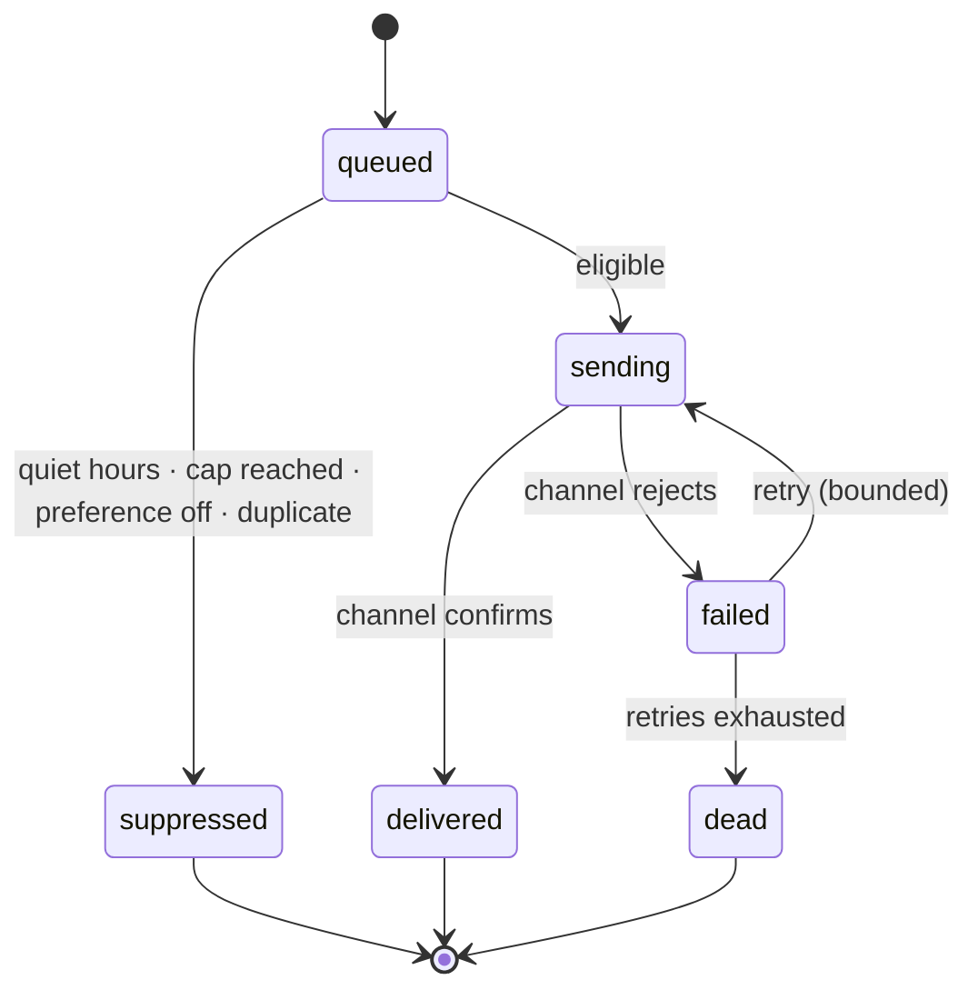

| Rule | Detail |
|---|---|
| **Suppression is a first-class outcome, and is recorded** | Caps in `BEHAVIORAL-DESIGN.md` §4.2 are domain rules |
| Emergency overrides quiet hours | Only for a genuine emergency category |
| `delivered` means the channel confirmed handoff | It does not mean the human saw it — copy must not claim otherwise (P4) |
| Failures are visible | Not `.catch(() => {})`, which is the current behaviour at 20+ sites |

---

## 15. Loan / financial services — **no state machine**

D-011 removes lending from scope. **No lending state machine is defined**, deliberately: defining one would create the impression the capability is available and would give implementers something to wire up.

If a licensed-partner referral is ever built (D-011 alternative 2, FUTURE), the only IMAP-side machine is a **referral** — `eligible → referred → partner_decision_unknown` — and IMAP never models the loan itself. Underwriting, disbursement and collection stay entirely with the licensed partner.

---

## 16. Cross-machine consistency rules

| Rule | Enforcement |
|---|---|
| A booking cannot complete while a payment is `refund_pending` | Guard in the completion use case |
| A payout claim cannot be `payable` while its booking is `disputed` | Guard in the clearance job |
| A provider cannot be `listed` while their verification is `rejected` or `revoked` | Trust owns eligibility; Marketplace applies it |
| A review cannot exist without a `completed` booking by that customer | Already enforced today |
| An emergency request never blocks or alters a booking transition | Contexts are isolated (AD-020) |
| Every terminal transition emits exactly one event | Outbox, in-transaction (AD-006) |
| Every guarded transition checks `affectedRows` | Domain layer; the Phase 0.5 pattern generalised |
