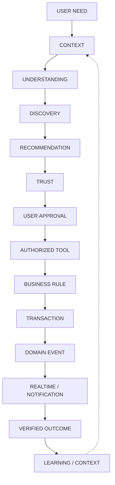
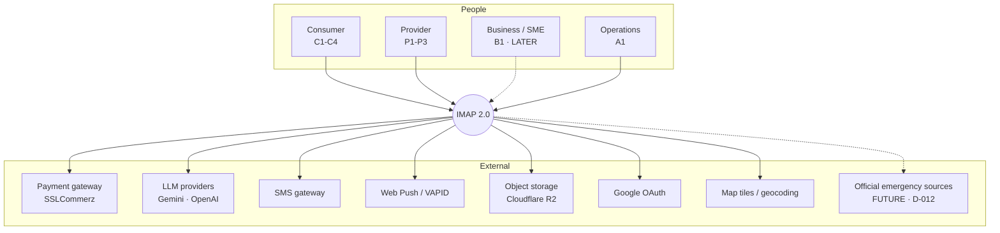
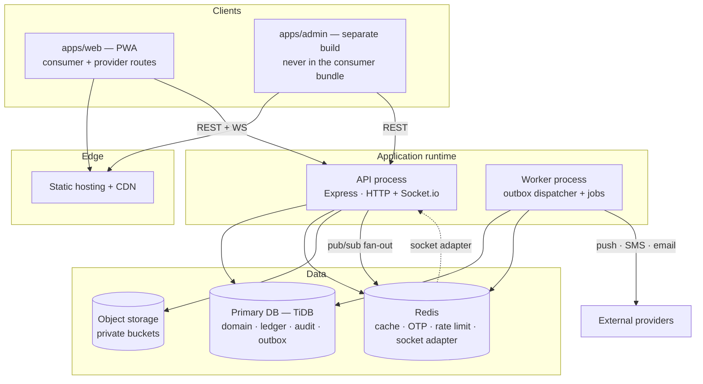
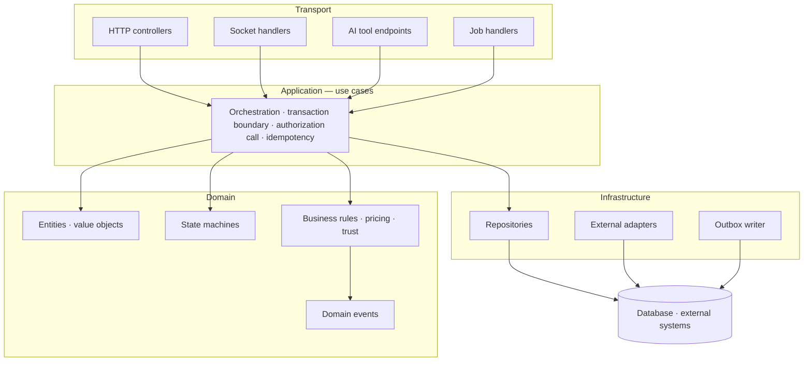
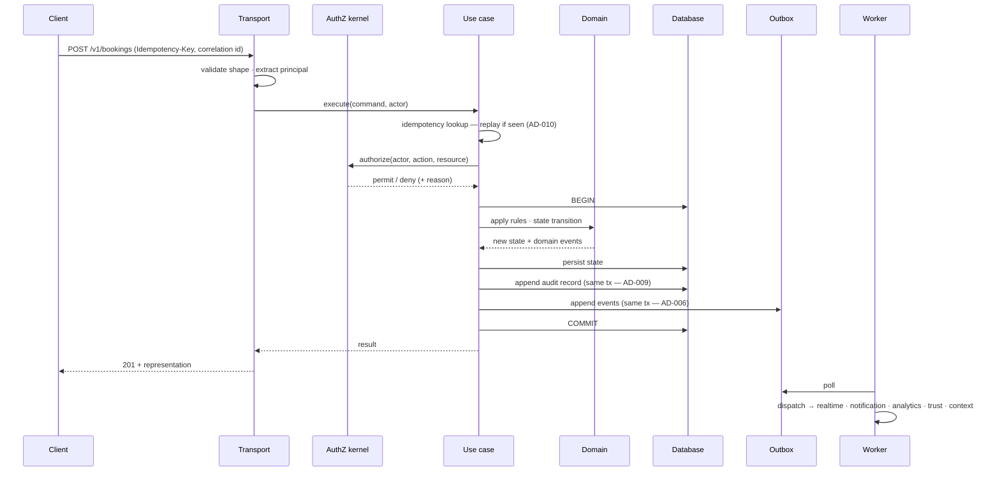
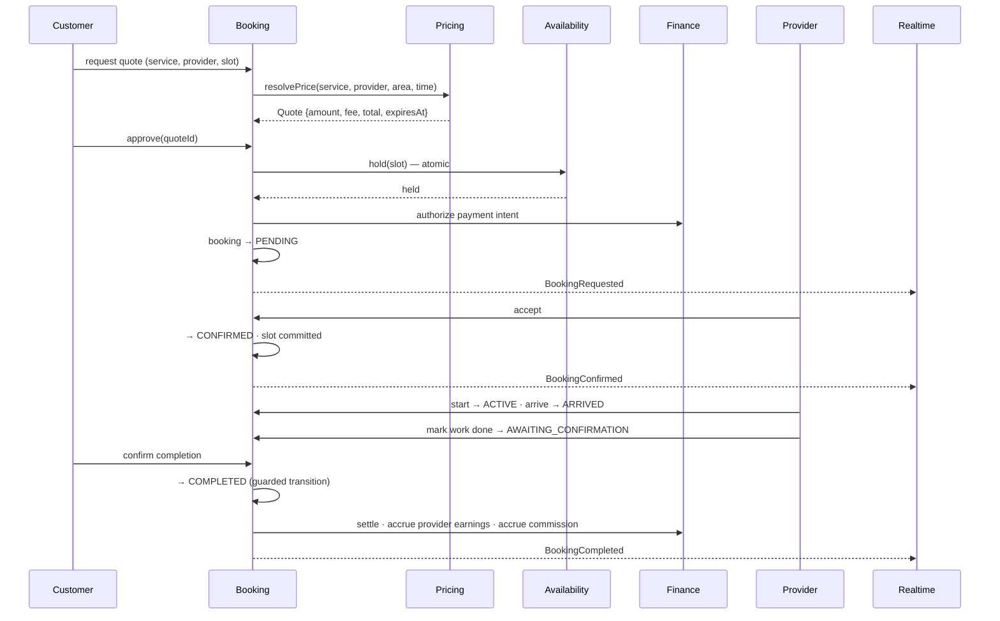
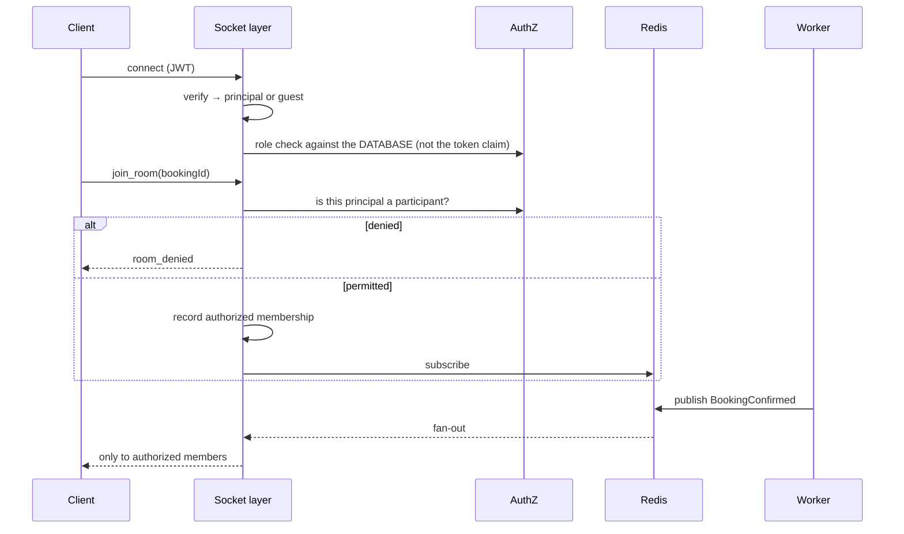
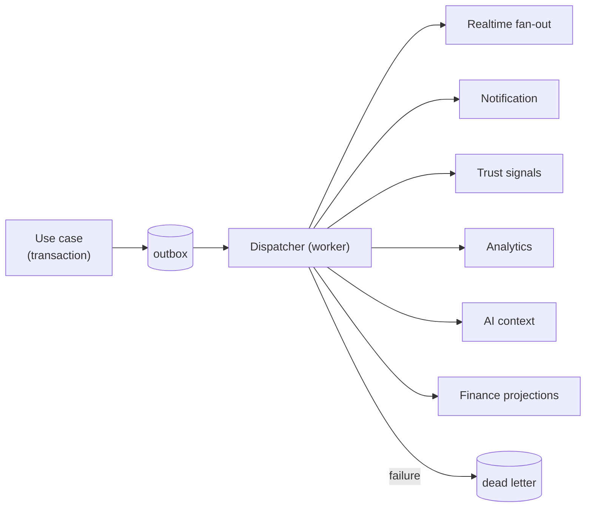

# IMAP 2.0 — System Architecture

**Status:** PROPOSED · **Phase:** 2 · **Date:** 2026-08-09
**Decisions:** `ARCHITECTURE-DECISIONS.md` · **Product law:** `docs/product/PRODUCT-CONSTITUTION.md`

---

## 1. The architectural heart

Every layer in this document exists to serve one loop. If a component cannot be traced to a step of it, it should not be built.



Two invariants hold at every step:

1. **The server is authoritative.** The client and the model may express intent; neither asserts fact (Constitution §P6).
2. **Nothing is claimed without evidence.** A user-visible outcome is derived from a committed domain event, never from a model's assertion (Constitution §P4).

---

## 2. System context



**Rule (brief §44).** No external provider is the domain source of truth. The gateway confirms a payment; IMAP's ledger records it. The model proposes; IMAP's domain decides. Every integration is an adapter behind a port owned by IMAP (§7.4).

---

## 3. Container architecture



**Two processes, one codebase** (AD-001, AD-016). The worker shares the domain modules and runs the outbox dispatcher and job consumers. It exists from Phase B, because fire-and-forget `.catch(() => {})` notifications are the current behaviour and are invisible when they fail.

**What is deliberately absent:** message broker (AD-006), search cluster (AD-005), graph database (AD-004), vector database (AD-018), microservices (AD-001).

---

## 4. Layer model



### 4.1 Layer contracts

| Layer | Owns | May not |
|---|---|---|
| **Transport** | Protocol concerns: parsing, validation of shape, auth-token extraction, response mapping, HTTP status | Contain business rules. Touch the database. Decide authorization outcomes. |
| **Application** | One use case per file. Opens the transaction. Calls authorization. Enforces idempotency. Emits events via the outbox. | Contain domain rules. Know about HTTP, sockets or AI. |
| **Domain** | Entities, value objects, state machines, pricing, trust computation, invariants | Perform I/O of any kind. Import infrastructure. Know about transport. |
| **Infrastructure** | SQL, external SDKs, object storage, LLM adapters, outbox writes | Contain business rules. Be imported by the domain. |

**The four transports call the same use cases.** This is D-002 made structural: an AI tool that creates a booking calls `CreateBooking` — the identical object the HTTP controller calls. There is no second write path, so the two cannot diverge.

### 4.2 Enforcement

Boundaries decay without tooling — that is precisely what happened to the current codebase, where `utils/response.js` was written to standardise responses and imported by zero route files.

| Rule | Enforced by |
|---|---|
| `pool.query` only under `infrastructure/` | Lint rule; CI fails |
| Domain imports nothing from `infrastructure/` or `transport/` | Import-boundary lint |
| Cross-module imports only from a module's `index.ts` public surface | Import-boundary lint |
| Every use case declares its authorization policy | Runtime assertion in the composition root; a use case with no declared policy throws at startup |
| Every mutating use case declares idempotency behaviour | Same |

---

## 5. Backend module structure

Derived from `DOMAIN-ARCHITECTURE.md`, not from the current route list.

```
backend/
├── src/
│   ├── modules/
│   │   ├── identity/        principals, sessions, accounts, memberships, verification
│   │   ├── catalog/         services, categories, service graph, capabilities
│   │   ├── provider/        provider profiles, coverage, availability
│   │   ├── discovery/       search, ranking, matching, need records
│   │   ├── booking/         booking lifecycle, quotes, disputes
│   │   ├── pricing/         price resolution, promotions, commission
│   │   ├── finance/         ledger, payments, refunds, payouts, reconciliation
│   │   ├── trust/           signals, standing, reviews, verification decisions
│   │   ├── messaging/       in-booking conversations
│   │   ├── notification/    channels, preferences, dedup, quiet hours
│   │   ├── emergency/       emergency requests, blood registry, sources  [isolated]
│   │   ├── ai/              gateway, orchestrator, tools, context, evaluation
│   │   ├── audit/           append-only audit log                        [write-only]
│   │   └── analytics/       event ingestion, funnel, metrics
│   ├── platform/            outbox, jobs, idempotency, authorization kernel,
│   │                        config validation, correlation, errors
│   ├── transport/           http/ · realtime/ · tools/ · jobs/
│   └── composition/         wiring, policy registration, startup checks
├── migrations/              (exists — Phase 0.5)
└── test/
```

Each module exposes `index.ts` declaring commands, queries and subscribed events. Everything else is private.

---

## 6. Client architecture

```
apps/
├── web/                     consumer + provider (AD-012)
│   └── src/
│       ├── routes/          file-based routes → INFORMATION-ARCHITECTURE.md
│       │   ├── (public)/    home · ask · services · providers · emergency
│       │   ├── (account)/   activity · account
│       │   └── (provider)/  lazy-loaded route group
│       ├── features/        need · discovery · booking · payment · tracking ·
│       │                    review · provider-jobs · provider-earnings
│       ├── shell/           layout, navigation, error boundaries, offline banner
│       └── ai/              assistant surface, proposal renderer
└── admin/                   separate build; Ant Design confined here

packages/
├── ui/                      design system from constants/theme.js tokens
├── api-client/              generated from the OpenAPI contract
├── domain-types/            shared types: money, states, proposals (AD-014)
├── i18n/                    bn/en catalogues
└── realtime-client/         one socket client (replaces the current two)
```

### 6.1 Feature module shape

Each feature owns its data access, state and components, and exposes only its route entry points and a small public API. This is what prevents a second `App.jsx`.

### 6.2 State classification

The current app conflates all four, which is why a network failure renders as fabricated data.

| Kind | Holds | Mechanism | Rule |
|---|---|---|---|
| **Server state** | Bookings, providers, prices, availability | Query cache, keyed, with explicit `loading`/`error`/`empty` | **Never falls back to constants.** U1 |
| **Domain/session state** | Authenticated principal, active account, locale | Context, hydrated from `/me` | Server is authoritative |
| **Flow state** | Multi-step progress in booking or onboarding | Persisted, server-mirrored | Survives reload (R-801) |
| **Ephemeral UI state** | Open/closed, focus, input buffers | Component-local | Never persisted |

### 6.3 Non-negotiable client rules

| Rule | Reason |
|---|---|
| No fallback constants on any data path | The defining defect: every loader was `if (d?.x?.length) setX(...)`, so empty, failed and expired all rendered as fabricated rows |
| Three states designed per surface: full, degraded, empty/error | `UX-CONSTITUTION.md` U10 |
| Optimistic updates only where reversion is shown | Admin actions previously rendered success under `.catch(e => console.warn(...))` |
| Money is rendered from `{amount, currency}` (AD-008), never a formatted string from the server | Prevents the currency assumption returning |
| Every state claim maps to one of the nine states | D-008 |
| Core loop completable with AI disabled | D-007 |
| Route-level code splitting; admin never in the consumer bundle | `UX-CONSTITUTION.md` §7 budget |

### 6.4 Offline and degraded behaviour

| Condition | Behaviour |
|---|---|
| Offline | Cached reads served with an explicit "showing saved data" marker and a timestamp. **No financial action is queued** (`N-08`) |
| Slow network | Skeletons that do not resemble content; explicit progress beyond 1 s |
| AI unavailable | Structured path; one-line notice; category browse promoted (D-007) |
| Realtime disconnected | Banner; polling fallback for the active booking; state marked as of a time |

---

## 7. Request lifecycles

### 7.1 Standard mutating request



**Audit and outbox writes are inside the transaction.** If the state change commits, both exist. This is the single most important structural property in the system, and its absence is what made the Phase 0 findings undetectable.

### 7.2 AI action lifecycle (D-002)

```mermaid
sequenceDiagram
    participant U as User
    participant AS as Assistant UI
    participant ORC as AI orchestrator
    participant CTX as Context service
    participant LLM as LLM provider
    participant TR as Tool runtime
    participant Z as AuthZ kernel
    participant UC as Use case
    participant DB as Database

    U->>AS: "kal shokale AC servicing lagbe, Mirpur"
    AS->>ORC: message + session
    ORC->>CTX: assemble(Open; Guarded only with declared purpose)
    CTX-->>ORC: context bundle (Sealed excluded structurally)
    ORC->>LLM: prompt + tools available to THIS principal
    LLM-->>ORC: tool calls
    loop Tier A tools
        ORC->>TR: invoke
        TR->>Z: authorize(actor=user, tool, resource)
        TR->>UC: read use case
        UC-->>TR: result + evidence stamp
    end
    ORC->>LLM: results
    LLM-->>ORC: proposal (structured)
    ORC-->>AS: PROPOSAL — never committed
    AS-->>U: rendered as the same card the manual flow uses
    U->>AS: Confirm
    AS->>TR: execute(proposalId, idempotencyKey)
    TR->>Z: authorize (again, at execution)
    TR->>UC: CreateBooking — the same use case as HTTP
    UC->>DB: transaction + audit + outbox
    UC-->>TR: committed event
    TR-->>AS: confirmation derived FROM THE EVENT
    AS-->>U: "Confirmed" — evidenced
```

**Five structural properties:**

1. The model never reaches the database. It emits tool calls; the runtime executes them.
2. Authorization runs at proposal time *and* again at execution. A permission revoked in between causes the execution to fail.
3. Tier B tools return a proposal and have no commit path (Constitution §4).
4. Tier C tools do not exist. Absence of capability, not policy.
5. The confirmation shown to the user is rendered from the committed event, not from model output.

### 7.3 Booking lifecycle



The provider cannot reach `COMPLETED` (R-505). Payout and commission are effects of the guarded transition, keyed on a deterministic ledger reference, so a repeat is impossible — the Phase 0.5 fix, now expressed as architecture.

### 7.4 Payment lifecycle

```mermaid
sequenceDiagram
    participant C as Client
    participant FIN as Finance
    participant GW as Gateway
    participant LG as Ledger
    participant O as Outbox

    C->>FIN: initiate(bookingId, idempotencyKey)
    FIN->>FIN: amount from the QUOTE, never from the request
    FIN->>GW: create session
    GW-->>FIN: redirect URL
    C->>GW: pays (off-platform)
    GW->>FIN: IPN callback
    FIN->>GW: validate(valId) — server-to-server
    GW-->>FIN: validated + amount
    FIN->>FIN: reconcile amount vs stored amount
    alt mismatch
        FIN-->>GW: refuse; alert; no ledger movement
    else match
        FIN->>LG: post double-entry (unique ref)
        FIN->>O: PaymentCaptured
    end
```

**The IPN is the only crediting path.** Redirect endpoints redirect and nothing else — they are public, unauthenticated, and were previously able to settle payments. In production an unconfigured gateway returns 503 and never settles (Phase 0.5, P0-12).

### 7.5 Realtime lifecycle



Membership is never inferred from a client-supplied booking id (brief §29). Emergency alerts go to a database-verified admin room, never `io.emit` (Phase 0.5, P0-8).

### 7.6 Event flow



All consumers are idempotent — delivery is at-least-once (AD-006).

---

## 8. Cross-cutting platform services

| Service | Responsibility | Notes |
|---|---|---|
| **Authorization kernel** | Single `authorize(actor, action, resource)` entry point | `AUTHORIZATION-ARCHITECTURE.md`. Three implementations exist today; there will be one |
| **Audit writer** | Append-only, in-transaction | AD-009. Never authored by AI (Tier C) |
| **Idempotency** | Key storage, replay, conflict | AD-010 |
| **Outbox + jobs** | Durable async work | AD-006, AD-016 |
| **Correlation** | One id per request, propagated to logs, events, tool calls, external calls | `X-Request-ID` is generated today and never used |
| **Config validation** | Fail fast at boot on missing or misnamed variables | Five env-var name mismatches silently degraded features in Phase 0 |
| **Feature availability** | Declares what a capability can actually do, feeding the nine-state vocabulary | E.g. `emergency.dispatch = unavailable` |

---

## 9. Scaling strategy

Assumes one deployable until a trigger fires (AD-001).

| Scale | Shape | First constraint | Action |
|---|---|---|---|
| **1K** | 1 API + 1 worker | None | Correctness, not capacity |
| **10K** | 2–3 API + 1–2 workers | In-process state | Redis for cache/OTP/sockets (already required by R-1107) |
| **100K** | Horizontal API; read replicas | Discovery queries; media | Read replica for discovery; CDN for media; connection pooler |
| **1M** | Extract workers; partition hot tables | `bookings`, `notifications`, `ledger_entry`, `audit_log` growth | Time-partition; archive; extract notification + analytics workers |
| **10M** | Selective service extraction | Cross-domain coupling | Extract in trigger order below |

### 9.1 Extraction triggers

Nothing is extracted before its trigger fires.

| Component | Trigger |
|---|---|
| Notification worker | Send volume affects request latency, or a separate on-call is needed |
| AI orchestrator | Inference cost or latency needs independent scaling and rate isolation |
| Search / discovery | AD-005 threshold: >5k providers or >3 cities |
| Analytics ingestion | Event volume affects primary DB write latency |
| Realtime gateway | Connection count exceeds what API instances can hold alongside HTTP |
| Finance | Regulatory or audit isolation is required — not for performance |

---

## 10. Anti-patterns this architecture forbids

Each was observed in Phase 0 or is a foreseeable regression.

| Anti-pattern | Structural prevention |
|---|---|
| God component (`App.jsx`, 5,567 lines) | Feature modules; route-level splitting; bundle budget in CI |
| God service | One use case per file; a use case that needs three modules is a design smell |
| Direct DB access from AI | The model emits tool calls; only the tool runtime executes |
| Client-controlled financial values | Money comes from a server-issued Quote; requests carry a `quoteId` |
| Duplicated authoritative state | `DOMAIN-ARCHITECTURE.md` §4 — one owner per state, enforced at review |
| Unbounded AI memory | Tiered context with TTL and user deletion (AD-018) |
| Unverified emergency claims | `verified_source` required; `dispatched` state does not exist (AD-020) |
| Unrestricted admin | Distinct admin functions with distinct permissions (AD-017) |
| Role checks without resource authorization | The kernel takes `(actor, action, resource)`; a policy without a resource is rejected at startup |
| Socket rooms without authorization | Membership recorded only after a participation check |
| Synchronous external chains on critical paths | External calls are adapters with timeouts; non-critical ones move to jobs |
| Fire-and-forget side effects | `.catch(() => {})` banned by lint; use the outbox |
| Fallback constants when data is missing | No constant may be imported by a data-fetching module |
| Silent enum drift | Enums generated from one shared definition (AD-014) |
| Runtime DDL from application code | Migrations only (already true since Phase 0.5) |
| Boot-time discovery of misconfiguration | Config validated at startup; process refuses to start |

---

## 11. Quality gates

The architecture does not proceed to implementation until each holds (brief §64).

| Gate | Criterion | Where satisfied |
|---|---|---|
| **Domain** | Every major state has exactly one owner | `DOMAIN-ARCHITECTURE.md` §4 |
| **Security** | Every sensitive operation crosses an authorization boundary | `AUTHORIZATION-ARCHITECTURE.md` §3 |
| **Finance** | Every financial effect is transactional and idempotent | `FINANCIAL-ARCHITECTURE.md` §4, §6 |
| **AI** | Every AI action passes through a tool and authorization | `TOOL-CATALOG.md` §2; §7.2 above |
| **Data** | No duplicated authoritative state | `DATA-ARCHITECTURE.md` §3 |
| **Realtime** | Every room and event is authorized | `REALTIME-ARCHITECTURE.md` §3 |
| **Emergency** | No unverified claim is presentable | `EMERGENCY-ARCHITECTURE.md` §2 |
| **Observability** | Every critical action is traceable end to end | `docs/engineering/OBSERVABILITY.md` §4 |
| **Migration** | Incremental and reversible where practical | `MIGRATION-STRATEGY.md` §2 |

---

## 12. Architecture scorecard (target)

Scored against the target design, not the current system, which the Phase 0 audit scored **1.4 / 5**.

| Dimension | Score | Reasoning |
|---|---:|---|
| **Maintainability** | 4 | Enforced module boundaries, one use case per file, no SQL in handlers. Not 5: a mixed JS/TS codebase during migration, and boundary enforcement depends on lint discipline holding |
| **Security** | 4 | Single authorization kernel, in-transaction audit, tiered context, Sealed data structurally excluded from AI. Not 5: CSP still deferred, and full customer identity verification is LATER |
| **Scalability** | 3 | Clean to ~100K with Redis and read replicas; extraction triggers defined. Deliberately not higher — a monolith with one primary database is a correct choice now, not a high scalability score |
| **Extensibility** | 4 | Service Graph makes new categories data, not code; accounts/memberships make new actor types additive; ports make providers swappable. Not 5: multi-country is abstraction-only |
| **AI readiness** | 5 | Tools, tiered context, evidence-bound outputs, provider abstraction, eval in CI, cost routing. This is the dimension the architecture is built around |
| **UX support** | 4 | Real routing, continuity as server state, nine-state vocabulary in tool contracts, guaranteed non-AI path. Not 5: a11y and performance still need measurement, not design |
| **Financial integrity** | 5 | Double-entry append-only ledger, integer minor units, two-layer idempotency, in-transaction audit, reconciliation designed in |
| **Realtime** | 4 | Authorized rooms, Redis fan-out, events from the outbox. Not 5: no delivery guarantee to a disconnected client beyond reconnect-and-refetch |
| **Observability** | 4 | Correlation ids end to end, audit log, AI telemetry, funnel events. Not 5: nothing is instrumented yet — this is a design score |
| **Testability** | 4 | Pure domain layer, use cases testable without HTTP, adapters behind ports. Not 5: the existing 31 tests use module-cache injection, which is workable but not a long-term seam |
| **Internationalisation** | 3 | Currency, locale, country and address strategy are abstracted; nothing is validated against a second market. Honestly a 3 |
| **Operational simplicity** | 4 | Two processes, one database, Redis, object storage. No broker, no search cluster, no graph DB. Not 5: the worker adds an on-call surface that does not exist today |
| **Cost efficiency** | 4 | Model-tier routing, prompt caching, structured-path default, no always-on AI. Not 5: inference cost is unmeasured and the routing policy is untested |

**Weighted target: 4.0 / 5**, against a current 1.4.
