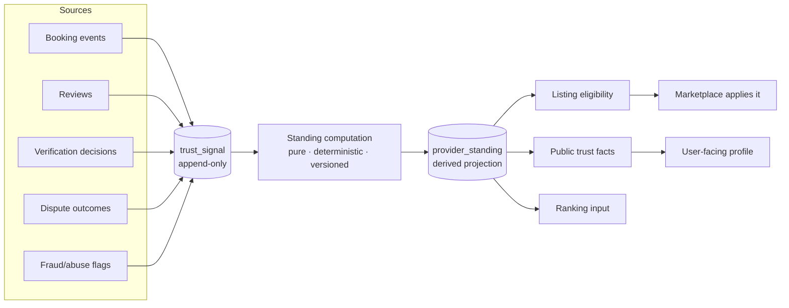
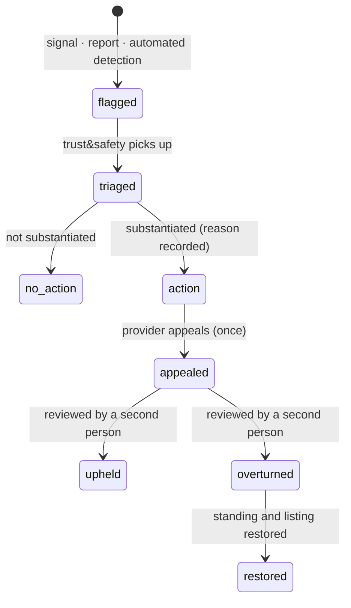

# IMAP 2.0 — Trust Architecture

**Status:** PROPOSED · **Phase:** 2 · **Date:** 2026-08-09
**Product basis:** D-004, D-005, Constitution §7 · **Decision:** AD-020 boundary rules

---

## 1. What trust is here

Trust is the **computed, explainable standing of a provider**, derived from append-only observations, exposed to users as a small set of legible facts, and never adjudicated by AI.

**Current state.** `providers.trust_score INT` is written in exactly one place (`+30` when NID verification is approved) and read nowhere. `rating` is a plain average. There is no dispute workflow, no appeal, and no audit log — so no negative determination could be justified even if one were made.

---

## 2. Model



**Signals are observations, standing is a computation.** Signals are never edited. Recomputation is deterministic and versioned, so a standing can always be explained by replaying the signals that produced it — which is what makes an appeal answerable.

---

## 3. Signals

| Signal | Source event | Gameable? | Mitigation | Weight |
|---|---|---|---|---|
| `identity_verified` | `VerificationApproved` | No — human decision | Tier C decision | High, binary |
| `capability_verified` | `VerificationApproved` (capability) | Yes, by false evidence | Evidence required where certification is regulated | High, per capability |
| `booking_completed` | `BookingCompleted` | Yes — self-dealing | **Counted only when the customer is a distinct principal, payment settled, and completion customer-confirmed** | Medium, log-scaled |
| `repeat_customer` | Second `BookingCompleted` from the same customer | Hard to fake at cost | Distinct principals only | **Highest** |
| `review_rating` | `ReviewPublished` | Yes at low volume | Volume context shown; single reviews never drive standing | Medium |
| `response_time` | Accept/decline latency | Yes — auto-accept | Paired with completion rate; auto-accept without completion reduces standing | Low |
| `acceptance_rate` | Offered vs accepted | Partly | Rolling window; declining at an unviable rate is not penalised | Low |
| `provider_cancellation` | `BookingCancelled` by provider after acceptance | No | Rolling window | **High negative** |
| `no_show` | Dispute outcome or customer report | No | Requires corroboration | **High negative** |
| `dispute_outcome` | `DisputeResolved` | No | Human-decided | High, signed |
| `platform_tenure` | Account age with activity | No | Weak by design | Very low |

**Anti-gaming rules encoded in the computation, not in policy documents:**

1. A completed booking counts only with a **distinct paying customer**, settled payment, and customer-confirmed completion — this closes the self-dealing loop the audit's booking defects would otherwise have opened.
2. Repeat-customer weight is highest because it is the hardest signal to fabricate: it requires a real second person to pay real money twice.
3. Rolling windows for behavioural signals, so a provider is judged on current behaviour, not a permanent record.
4. All positive-signal contributions are log-scaled; volume alone cannot buy standing.

---

## 4. Standing and what users see

**Users never see a composite score** (D-004). They see facts with volume context.

```
Md. Karim Hossain
ID verified · 47 jobs on IMAP · 12 repeat customers
Usually replies within 1 hour
Electrical · AC servicing
Serves: Mirpur, Kazipara, Shewrapara
```

**A new provider:** `New to IMAP · ID verified` — neither hidden nor inflated (R-408).

**Providers see more** (R-406): every signal contributing to their standing, its current value, and what would change it. A standing a provider cannot understand is a standing they cannot improve, and an appeal against it is unanswerable.

**Internal standing** (`eligibility`, ranking weight) is **Sealed** (`DATA-ARCHITECTURE.md` §6). It is never returned by a public API and never enters AI context — publishing it would create an optimisation target and an arms race.

---

## 5. Eligibility — the gate that matters

Trust **owns** listing eligibility; Marketplace **applies** it (`DOMAIN-ARCHITECTURE.md` §4). A provider cannot self-list.

```
listable = identity_verified
         ∧ ≥1 capability declared (verified where certification required)
         ∧ ≥1 coverage area
         ∧ ≥1 price
         ∧ not suspended
         ∧ approved by a human reviewer
```

This is D-005 expressed structurally. The audited defect — any authenticated user publicly listed immediately, while being told review takes 24–48 hours and while the site marketed "KYC-verified providers" — becomes impossible because the boolean is not the provider's to set.

---

## 6. Verification

| Level | Requires | Grants |
|---|---|---|
| **Phone verified** | OTP | Book as a customer; **required for in-home bookings** (R-410) |
| **Identity verified** | NID + selfie, human review | Provider listing eligibility |
| **Capability verified** | Evidence for certification-gated capabilities | Access to those services |
| **Enhanced** (FUTURE) | Background check | Higher-trust categories |

**Rules:**
* Decisions are **Tier C** — human only. AI may run a document-quality pre-check and flag; it may never decide (Constitution §4).
* Documents live in object storage; every access logged with actor and reason (`D-02`, `D-03`).
* Verification expires and is re-requested. Expiry is not a penalty.
* Public claims state **exactly what was checked** — "ID verified" never implies a background check.
* Two-sided: customers are phone-verified for in-home services, and the provider sees the customer's verification level and booking history before accepting (R-410, the `PERSONAS.md` P2 safety requirement).

---

## 7. Human review and appeal



| Rule | Detail |
|---|---|
| **Every punitive action is human** | Tier C. Suspension, capability removal, review removal, standing downgrade |
| **Every action records a reason** | R-1103, audit-logged with actor |
| **Appeals go to a different person** | Not the original decision-maker |
| **Overturn rate is monitored** | A high rate means the detection is wrong, not that appellants are lucky (`KPI.md` §4) |
| **Automated detection flags only** | It opens a case; it never closes one |
| **Suspension does not auto-cancel active bookings** | They go to manual review — a customer with a provider en route should not lose the booking to an automated decision |

---

## 8. Fraud and abuse

Detection produces **signals and cases**, never penalties.

| Pattern | Detection | Response |
|---|---|---|
| Self-dealing (provider books own service) | Distinct-principal rule (§3) | Signal not counted; case if repeated |
| Review manipulation | Review clustering, duplicate text, no-booking reviews | Flag → moderation queue |
| Off-platform diversion | Contact exchange patterns in messages | **Measured, not policed.** Disintermediation is a product problem (`BUSINESS-MODEL.md` §7), not a trust penalty |
| Payment fraud | Gateway signals, velocity | Payment blocked; case raised |
| Account takeover | Auth anomalies | Sessions revoked; re-verification |
| Provider no-show pattern | Repeated non-arrival | Case; standing signal |
| Emergency abuse | Repeated unfounded emergency requests | Case; **never automated blocking** — the cost of a false positive is somebody unable to call for help |

The existing heuristic scorers in `routes/ai.js` (`/fraud-check`, `/review-check`) move here, run **server-side on the write path**, and stop being called AI. Today they are client-invoked and dismissable with a "Proceed Anyway" button, which makes them decorative.

---

## 9. Cold start

The hardest structural problem: multi-signal ranking places a new provider last, permanently, so they never earn a first job and never generate signals.

**Resolution (from `USER-JOURNEYS.md` J4):**
* A **bounded share** of matched requests is reserved for approved-but-unrated providers.
* Shown to the customer as "new to IMAP · ID verified" — disclosed, never disguised.
* Never presented as a top pick.
* The allocation is monitored via `time_to_first_job` and `earnings_concentration` (`KPI.md` §3).

**For customers**, cold start is honest: a new user sees popularity and proximity, not a fabricated personal feed (`BEHAVIORAL-DESIGN.md` §3.2).

---

## 10. Trust in ranking

Standing is **one input** to ranking, alongside availability fit, capability fit, proximity, price fit and relationship (`DOMAIN-ARCHITECTURE.md` §5).

| Rule | Reason |
|---|---|
| Trust never dominates | Otherwise incumbents lock out new supply |
| The basis is inspectable | R-302 — the user sees why this provider is first |
| Paid placement never outranks a materially better option | P7, D-009 |
| Ranking optimises for resolution probability | Never engagement, never platform margin |

---

## 11. Anti-patterns forbidden

| Anti-pattern | Why |
|---|---|
| A single public trust score | Users cannot act on "82/100"; providers cannot fix it; it invites an arms race (D-004) |
| An opaque score written and never read | The current `trust_score` — worse than none |
| AI-adjudicated suspension | A false positive removes someone's income with no recourse |
| Permanent records with no decay | A provider must be judgeable on current behaviour |
| Hiding that a provider is new | Dishonest, and it also starves supply |
| Trust computed inside Discovery | Duplicated authority (`DOMAIN-ARCHITECTURE.md` §4) |
| Publishing internal weights | Creates an optimisation target |
| Automated penalties on emergency-adjacent behaviour | The false-positive cost is someone unable to get help |

---

## 12. Dependencies

Trust cannot be built before these exist, which is why it is Phase F, not Phase D:

| Dependency | Why |
|---|---|
| **Audit log** (R-1101) | A determination that cannot be justified cannot be appealed |
| **Dispute workflow** (R-1102) | Dispute outcomes are among the strongest signals |
| **Customer-confirmed completion** (R-505) | Without it, `booking_completed` is provider-asserted and worthless |
| **Distinct-principal identity** (AD-017) | Self-dealing detection requires knowing who is who |
| **Event stream** (AD-006) | Signals are event-derived |

At Gate 1, trust is reduced to: verification state, completed-booking count, repeat-customer count and review average — all directly computable, all displayed as facts. The full graph follows in Phase F.
