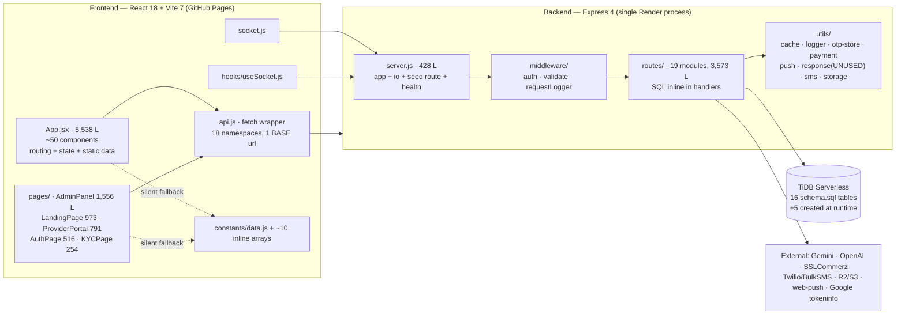

# IMAP — Architecture Gaps

> **STATUS UPDATE — 2026-08-09 (Phase 0.5).** The findings below are the
> Phase 0 baseline and are preserved unchanged for traceability. Many have
> since been contained on branch `imap/phase-0.5-containment`. For current
> status see [`PHASE-0.5-SECURITY-REGRESSION.md`](PHASE-0.5-SECURITY-REGRESSION.md)
> — **all 12 P0 findings fixed and verified; 19 P1 fixed.** Do not read the
> text below as a description of the code as it stands today.

**Audit date:** 2026-08-09 · **Commit:** `726cc87` · **Scope:** read-only.

Format for each gap: **CURRENT → TARGET → GAP → RECOMMENDATION.** Recommendations are proposals for Phase 1 to decide, not decisions made here.

---

## 1. Actual architecture (as built)



**One tier, no layers.** Every route module imports `pool` directly and writes SQL in the handler. There is no domain model, no repository, no service, no use-case object. `utils/response.js` was written to standardise envelopes and **is imported by zero route files**.

---

## 2. Modularity

**CURRENT.** Modules are HTTP-route files, not domains. `routes/users.js` (418 L) contains profile, wallet, notifications, loyalty, referral, complaints, settings, and web-push — seven unrelated concerns behind one path prefix. Conversely, one domain is split across files with no owner: booking logic lives in `routes/bookings.js`, `routes/payments.js`, `routes/reviews.js`, `routes/chat.js`, `routes/schedule.js`, and `server.js` (socket events).

**TARGET (IMAP 2.0 §2.6).** Domain-oriented modules with explicit boundaries so new service categories and new capabilities can be added without touching the core.

**GAP.** No boundary exists to add anything *to*. Adding a service category today means editing: `schema.sql` seed, `server.js:211-227` seed, `frontend/src/constants/data.js` (`SVCS`), `routes/ai.js:374-380` (`BASE` price map), `routes/ai.js:731-737` (`BUNDLES` map), and `frontend/src/App.jsx` filter logic — six places, three of which are hardcoded literal tables.

**RECOMMENDATION.** Phase 1 decides between (a) refactoring in place into `domain/ application/ infrastructure/` per bounded context, or (b) the brief's default NestJS module structure. Either way the first extraction should be `booking`, because it currently has the most callers and the least defined contract.

---

## 3. Coupling

| Coupling | Evidence | Consequence |
|---|---|---|
| Routes ↔ SQL schema | Every handler embeds table and column names | Any schema change requires a repo-wide grep; three code↔schema mismatches already exist undetected (see `DATABASE-GAPS.md`) |
| Routes ↔ cache keys | 60+ literal cache keys such as `` cache.del(`user:wallet:${id}`) `` scattered across 9 files (`bookings.js:104-108`, `payments.js:87-93`, `loans.js:281-289`, …) | Invalidation is manual and provably incomplete — `bookings.js` busts `provider:jobs` but not `provider:analytics`; `users.js:66` busts `user:profile` but not `providers:list:*` |
| Frontend ↔ backend field names | `bookings.js:28-41` accepts both `amount`/`total_amount`, `service_name_en`/`service_type`, `scheduled_time`/`scheduled_at` to tolerate three different callers | The API has no contract; the backend absorbs client drift |
| AI ↔ provider SDK | `routes/ai.js:41-51, 67-84, 253-260` inline `fetch` to Gemini and OpenAI with hardcoded model names and URLs | Changing model or provider means editing three call sites; no abstraction exists to add a third |
| Socket ↔ HTTP | `req.app.get("io")` in `bookings.js:200`, `chat.js:84`, `sos.js:29` | Realtime is a side effect of an HTTP handler; there is no event, so nothing else can subscribe |
| Frontend ↔ demo constants | `App.jsx:5` imports `SVCS, PROVIDERS, MY_BOOKINGS, NOTIFS_DATA`; `contexts/index.jsx:16-18` seeds the shared context with them | Removing mock data breaks the app's default render path |

**TARGET.** Domain events, a data-access layer, a versioned API contract, a model abstraction.
**GAP.** None of these exist.
**RECOMMENDATION.** Introduce, in order: (1) a repository layer to break routes↔SQL, (2) a domain event/outbox to break HTTP↔socket, (3) a provider-agnostic LLM client to break AI↔SDK. (1) is the prerequisite for the database work in `DATABASE-GAPS.md`.

---

## 4. Cohesion

**Misplaced responsibilities found:**

* **Seeding lives in the web server.** `server.js:189-338` — a 150-line demo-data seeder is an HTTP route on the production API.
* **DDL lives in route modules.** Nine files run `CREATE TABLE` / `ALTER TABLE` at import time (`providers.js:261`, `admin.js:391`, `chat.js:8`, `loans.js:17`, `blood.js:8`, `disaster.js:8`, `promos.js:7`, `users.js:347`, `server.js:379`), each with the error discarded.
* **Business seeding lives in read handlers.** `GET /api/users/notifications` inserts three welcome notifications if the list is empty (`users.js:162-177`); `GET /api/schedule` inserts 14 slots if none exist (`schedule.js:8-39`); `routes/promos.js:7-25` and `routes/blood.js:31-44` seed on module load. A GET request mutates state.
* **Pricing lives in the AI module.** `routes/ai.js:374-380` holds the only base-price table in the backend; `categories.base_price` is never read by any route.
* **Authorization lives inline.** No policy module; see `SECURITY-GAPS.md §Cross-cutting`.
* **Frontend routing lives in a 5,538-line component file.** `App.jsx` holds page selection, modal stack, ~50 components, and 10 static data arrays.

**RECOMMENDATION.** Move seeding to `scripts/` (it already partly exists as `scripts/seedDemo.js`, duplicated in `server.js`), DDL to a migration tool, pricing to a pricing service consulted by booking, and authorization to a policy module.

---

## 5. Scalability — what fails first

| Scale | First failure | Evidence |
|---|---|---|
| **1,000 users** | Correctness before capacity | The 12 P0 defects are scale-independent. Also: Render free tier sleeps, so the first request after idle takes ~30 s (worked around client-side by `wakeBackend()` in `api.js:15-17`). |
| **10,000 users** | In-process state | `utils/otp-store.js:5` and `utils/cache.js:12` are `Map`s in the API process. A restart drops all pending OTPs; a second instance makes OTP verification non-deterministic. Base64 KYC images (`schema.sql:141-143`, up to 7 MB each per `kyc.js:53`) and base64 avatars (`schema.sql:17`, up to 2.7 MB per `users.js:65`) inflate the row size of the two hottest tables. |
| **100,000 users** | Query shape | `providers.js:25-27` searches with `LIKE '%q%'` across five columns — no index can serve it. `providers.js:80` runs a correlated `(SELECT COUNT(*) FROM reviews …)` per row. `GET /providers/me/jobs` (`providers.js:243`) and `GET /reviews/provider/:id` (`reviews.js:73`) have no LIMIT. `admin.js:296` loads every active user id into memory. `ai.js:314-331` joins `providers × bookings × reviews` and `GROUP BY p.id` with no date bound. |
| **1,000,000 users** | Architecture | No queue, no worker, no read replica, no partitioning on `bookings`/`notifications`/`wallet_transactions`, no CDN for media (media is in the DB by default), no event log, no sharding key. `users.balance` as a single mutable column is a per-user write hotspot with no ledger to rebuild from. |

**Not over-engineering:** the fixes that matter first are (1) move OTP + cache to Redis, (2) move media out of the DB, (3) paginate the three unbounded endpoints, (4) replace `LIKE '%…%'` with a real index or search service. Nothing above requires microservices.

---

## 6. Maintainability

**Can another senior engineer understand this project?** Partially, and slowly.

Working in its favour: consistent file layout, heavy inline comments with section banners, a single well-organised API client (`api.js`), meaningful commit messages, and a README that is accurate about setup.

Working against it:
* `App.jsx` at 5,538 lines is the primary obstacle. It cannot be reviewed in one sitting and cannot be split without a dependency map, because ~50 components share module-scope constants.
* No tests means no executable specification. The only way to learn a behaviour is to read the handler.
* Four response envelopes and dual field names mean the API's shape must be learned per endpoint.
* Silent `.catch(()=>{})` appears throughout (`server.js:226`, `providers.js:261,309`, `users.js:170`, `bookings.js:219,225`, and 20+ client sites). A failure is indistinguishable from a success.
* Documentation is one file. See `DOCUMENTATION-INVENTORY.md` — 61 of the 62 documents the brief asks about do not exist.

---

## 7. Extensibility

**Can a new service category be added without rewriting the core?** No — it requires edits in six places (see §2).

**Can a new booking state be added?** No — `bookings.status` is a MySQL `ENUM` (`schema.sql:105`), so it needs a DDL change; and the string list is duplicated in `bookings.js:180`, `server.js:108` (which lists a sixth value, `"ongoing"`, that the DB enum does not contain), `AdminPanel.jsx` status map, and the frontend status ternaries.

**Can a new payment method be added?** Partially — `payment_method` is a `VARCHAR(30)` but the accepted list is hardcoded in `bookings.js:14` and the gateway is a direct `sslcommerz-lts` import in `utils/payment.js:11` with no adapter interface.

**Can a new role be added?** No — `users.role` is `ENUM('customer','provider','admin')` (`schema.sql:16`), and `requireRole()` (`middleware/auth.js:29-36`) is a flat string match. The brief's §17 asks for agency and business/SME actors; neither is expressible.

**Can a new AI capability be added?** Only as another hand-written route. There is no tool registry, no schema for an AI action, no dispatcher.

---

## 8. AI readiness

**CURRENT.** AI is a text endpoint. `routes/ai.js` exposes chat plus five deterministic scorers. Nothing in the system consumes an AI decision: `/dynamic-price` returns a number the *client* then sends back as authoritative; `/fraud-check` is called by the client and is bypassable (`App.jsx:603`); `/review-check` is never called before a review insert.

**TARGET (brief §14).** `AI → Tool → Authorization → Business Rules → Transaction → Database`.

**GAP — every link is missing:**

| Link | Present? | What is missing |
|---|---|---|
| Tool | No | No tool registry, no JSON-schema tool definitions, no function-calling configuration on either provider call (`ai.js:46-49`, `:70-83`) |
| Authorization | No | No per-tool permission model; no user-consent step; no distinction between read and write tools |
| Business rules | No | Rules live inside HTTP handlers and are not callable from anywhere else |
| Transaction | No | Zero transactions exist (P0-11) |
| Database | Reachable | `db.query` is available, but only from a route handler |

**Additional blockers for an agentic layer:** no idempotency keys (an agent retry double-books); no audit log (an agent action cannot be traced); no structured error taxonomy (an agent cannot distinguish "insufficient balance" from "database down" — both are `{error:"Server error"}`); no confirmation/approval primitive (the brief's "User Approval" step has no representation).

**RECOMMENDATION.** The tool contract is the highest-leverage single artifact for IMAP 2.0. Defining it forces a service layer, an authorization policy, transaction boundaries, and an audit log into existence — all four of which are independently required anyway. Phase 1 should draft `docs/ai/TOOL-CATALOG.md` before any implementation.

---

## 9. Gap table against the IMAP 2.0 principles

| Brief § | Principle | Current | Gap | Recommendation |
|---|---|---|---|---|
| 2.1 | AI-native, multimodal | Text chat only. Voice is Web Speech → keyword → page nav (`VoiceCommand.jsx:62-70`), never reaches an LLM. Image is client-side OCR for one NID field (`App.jsx:1388`). No location/document/context input to AI. | No multimodal ingestion path; no shared context object | Define a `Context` envelope (user, location, active booking, recent history) that every AI call receives |
| 2.2 | AI + UI, not AI instead of UI | UI is complete; AI is a floating chat panel that shares no state with it | No bridge — AI cannot reference or drive the current screen | Structured AI responses that can render as cards/actions the existing UI already knows how to display |
| 2.3 | Behavioural-first UX | Personalisation absent; feed is `ORDER BY rating DESC`; one-tap actions absent; proactive assistance absent | See `UX-GAPS.md` scorecard | — |
| 2.4 | Goal-based experience | No intent model, no goal decomposition | Total | Requires the service graph (2.6) first |
| 2.5 | Personal AI context | `users.settings JSON` holds 5 notification booleans and is written but never read (`users.js:318-333`) | No preference, history, memory, or consent model | New bounded context; privacy/consent must be designed in, not added |
| 2.6 | Service graph | Flat `categories` table (12 rows). No `services` table. Provider capability is one free-text string. `providers.category_id` is nullable and often null. | No graph, no edges, no capability model, no availability model that booking respects | Highest-priority schema work; everything in 2.4 and 2.7 depends on it |
| 2.7 | Provider AI | Provider analytics is 6-month earnings + last 5 reviews (`providers.js:144-186`) | No demand, pricing, or customer intelligence; no marketing or optimisation surface | After 2.6 |
| 2.8 | Trust & safety | KYC submit/review exists and works. Reviews exist. `trust_score` is an integer column mutated in exactly one place (`kyc.js:117`, +30 on NID verification) and read nowhere. | No fraud enforcement, no abuse detection, no audit log, no complaint SLA, no provider verification gate (P1-7) | Audit log first — it is a prerequisite for every other item here |
| 2.9 | Real-world execution | Discover → Match → Book → Pay → Track → Complete → Review all exist as flows | Each link is unsafe (see `SECURITY-GAPS.md`); tracking is unauthorized; payment is not reconciled | Phase 0.5 containment |
| 2.10 | North Star = needs resolved | Only counters are booking count and summed amount (`admin.js:12-19`) | No resolution metric, no funnel, no analytics events | Define the metric before instrumenting |

---

## 10. Notable conflicts to resolve in Phase 1 (documented, not decided)

```
SOURCE A: docs (CLAUDE.md default stack) — Next.js, NestJS, PostgreSQL, Prisma, Redis
SOURCE B: README.md:55-71 — React+Vite, Node+Express, MySQL 8
CURRENT CODE — React 18 + Vite 7 + Ant Design 6; Express 4 CommonJS; TiDB (MySQL wire); no Redis, no ORM
CONFLICT
```

```
SOURCE A: README.md:201-213 "Security Checklist — [x] JWT authentication on all protected routes"
CURRENT CODE — /api/ai/chat, /api/ai/chat/stream, /api/ai/match, /api/ai/dynamic-price,
               /api/ai/fraud-check, /api/ai/review-check, /api/ai/bundle-suggest,
               /api/providers (list + detail), /api/blood, /api/disaster/alerts,
               /api/disaster/report, /api/promos, /api/promos/validate,
               /api/schedule/provider/:id, /api/services, /api/payments/success|fail|cancel|ipn,
               /api/admin/seed-demo  — all unauthenticated
CONFLICT
```

```
SOURCE A: index.html:9 meta description — "KYC-যাচাইকৃত Provider" / "KYC-verified providers"
CURRENT CODE — routes/providers.js:263-328 lists any authenticated applicant immediately;
               schema.sql:61 is_available DEFAULT 1; no approval state exists
CONFLICT
```

```
SOURCE A: backend/.env.example:35-36 — SSL_STORE_ID / SSL_STORE_PASSWORD
SOURCE B: render.yaml:53-56 — SSLCOMMERZ_STORE_ID / SSLCOMMERZ_STORE_PASSWORD
CURRENT CODE — utils/payment.js:13-14 reads SSLCOMMERZ_*
CONFLICT (render.yaml matches the code; .env.example does not — following it yields mock payments)
```

```
SOURCE A: server.js:108 VALID_BOOKING_STATUSES = [pending, confirmed, ongoing, completed, cancelled]
SOURCE B: schema.sql:105 ENUM('pending','confirmed','active','completed','cancelled')
SOURCE C: routes/bookings.js:180 allowed = [pending, confirmed, active, completed, cancelled]
CONFLICT ("ongoing" vs "active")
```

```
SOURCE A: routes/kyc.js:10-12 doc_type ∈ [nid, passport, birth_cert, driving_license]
SOURCE B: schema.sql:139 ENUM('nid','driving','passport','birth')
SOURCE C: routes/upload.js:80 VALID_DOC_TYPES = [nid, passport, birth_cert, driving_license]
CONFLICT
```

```
SOURCE A: schema.sql:267-279 — 12 categories, INT AUTO_INCREMENT ids, slugs electrician/plumber/…
SOURCE B: server.js:211-220 + scripts/seedDemo.js:26-35 — 8 categories, STRING ids ('cat-electric'),
          slugs electrical/plumbing/…
SOURCE C: frontend/src/constants/data.js:1-96 — 19 categories, numeric ids 1-19, different names again
CONFLICT (three incompatible category taxonomies; source B cannot insert at all because the PK is INT)
```
