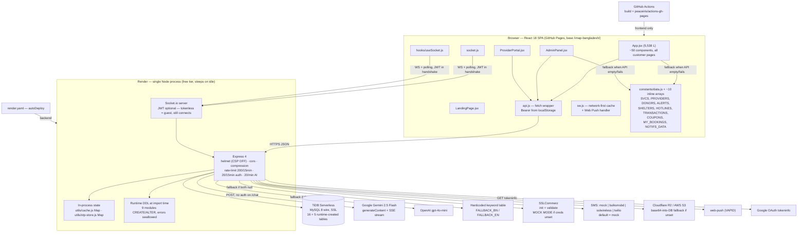

# IMAP 2.0 — Baseline Audit (Phase 0)

> **STATUS UPDATE — 2026-08-09 (Phase 0.5).** The findings below are the
> Phase 0 baseline and are preserved unchanged for traceability. Many have
> since been contained on branch `imap/phase-0.5-containment`. For current
> status see [`PHASE-0.5-SECURITY-REGRESSION.md`](PHASE-0.5-SECURITY-REGRESSION.md)
> — **all 12 P0 findings fixed and verified; 19 P1 fixed.** Do not read the
> text below as a description of the code as it stands today.

**Audit date:** 2026-08-09
**Repository:** `c:\my core project\imap-app`
**Commit audited:** `726cc87` (branch `main`, working tree clean)
**Auditor scope:** read-only. No application code, schema, migration, dependency, or configuration was modified.

---

## 1. Executive Summary

IMAP today is a **single-repository, two-tier demo-grade web application**: a React 18 + Vite SPA (deployed to GitHub Pages) talking to an Express 4 REST + Socket.io API (deployed on Render) backed by a TiDB Serverless MySQL-compatible database. It is real software — it builds, it deploys, it persists data, it authenticates users, it takes bookings, and it can talk to Google Gemini. It is not a mockup.

It is also **not production-safe**, and the gap is not incremental. The audit found **12 P0 findings**, of which the most consequential cluster is that *money is not server-authoritative and no operation is transactional*. Booking prices, platform fees, and wallet effects are all derived from client-supplied values, applied through independent autocommit statements, with no state machine guarding repeat transitions. A user can mint wallet balance from an unauthenticated-adjacent position; a provider can be paid an unbounded number of times for one job.

The second cluster is **identity**. Any account created via OTP or social login has `password_hash = NULL`, and the login handler skips password verification entirely when the hash is null — so knowing a phone number is sufficient to obtain that user's JWT. A separate endpoint (`/api/auth/social-login`) issues a JWT for any `socialId` that exists in the database, with no token verification of any kind.

The third cluster is **truthfulness**. Substantial parts of the product present fabricated data as real: seeded disaster alerts with evacuation instructions, seeded blood donors with phone numbers, a landing page counting "10,000+ customers / 1,200+ providers" from hardcoded constants, a schema.org `aggregateRating` of 4.8 over 10,000 reviews, a "LIVE ACTIVITY TICKER" that is a CSS animation over a static array, an admin panel that silently keeps showing fake KYC applications and support tickets when the API returns an empty list, and a booking payment step that generates a six-digit "OTP" in the browser and prints it on screen next to a random fake phone number.

Against the IMAP 2.0 direction stated in the brief, the current codebase supplies **almost none of the required substrate**. There is no service graph (categories are a flat table; there is no `services` table, no provider-capability join, no relationship modelling). There is no AI tool layer — AI cannot perform an action, only generate text. There is no memory, context, or personalisation store. There is no event architecture, no audit log, no migration system, and no test of any kind.

**Overall score: 1.4 / 5.** Recommended next phase: a security-and-money remediation sprint (P0 only, no features), executed *before* any IMAP 2.0 architecture work begins, because several P0s are live on a publicly reachable deployment.

---

## 2. What IMAP currently is

Verified by reading the code, not the README:

* A **service-marketplace CRUD application** for Bangladesh, bilingual (Bengali/English), mobile-first, installable as a PWA.
* **19 route modules** on Express covering auth, users, providers, bookings, KYC, reviews, categories, admin, AI, blood donors, disaster reports, chat, promos, provider schedules, SOS, payments, uploads, and microloans.
* A **JWT bearer-token auth model** with a DB round-trip per request (`backend/middleware/auth.js:14-21`) and a coarse `requireRole()` guard.
* A **wallet-balance model**: `users.balance DECIMAL(12,2)` mutated in place, with `wallet_transactions` written as a best-effort side log.
* A **Socket.io layer** carrying booking-room chat, provider location, booking-status broadcasts, and SOS alerts.
* An **AI layer** that is: a proxy to Gemini 2.5 Flash (with an OpenAI `gpt-4o-mini` fallback and a hardcoded Bengali/English keyword-matching fallback below that), plus five deterministic scoring functions labelled "AI" (provider ranking, surge pricing, fraud heuristics, fake-review heuristics, co-booking bundles).
* A **PWA shell**: `manifest.json`, a network-first service worker (`frontend/public/sw.js`), Web Push via VAPID.
* A **deployed system**: frontend at `https://hasib61714.github.io/imap-bangladesh/`, API at `https://imap-backend-mghb.onrender.com`, DB on TiDB Cloud (`render.yaml:16-27`).

**Size:** 74 tracked files, ~17,900 lines of source (excluding lockfiles). `frontend/src/App.jsx` alone is 5,538 lines — 31% of the codebase in one file.

---

## 3. What IMAP currently is NOT

* **Not AI-native.** AI has no tools, no function calling, no ability to act. `POST /api/ai/chat` returns a string; nothing in the system consumes an AI decision. The one AI endpoint whose output *could* gate an action — `/api/ai/fraud-check` — is called by the client (`frontend/src/App.jsx:531`) and is bypassable with a "Proceed Anyway" button (`App.jsx:603`). `/api/ai/dynamic-price` produces a price that the client then *sends back* as the authoritative booking amount.
* **Not goal-based.** There is no intent model, no goal decomposition, no multi-service orchestration. The only entry point is category → provider → book.
* **Not context-aware.** No user preference store, no memory table, no interaction history feeding any decision. `users.settings JSON` holds five notification booleans and nothing reads them.
* **Not a service graph.** `categories` is a flat 12-row table with no parent/child, no related-service edges, no capability model. A provider has one free-text `service_type_en` string and one optional `category_id`.
* **Not transactional.** Zero uses of `beginTransaction`/`COMMIT`/`ROLLBACK` in the entire backend.
* **Not auditable.** No `audit_logs` table, no admin action log, no financial ledger, no reconciliation path.
* **Not tested.** Zero test files, zero test scripts, no linter, no type checking.
* **Not migration-managed.** Schema evolves through `CREATE TABLE IF NOT EXISTS` / `ALTER TABLE` statements executed from route modules at import time, with errors swallowed.

---

## 4. Actual repository structure

```
imap-app/
├── .github/workflows/deploy.yml     # frontend → gh-pages only
├── README.md                        # the ONLY documentation artifact
├── render.yaml                      # backend service + 30 env vars
├── backend/                         # Express 4, CommonJS, Node
│   ├── server.js                    # 428 L — app, Socket.io, seed endpoint, health
│   ├── db.js                        # mysql2 pool (TiDB, SSL)
│   ├── schema.sql                   # 356 L — 16 tables + seed data
│   ├── middleware/  auth.js  validate.js  requestLogger.js
│   ├── routes/      19 files, 3,573 L total
│   ├── utils/       cache logger otp-store payment push response sms storage
│   └── scripts/     initDb  resetAdmin  checkLogin  seedDemo
└── frontend/                        # React 18 + Vite 7 + Ant Design 6
    ├── index.html                   # SEO + schema.org JSON-LD
    ├── public/  manifest.json  sw.js  icons/
    └── src/
        ├── App.jsx                  # 5,538 L — ~50 components, all customer pages
        ├── api.js                   # 408 L — typed API client
        ├── socket.js  hooks/useSocket.js   # TWO parallel socket clients
        ├── pages/   AdminPanel(1556) LandingPage(973) ProviderPortal(791)
        │            AuthPage(516) KYCPage(254)
        ├── components/  ui.jsx  VoiceCommand.jsx
        ├── constants/   data.js(120) theme.js(322) translations.js(111)
        └── contexts/index.jsx
```

**Directories that do not exist:** `docs/`, `tests/`, `migrations/`, `infra/`, `packages/`, `services/`, `.claude/`, any workers directory.

---

## 5. Actual architecture



### What this diagram makes visible

* **No caching tier, no queue, no worker, no search engine.** `utils/cache.js` is a `Map` in the API process. Anything horizontal (a second Render instance) breaks OTP verification and produces divergent cache views.
* **Two independent Socket.io client singletons** (`socket.js` and `hooks/useSocket.js`) both connect to the same server with the same token — duplicated connections per user.
* **Three-level AI fallback chain** where the bottom level is a keyword table that fabricates specific numbers ("45+ verified electricians", "your IMAP credit score is 82/100").
* **Three-level degradation to fake data** in the client: real API → static constant → rendered as if real.

---

## 6. Implemented modules

Present, wired end-to-end, and backed by real persistence:

| Module | Backend | Frontend | Notes |
|---|---|---|---|
| Email/password + phone-OTP + Google auth | `routes/auth.js` | `pages/AuthPage.jsx` | Works; see §15 for the bypasses |
| User profile / avatar | `routes/users.js:8-71` | `App.jsx` CustomerProfilePage | Avatar stored as base64 LONGTEXT unless R2 configured |
| Provider directory + search + filter | `routes/providers.js:13-141` | `App.jsx` providers page | Public, unauthenticated, returns phone numbers |
| Booking create / list / status | `routes/bookings.js` | `App.jsx` BookModal, MyBookings | No transaction, no state machine |
| Reviews | `routes/reviews.js` | RatingModal | Correctly gated on a completed, unrated, own booking |
| KYC submit + admin review | `routes/kyc.js`, `routes/upload.js` | `pages/KYCPage.jsx` | Images as base64 in DB by default |
| Booking chat (REST + socket) | `routes/chat.js` | `App.jsx` Chat, ProviderPortal | REST access control is correct; socket rooms are not |
| Wallet (balance, ledger view, withdraw) | `routes/users.js:74-150` | WalletPage | `balance` is a mutable column, not a ledger |
| Loyalty points + redemption | `routes/users.js:200-216, 290-315` | LoyaltyPage | Redeems points → wallet at 0.5 BDT/point |
| Referral codes | `routes/users.js:219-249` | ReferralPage | `referrals` table created at boot; nothing writes to it |
| Complaints / disputes | `routes/users.js:252-272`, `routes/admin.js:229-276` | DisputeModal | |
| SOS alerts | `routes/sos.js` | App.jsx SOS | Broadcast to all sockets — see §15 |
| Microloans | `routes/loans.js` | LoanScore | Disbursement is non-idempotent |
| Payments (SSLCommerz) | `routes/payments.js` | WalletPage, BookModal | Mock mode is a money printer if creds unset |
| Promo codes | `routes/promos.js` | PromosPage | Validated, never applied to any price |
| Provider schedule | `routes/schedule.js` | ProviderPortal | Never consulted during booking |
| Admin console | `routes/admin.js` | `pages/AdminPanel.jsx` | 1,556 L; falls back to fake rows |
| Web Push | `utils/push.js` | `sw.js` | Requires VAPID keys |
| Blood donors | `routes/blood.js` | BloodDonationPage | Seeded with 8 fabricated donors |
| Disaster reports | `routes/disaster.js` | DisasterPage | Seeded with 4 fabricated alerts |
| Voice command | — | `components/VoiceCommand.jsx` | Web Speech API → keyword → page nav. Not AI. |
| NID OCR | — | `App.jsx:1388` (tesseract.js) | Client-side OCR to prefill the NID field |

---

## 7. Partial modules

| Module | What exists | What is missing |
|---|---|---|
| **Provider onboarding** | `POST /api/providers/apply` writes the profile and sends "will be reviewed in 24–48 hours" | No review gate. `is_available` defaults to 1, so the profile is publicly listed immediately. There is no `pending`/`approved` state on `providers`. |
| **Refunds** | Cancellation credits the wallet if the prior status was `pending`/`confirmed` (`bookings.js:268-295`) | No refund through the payment gateway, no partial refund, no refund on `active`/`completed`, no `refunds` table, no reconciliation. `payments.refunded_at`/`refund_reason` columns exist and are never written. |
| **Platform fee / take rate** | `bookings.platform_fee` column, summed in `/api/admin/revenue` | Client supplies the value; default is 0. There is no fee schedule, no per-category rate, no config. |
| **Notifications** | DB rows + Web Push | No delivery status, no preference enforcement (`users.settings` is written but never read), no digest, no SMS/email channel. |
| **Search** | `LIKE '%q%'` across five columns (`providers.js:25-27`) | No index usable by these predicates, no ranking, no typo tolerance, no geo filter (`providers.latitude/longitude` exist and are never queried). |
| **Analytics** | `/api/admin/stats`, `/revenue`, `/ai/forecast`, `/ai/churn`, `/ai/heatmap` | `areaDemand`/`heatmap` group by the raw free-text `bookings.address`, so every distinct address is its own "area". |
| **Refresh tokens** | `refresh_tokens` table in `schema.sql:252-260`; `POST /api/auth/refresh` | The endpoint re-signs the *existing* JWT. The table is never read or written. No rotation, no revocation. |
| **Storage** | R2/S3 client in `utils/storage.js` | Reads `R2_BUCKET_NAME`; `render.yaml` provisions `R2_BUCKET`. The bucket name silently falls back to `imap-media`. |
| **i18n** | `constants/translations.js` (~108 keys) | Most UI strings are inline ternaries `lang==="en"?…:…` scattered across all files. No extraction, no pluralisation, no RTL. |

---

## 8. Missing modules

Required by the IMAP 2.0 direction, **entirely absent** from the codebase:

* Service graph / taxonomy (categories → services → related services → capabilities)
* Provider capability, certification, and coverage-area modelling
* Goal decomposition ("I'm moving to a new apartment" → service set)
* AI tool layer / function calling / action authorization
* AI memory, user context, preference, or personalisation store
* Retrieval / RAG / embedding store
* Recommendation engine (the "recommendation" is `ORDER BY rating DESC`)
* Event bus, outbox, or domain events
* Background workers, job queue, scheduled tasks
* Financial ledger, double-entry accounting, settlement, payout runs
* Audit logging (application, admin, or security)
* Trust & safety pipeline (abuse detection, content moderation, fraud enforcement)
* Dispute/escalation workflow beyond a status field
* Business/SME accounts, agencies, multi-seat providers
* Subscriptions, premium placement, lead fees — any monetisation beyond the unused `platform_fee`
* Observability: metrics, tracing, error tracking, alerting, dashboards
* Test suite of any kind
* Migration system
* API versioning, OpenAPI/contract definition
* Feature flags, experimentation
* Data retention, deletion, export (GDPR/PDPA-style user rights)

---

## 9. Mock / demo modules

See `DEMO-TO-PRODUCTION GAP LIST` in `PRODUCTION-GAPS.md` for the itemised table. Summary of what is fabricated:

**Server-seeded fabrications** (written to the production database on first boot):
* 4 disaster alerts including "Cyclone warning — critical, Cox's Bazar" (`routes/disaster.js:24-31`)
* 8 blood donors with phone numbers and coordinates (`routes/blood.js:33-44`)
* 6 promo codes with fabricated redemption counts up to 1,890 (`routes/promos.js:14-23`)
* 6 provider accounts with real-looking Bengali names, ratings 4.6–4.9, and job counts up to 847 — password `demo1234` (`server.js:231-269`)
* 1 admin account, password `admin123` (`schema.sql:353-356`)
* 14 default schedule slots per provider (`routes/schedule.js:13-28`)
* 3 welcome notifications per new user, including a promo claim (`routes/users.js:163-169`)

**Client-side fabrications rendered as product data:**
* `constants/data.js`: 19 service categories with provider counts summing to 2,142; 6 providers; 4 bookings; 5 notifications
* `App.jsx`: `ALERTS` (3 disaster warnings with evacuation instructions), `SHELTERS`, `HOTLINES`, `DONORS` (8), `TRANSACTIONS` (8), `COUPONS` (6), `LY_HISTORY`, `PF_PROVIDERS`
* `LandingPage.jsx:112`: counters animate to `{svc:500, cust:10000, prov:1200, rat:4.8}` — all constants
* `LandingPage.jsx:717-737`: "LIVE ACTIVITY TICKER" — a CSS marquee over an 8-element static array
* `index.html:55-59`: schema.org `aggregateRating` `{ratingValue: 4.8, reviewCount: 10000}`
* `AdminPanel.jsx:118-126` and siblings: KYC applications and support tickets initialised with fake rows; every loader uses `if (d?.x?.length)` so an empty or failed API response **leaves the fake rows on screen**

**Fake flows:**
* Booking payment "OTP": generated in the browser (`App.jsx:503`), displayed on screen labelled "Demo OTP" (`App.jsx:570`), next to a randomly generated fake phone number (`App.jsx:504`)
* `POST /api/blood/request` responds `"Request sent to available donors"` and only writes a log line (`routes/blood.js:139-141`)
* `POST /api/sos` responds `"SOS alert sent to admin & call center"` — no call-centre integration exists (`routes/sos.js:44`)
* Payment mock mode: marks a payment `success` and credits the wallet with no gateway call (`routes/payments.js:78-94`)

---

## 10. Critical risks

Ranked by expected loss. Full evidence in `SECURITY-GAPS.md`.

| # | Risk | Severity |
|---|---|---|
| 1 | Any account without a password hash (every OTP/social user) accepts **any** password | P0 |
| 2 | `/api/auth/social-login` issues a JWT for any known `socialId`, unverified | P0 |
| 3 | Booking `amount` and `platform_fee` are client-supplied and never validated server-side | P0 |
| 4 | Negative `platform_fee` inflates the wallet balance through the "atomic deduction" guard | P0 |
| 5 | `PATCH /bookings/:id/status → completed` credits provider earnings **on every call** | P0 |
| 6 | `PATCH /loans/:id → disbursed` credits the wallet **on every call** | P0 |
| 7 | Socket `join_room` has no participant check — any authed user reads any booking's chat and live location | P0 |
| 8 | SOS alerts are `io.emit`-broadcast to every connected socket including guests, with name, phone, and GPS | P0 |
| 9 | Known credentials seeded into production (`admin123`, `demo1234`); `/api/admin/seed-demo` runs without a secret when fewer than 4 providers exist | P0 |
| 10 | Fabricated disaster alerts, blood donors, and emergency confirmations served as real | P0 |
| 11 | Zero database transactions — every money path can partially apply | P0 |
| 12 | If SSLCommerz credentials are unset, wallet top-up succeeds instantly with no payment | P0 |
| 13 | Provider and blood-donor phone numbers exposed on unauthenticated endpoints | P1 |
| 14 | KYC document images (NID front/back/selfie) stored as base64 in the primary DB and shipped whole in admin listings | P1 |
| 15 | Wallet debited at booking creation *and* charged again through the gateway | P1 |
| 16 | Admin "suspend user" writes `is_active = -1`, which the auth middleware treats as active | P1 |
| 17 | `helmet` is configured with `contentSecurityPolicy: false` | P1 |
| 18 | OTP store and cache are in-process — break on restart and prevent horizontal scaling | P1 |

---

## 11. Technical debt

**Structural**
* `App.jsx` at 5,538 lines holds ~50 components, all customer-facing routing, and ~10 static data arrays. `AdminPanel.jsx` at 1,556 lines. No module boundaries, no domain layering — routes call `pool.query` directly with SQL inline.
* No service/repository layer. Business rules live inside Express handlers, duplicated (participant checks in `chat.js` appear twice verbatim; provider lookup by `user_id` appears in six files).
* `utils/response.js` defines `ok`/`fail`/`paginated` helpers. **Zero route files import it.** Response envelopes are inconsistent: some return bare arrays, some `{data,total,page}`, some `{bookings,total}`, some `{success:true}`.
* Two parallel Socket.io client implementations.
* `frontend/.vite/deps/` is committed to git.

**Schema**
* No migration tool. Nine modules run DDL at import time: `providers.js:261`, `admin.js:391`, `chat.js:8`, `loans.js:17`, `blood.js:8`, `disaster.js:8`, `promos.js:7`, `users.js:347`, `server.js:379`. Errors are caught and discarded, so a failed schema change is invisible.
* `schema.sql` and the runtime DDL disagree: `microloans` is defined in both; `blood_donors` in both; `loyalty_log` in both.
* `server.js:211-227` (the seed endpoint) inserts `categories` with string ids (`'cat-electric'`) into an `INT AUTO_INCREMENT` primary key, wrapped in `.catch(() => {})` — the category seed silently does nothing.

**Correctness**
* `routes/kyc.js:10-12` accepts `birth_cert`/`driving_license`; `schema.sql:139` defines `ENUM('nid','driving','passport','birth')`.
* `routes/payments.js:85,126,161` inserts `wallet_transactions.type = 'topup'`; `schema.sql:158` defines `ENUM('credit','debit')`.
* `routes/providers.js:297-304` inserts into `providers` without `id`; `providers.id` is `VARCHAR(36) PRIMARY KEY` with no default.
* `routes/ai.js:341` scores on `p.last_active`, a column that does not exist on `providers`.
* `routes/providers.js:60` recomputes the count query with `params` that still contain the LIMIT/OFFSET values on the cached path.
* Five environment-variable names in code do not match the names provisioned in `render.yaml`/`.env.example` (see §17).

**Operational**
* No tests, no linter, no formatter, no type checking, no pre-commit hooks.
* Backend has no CI at all — `.github/workflows/deploy.yml` builds only the frontend.
* `express.json({limit:"10mb"})` applies to every route, including unauthenticated ones.

---

## 12. Product gaps

| Area | Status |
|---|---|
| Product vision / mission / principles | **MISSING** — no document exists |
| Target users, personas | **MISSING** |
| User journeys | **MISSING** |
| Business model, monetisation | **MISSING** — and unimplemented: `platform_fee` defaults to 0 and is client-set; promos are validated but never applied to a price; no subscription, lead-fee, or placement mechanism exists |
| Roadmap | **MISSING** |
| KPIs / North Star | **MISSING** — nothing measures "needs resolved"; the only counters are booking count and summed amount |
| Non-goals | **MISSING** |
| Pricing policy | **MISSING** — `categories.base_price` and `providers.hourly_rate` exist and are never used to price a booking |

The functional surface is broad (19 domains) and uniformly shallow. There is no evidence of a prioritisation decision anywhere in the repository: microloans, disaster reporting, and blood donation received the same architectural investment as booking.

---

## 13. UX gaps

Detail in `UX-GAPS.md`. Headlines:

* **Trust is asserted, not earned.** "KYC-verified providers" appears in the meta description and landing copy, while `POST /api/providers/apply` lists a provider publicly with no verification.
* **Demo data is indistinguishable from real data.** No empty states — every list falls back to fabricated rows. A user cannot tell whether the eight blood donors are real.
* **The AI is a sidebar, not a layer.** It cannot see the current page, the active booking, or the user's history; it cannot take an action; its answers are not grounded in the database (the fallback path invents provider counts).
* **No continuity.** No "resume where you left off", no active-task surface, no saved state across sessions beyond the JWT.
* **Accessibility is largely unaddressed.** Inline styles throughout, minimal ARIA (`LandingPage.jsx` has a few `aria-label`s; `App.jsx` has almost none), no focus management on the many modal overlays, no keyboard path through the booking flow, colour-only status indication.
* **Loading/error states are inconsistent.** Many handlers are `.catch(()=>{})` or `.catch(e=>console.warn(...))` — the user sees stale or fake data instead of an error.

---

## 14. AI gaps

Detail in `AI-GAPS.md`. Classification of every AI surface:

| Endpoint | Classification |
|---|---|
| `POST /api/ai/chat` | **REAL AI** (Gemini/OpenAI) → **FALLBACK** (keyword table) |
| `POST /api/ai/chat/stream` | **REAL AI** (Gemini SSE) → **FALLBACK** (simulated character-by-character replay of the keyword table) |
| `POST /api/ai/match` | **RULE-BASED** — weighted sum of rating/bookings/reviews/verified |
| `POST /api/ai/dynamic-price` | **RULE-BASED** — hardcoded base prices × time/weekend/area multipliers |
| `POST /api/ai/fraud-check` | **RULE-BASED** — four heuristics, advisory only |
| `POST /api/ai/review-check` | **RULE-BASED** — five heuristics, **not called before review insert** |
| `POST /api/ai/bundle-suggest` | **PARTIAL** — co-booking SQL, falls back to a static bundle map |
| `GET /api/ai/forecast` | **RULE-BASED** — last-two-months linear extrapolation |
| `GET /api/ai/churn` | **RULE-BASED** — days-since-last-booking thresholds |
| `GET /api/ai/heatmap` | **RULE-BASED** — grouped by raw free-text address |

**Can AI safely perform actions? No — because AI cannot perform actions at all.** There is no tool registry, no action schema, no authorization hook, no confirmation step, no transaction boundary. The required chain `AI → Tool → Authorization → Business Rules → Transaction → Database` does not exist at any link.

**AI safety violations found:** the keyword fallback asserts specific unverified facts to users, including *"Your IMAP credit score is 82/100 — eligible for instant microloan up to ৳50,000"* (`routes/ai.js:126`) and *"45+ verified electricians"* (`routes/ai.js:118`). Neither is read from the database. Details in `AI-GAPS.md §4`.

**Also missing:** authentication on `/ai/chat` and `/ai/chat/stream`, prompt-injection defence, output validation, model/provider abstraction (both providers are inlined with `fetch`), token accounting, cost controls beyond a 20/min rate limit, evaluation harness, tracing, and any record of AI interactions.

---

## 15. Security gaps

Full findings with evidence in `SECURITY-GAPS.md`. Counts: **12 P0, 18 P1, 11 P2, 6 P3**.

The two most urgent, restated with evidence because they are exploitable against the live deployment:

```
Finding:  Authentication bypass for every password-less account.
Evidence: backend/routes/auth.js:105-108
            if (user.password_hash) {
              const ok = await bcrypt.compare(password || "", user.password_hash);
              if (!ok) return res.status(401).json({ error: "Wrong password" });
            }
          backend/routes/auth.js:56
            const hash = password ? await bcrypt.hash(password, 10) : null;
Behavior: Accounts created through OTP or social flows have password_hash = NULL.
          The verification block is skipped and a JWT is issued at line 111.
Impact:   Full account takeover from knowledge of a phone number or email.
Severity: P0
```

```
Finding:  Unverified social login issues a session token.
Evidence: backend/routes/auth.js:119-133  POST /api/auth/social-login
            const [rows] = await pool.query("SELECT * FROM users WHERE social_id = ?", [socialId]);
            if (rows.length) return res.json({ user: safeUser, token: makeToken(rows[0]) });
          backend/routes/auth.js:216  — /auth/google stores the Google `sub` as social_id
Behavior: No ID token, signature, audience, or provider check. Possession of the
          social_id string alone yields a valid JWT.
Impact:   Full account takeover. Google `sub` is not a secret.
Severity: P0
```

---

## 16. Business gaps

| Revenue mechanism | Implemented? | Evidence |
|---|---|---|
| Commission / take rate | **No** | `bookings.platform_fee` defaults to `0.00` (`schema.sql:102`) and is read from the request body (`bookings.js:33`). No fee schedule exists. |
| Subscription | **No** | No plan, entitlement, or billing-cycle model anywhere |
| Lead fees | **No** | — |
| Premium placement | **No** | Provider ordering is `rating DESC` only |
| Paid provider tools | **No** | `ProviderPortal` features are all free |
| Business / SME accounts | **No** | `users.role` is `ENUM('customer','provider','admin')` |
| Transaction fees | **No** | `payments.amount` = booking total; no fee is split out |
| AI features as a product | **No** | AI endpoints are free and mostly unauthenticated |

Actors supported: **customer, provider, admin.** Not supported: agency, business/SME, partner, call-centre operator, dispatcher, finance/ops.

Revenue is therefore **zero by construction**: every booking's platform fee is whatever the client sends, and the client sends nothing.

---

## 17. Production readiness

Detail in `PRODUCTION-GAPS.md`.

| Check | Status | Evidence |
|---|---|---|
| Frontend build | **VERIFIED** | `npx vite build` succeeded — 3,100 modules, 24.28 s, ~1.85 MB raw / ~540 KB gzip. Built to a scratch directory; the repo's `dist/` was not touched. |
| Backend syntax | **VERIFIED** | `node --check` passes on all 43 backend `.js` files |
| Backend runtime start | **UNVERIFIED** | Requires live TiDB credentials, not available to this audit |
| Tests | **MISSING** | Zero test files, zero test scripts in either `package.json` |
| Lint | **MISSING** | No ESLint config anywhere |
| Type checking | **MISSING** | Plain JS/JSX; no `tsconfig.json`, no JSDoc checking |
| Migrations | **MISSING** | Runtime DDL only; no version table, no rollback |
| Env var contract | **BROKEN** | 5 mismatches between code and `render.yaml`/`.env.example` — see below |
| Secrets management | **PARTIAL** | Secrets are Render env vars with `sync: false`; but `admin123` and `demo1234` are hardcoded in `schema.sql` and `server.js` |
| CI/CD | **PARTIAL** | Frontend → gh-pages on push. Backend has no pipeline; `render.yaml` autoDeploys unbuilt, untested code. |
| Monitoring | **MISSING** | No metrics, no APM, no uptime check beyond `/api/health` |
| Error tracking | **MISSING** | No Sentry/Rollbar/equivalent; errors go to stdout |
| Logging | **PARTIAL** | Winston JSON in prod (`utils/logger.js`), request logger with method/url/status/ms/ip/userId. No correlation into downstream calls, no log retention policy, no PII redaction. |
| Health check | **VERIFIED (code)** | `GET /api/health` reports DB latency, uptime, heap, socket count |
| Backups / recovery | **UNVERIFIED** | Delegated to TiDB Cloud; no documented RPO/RTO, no restore drill |
| Observability | **MISSING** | No tracing, no dashboards, no alerting |
| Performance testing | **MISSING** | No load test, no budget, no baseline |

**Environment-variable mismatches (each silently degrades a feature):**

| Code reads | Provisioned as | Consequence |
|---|---|---|
| `R2_BUCKET_NAME` / `S3_BUCKET_NAME` (`utils/storage.js:34`) | `R2_BUCKET` / `AWS_S3_BUCKET` (`render.yaml:88,101`) | Bucket falls back to `imap-media`; uploads target the wrong bucket |
| `BULKSMS_API_KEY` / `BULKSMS_SENDER_ID` (`utils/sms.js:43`) | `BD_SMS_API_KEY` / `BD_SMS_SENDER_ID` (`render.yaml:73,75`) | `bulksmsbd` provider sends `api_key=undefined` |
| `TWILIO_PHONE` (`utils/sms.js:57`) | `SMS_FROM` (`render.yaml:63`) | Twilio `From` is `undefined` |
| `SSLCOMMERZ_STORE_ID` / `_PASSWORD` (`utils/payment.js:13-14`) | `SSLCOMMERZ_*` in `render.yaml:53-56` ✓ but `SSL_STORE_ID`/`SSL_STORE_PASSWORD` in `.env.example:35-36` ✗ | Following `.env.example` leaves payments in mock mode — see P0-12 |
| `NODE_ENV !== "production"` → sandbox (`utils/payment.js:15`) | `SSL_IS_SANDBOX` (`render.yaml:57`) | The sandbox flag is provisioned and never read |

---

## 18. Overall score

| Area | Score | Justification |
|---|---:|---|
| Product | **1** | No vision, PRD, personas, journeys, roadmap, or KPIs exist. Feature scope is broad and undifferentiated; no prioritisation is evidenced. |
| UX | **2** | Visually polished, bilingual, mobile-first, animated. Undermined by fabricated data with no empty states, fake payment verification, near-absent accessibility. |
| Frontend | **2** | Builds cleanly and deploys. But 31% of the codebase is one 5,538-line file, there are two socket clients, no tests, and silent fallback to mock data throughout. |
| Backend | **2** | 19 route modules with consistent auth middleware and broad input validation. But no service layer, no transactions, no state machines, SQL inline in handlers, `utils/response.js` written and never used. |
| Database | **2** | Sensible core entities with FKs and indexes. But no migrations, runtime DDL in nine modules, three code↔schema enum/PK conflicts, no ledger, no audit table, no soft-delete strategy. |
| API | **2** | RESTful shape and a clean typed client. But four different response envelopes, no versioning, no OpenAPI, no idempotency keys, no pagination on several list endpoints. |
| Security | **1** | Two authentication bypasses, IDOR on realtime rooms, PII broadcast, seeded production credentials, CSP disabled. Real effort is visible in the recent commit history — it has not yet reached the auth and money layers. |
| Payments | **1** | Client-authoritative amounts, non-atomic, non-idempotent, double-charging, no reconciliation, and a mock mode that credits balances for free. |
| Realtime | **1** | Working Socket.io transport with JWT handshake. No room authorization, no payload authorization, PII broadcast to all sockets, no rate limiting on socket events. |
| AI | **1** | A working LLM proxy plus five rule-based scorers labelled AI. No tools, memory, context, grounding, evaluation, observability, or model abstraction. The fallback asserts fabricated facts. |
| Provider Experience | **2** | Functional portal: jobs, wallet, schedule, chat, analytics, availability. No verification gate, no earnings statement, no payout, no demand or pricing intelligence. |
| Admin | **2** | Broad console covering users, providers, bookings, KYC, complaints, promos, settings, SOS, loans, payments. No audit trail; a broken suspend action; falls back to fabricated rows. |
| Observability | **1** | Structured logging and a health endpoint. Nothing else. |
| Testing | **0** | No test file, no test runner, no test script, no CI test step. |
| Deployment | **2** | Frontend CI/CD works. Backend autodeploys with no build, test, or migration step; free-tier cold starts are papered over by a client-side wake ping. |
| Documentation | **1** | One README (224 lines), accurate on setup, materially overstated on security (its checklist claims "JWT authentication on all protected routes" while `/api/ai/chat` is public and `/api/auth/login` accepts any password for password-less accounts). No other document exists. |
| Scalability | **1** | In-process cache and OTP store make horizontal scaling impossible today. Unpaginated queries, `LIKE '%…%'` search, base64 blobs in the DB, and full-table broadcast on admin notify. |
| Business readiness | **1** | Zero functioning revenue mechanism. Platform fee is client-supplied and defaults to 0. |

**Weighted overall: 1.4 / 5.**

### Where it breaks first

| Scale | First failure | Why |
|---|---|---|
| **1,000 users** | Correctness, not capacity | The P0 money and auth defects are exploitable at any scale; one bad actor is enough. |
| **10,000 users** | Render free tier + in-process state | Cold starts, single instance, OTP lost on restart, `express.json` 10 MB on every route, base64 KYC images inflating the DB. |
| **100,000 users** | Database and search | `LIKE '%q%'` over `providers`+`users` with no usable index; `GET /providers/me/jobs` and `GET /reviews/provider/:id` unpaginated; admin broadcast loads every user id into memory; the in-process cache cannot be shared across instances. |
| **1,000,000 users** | Architecture | No queue, no worker, no read replicas, no event log, no sharding path, no CDN for user media, no partitioning on `bookings`/`notifications`/`wallet_transactions`, and a mutable `users.balance` column as the sole source of financial truth. |

---

## 19. Recommended next phase

Do **not** start IMAP 2.0 architecture work yet. The P0 set is live.

**Phase 0.5 — Containment (proposed, no work performed in this phase)**

Ordered by exploitability against the current deployment:

1. **Identity.** Fix the null-`password_hash` bypass; remove or properly verify `/api/auth/social-login`; rotate the seeded `admin123` account and the six `demo1234` provider accounts; require `SEED_SECRET` unconditionally on `/api/admin/seed-demo`.
2. **Money.** Make price server-authoritative (derive from `providers.hourly_rate` / `categories.base_price`); validate and clamp `platform_fee`; add booking and loan status-transition guards; wrap every money path in a transaction; add idempotency keys to payment and disbursement.
3. **Realtime.** Add a participant check to `join_room`; move SOS from `io.emit` to an admin room.
4. **Truthfulness.** Remove the seeded disaster alerts and blood donors, or label them unambiguously; remove the client-side "Demo OTP"; make `blood/request` and `sos` responses reflect what actually happened; make every list render a real empty state instead of falling back to fabricated rows.
5. **Payment mode.** Make mock mode impossible when `NODE_ENV === "production"`; reconcile the five env-var name mismatches.

**Phase 1 — Decide (the actual next phase for the IMAP 2.0 brief)**

With the truth established, Phase 1 should resolve the KEEP / REFACTOR / REWRITE / REMOVE / ADD matrix in `IMPLEMENTATION-MATRIX.md`, and specifically decide:

* Whether the Express + raw-SQL backend is refactored into a layered architecture or rewritten (the brief's default stack is NestJS + PostgreSQL + Prisma, which the current code does not use — this is a decision, not a defect).
* Whether `App.jsx` is decomposed in place or the frontend is rebuilt on the Next.js target.
* What the service graph and provider capability model look like, since almost nothing in the current schema supports the IMAP 2.0 direction.
* What the AI tool contract is — this is the single largest missing piece and everything in §2.1–2.7 of the brief depends on it.

Companion documents: `ARCHITECTURE-GAPS.md`, `DATABASE-GAPS.md`, `SECURITY-GAPS.md`, `UX-GAPS.md`, `AI-GAPS.md`, `PRODUCTION-GAPS.md`, `DOCUMENTATION-INVENTORY.md`, `IMPLEMENTATION-MATRIX.md`.
