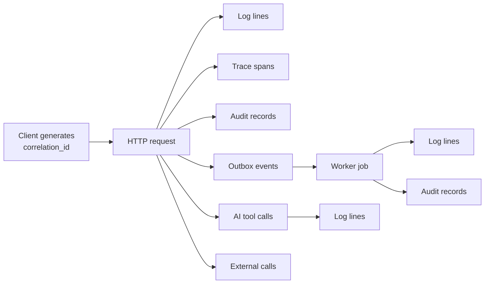

# IMAP 2.0 — Observability Architecture

**Status:** PROPOSED · **Phase:** 2 · **Date:** 2026-08-09
**Baseline:** `docs/audit/PRODUCTION-GAPS.md` §5 · **Metrics:** `docs/product/KPI.md`

---

## 1. Position

**Current state.** Structured Winston logging and a genuinely good `/api/health` endpoint. Beyond that: no metrics, no traces, no error tracking, no alerting, no dashboards, no business metrics. `X-Request-ID` is generated on every request and never used by anything.

Observability is not monitoring dashboards. It is the ability to answer **"what happened to this user's booking?"** without adding logging and redeploying.

---

## 2. The four signals

| Signal | Answers | Retention |
|---|---|---|
| **Logs** | What happened in this request | 30 days hot, 1 year cold |
| **Metrics** | Is the system healthy; is the business working | 15 months |
| **Traces** | Where did the time go; what called what | 7 days, sampled |
| **Audit** | Who changed what, and why | Per `AUDIT-LOG-ARCHITECTURE.md` §7 |

Audit is listed as a signal because it is the only one that is legally and contractually load-bearing. It is not a log level.

---

## 3. Correlation — the foundation

One id per user action, propagated everywhere.

| Rule | Detail |
|---|---|
| Client generates it; the server accepts or creates it | `X-Correlation-ID`, validated as a UUID |
| Carried on every log line, span, audit record, event and job | Currently `req.requestId` is set and never used |
| Returned in every response and every error body | Support tickets quote it (`API-ARCHITECTURE.md` §4) |
| `causation_id` links an event to what produced it | Reconstructs async chains |
| Never contains user data | It is an opaque id |

**The test:** given one correlation id, an engineer can reconstruct the complete story of a user action across HTTP, database, events, jobs, AI tool calls and external providers, without adding instrumentation.

---

## 4. Logging

### Levels

| Level | Use |
|---|---|
| `error` | Something failed that needs a human |
| `warn` | Degraded but handled — retry, fallback, quota |
| `info` | State changes and external calls |
| `debug` | Development only; off in production |

### Every line carries

`timestamp` · `level` · `message` · `correlation_id` · `principal_id` (never PII) · `module` · `action` · `duration_ms` · `outcome`.

### Never logged

| Never | Instead |
|---|---|
| Passwords, OTPs, tokens, secrets | Nothing |
| Identity document content | Document id + access reason |
| Payment card data | Never touched |
| Message content | Conversation id + length |
| Emergency descriptions | Request id |
| Precise coordinates | "location released", purpose |
| Full request/response bodies | Field names on validation failure |
| Prompts containing Sensitive or Sealed data | Hash + metadata |
| Raw upstream error bodies | Status + classified reason |

**Redaction is a library at the logging boundary, not developer discipline.** The audit found `blood.js` logging a requester's name and message, and `ai.js` logging Gemini error bodies.

### Rules

* No `.catch(() => {})`. Ever. Lint-enforced — 20+ sites do this today, which is why failed notifications are invisible.
* One log line per meaningful event. Not one per statement.
* Errors log once, at the boundary that handles them — not at every frame.

---

## 5. Metrics

### System

| Metric | Type | Alert |
|---|---|---|
| Request rate, error rate, duration by route | histogram | 5xx rate > 1% for 5 min |
| Database pool: in use, waiting, acquire time | gauge | waiting > 0 sustained |
| Query duration by repository | histogram | p99 > 1 s |
| Outbox lag (oldest unpublished) | gauge | **> 30 s — a stalled dispatcher is invisible to users** |
| Job queue depth and age | gauge | age > 5 min |
| Dead-letter depth | counter | **> 0 — a non-zero steady state is a defect** |
| Socket connections; rooms | gauge | — |
| Redis latency, hit rate | histogram | — |
| Memory, CPU, event-loop lag | gauge | lag > 200 ms |

### Domain

| Metric | Alert |
|---|---|
| Bookings created / confirmed / completed / cancelled | Completion rate drop > 20% day-on-day |
| Slot-hold contention | Rising — availability model under strain |
| Payment initiated / captured / failed | Failure rate > 10% |
| **Reconciliation mismatches** | **> 0 — pages finance** |
| Ledger transactions posted; balance-projection divergence | **Divergence > 0 — pages immediately** |
| Payout batch success | Any failure |
| Verification queue depth and age | Age > SLA |
| Dispute queue depth and age | Age > SLA |
| **Emergency requests with zero responders online** | **> 0 — pages** |
| Notification suppression rate by reason | Rising — caps may be mis-set |

### Business (`KPI.md`)

Resolved Needs · Need Resolution Rate · Supply Hit Rate · Time to Resolution · repeat rate · provider net earnings-per-hour · commission collection rate. Computed from the audit log and analytics events, **never estimated from application logs**.

---

## 6. AI telemetry

Per invocation:

`correlation_id` · `principal_id` · `task_class` · `model` + `tier` · `prompt_version` · `context_tiers_used` · `context_items_count` · `tool_calls[]` with tier and outcome · `tokens_in/out` · `cost` · `latency_first_token` · `latency_total` · `guardrail_triggers[]` · `outcome` · `user_correction`.

| Metric | Alert |
|---|---|
| **Unevidenced-claim detections** | **> 0 — incident** (D-008) |
| **Tier-C invocation attempts** | **> 0 — security alert** |
| Injection detections | Spike |
| Tool selection accuracy (online proxy) | Below the eval gate |
| Fallback-to-structured rate | Spike — provider degradation |
| Cost per resolved need | Above budget |
| Escalation rate | Rising — the cheap tier is mis-chosen |
| First-token latency p75 | > 2 s (`N-03`) |

**Content storage:** conversation content is stored redacted, access-controlled, and retained 30 days (`CONTEXT-ARCHITECTURE.md` §6). Telemetry carries hashes and metadata, not prompts.

---

## 7. Tracing

| Aspect | Design |
|---|---|
| Instrumented | HTTP, database, Redis, object storage, LLM calls, gateway calls, job execution, event dispatch |
| Sampling | 100% of errors and financial operations; 10% baseline; 100% when a debug header is present |
| Span attributes | `correlation_id`, module, action, outcome. **Never user data** |
| Cross-process | Context propagated through the outbox into worker spans |

**The trace that matters most:** need → understanding → discovery → quote → booking → payment → completion, across processes. That is `N-02` and the funnel in one view.

---

## 8. Error tracking

| Requirement | Detail |
|---|---|
| Every unhandled error and handled 5xx reported | With correlation id, principal id, module, release |
| Grouped by fingerprint | Not by message string |
| Release-tagged | Regressions attributable to a deploy |
| **Scrubbed before send** | No PII, no secrets, no tokens — the scrubber is a required client-side config, not a hope |
| Alert on new error types and on rate spikes | |
| Frontend errors included | With route and browser context |

The `ErrorBoundary` in `main.jsx` (bounded auto-reload + cache-clear recovery) is thoughtful work and stays — it should report to error tracking rather than only `console.error`.

---

## 9. Alerting

Alert on **symptoms users feel** and on **integrity violations**. Everything else is a dashboard.

| Severity | Examples | Response |
|---|---|---|
| **Page** | API down · 5xx spike · **balance-projection divergence** · reconciliation mismatch · payment gateway down · **emergency request with no responder** · Tier-C attempt | Immediate |
| **Ticket** | Outbox lag · dead-letter growth · queue age · verification/dispute SLA breach · AI cost over budget · error-rate rise | Business hours |
| **Dashboard** | Latency percentiles · funnel · business metrics · AI quality | Reviewed |

**Rules:** every alert names an owner and a runbook · an alert nobody acts on is deleted · alert fatigue is a defect · **the audit log is not an alerting source** — it is evidence.

---

## 10. Health

| Endpoint | Purpose |
|---|---|
| `/health/live` | Process is alive. No dependency checks |
| `/health/ready` | Ready for traffic: database, Redis, migrations current |
| `/health/deep` | Authenticated. Dependency latencies, outbox lag, queue depth, gateway reachability |

The existing `/api/health` already reports database latency, uptime, heap and socket count — that content moves into `/health/deep`.

---

## 11. Dashboards

| Dashboard | Audience |
|---|---|
| **Product** | North Star, funnel, abandonment reasons | Product |
| **Reliability** | Availability, latency, errors, saturation | Engineering |
| **Money** | Payments, reconciliation, payouts, commission collection | Finance |
| **Trust & safety** | Queues, SLAs, disputes, appeal overturn rate | Trust & safety |
| **AI** | Quality, cost, latency, fallback, guardrails | AI |
| **Emergency** | Request volume, responder availability, response time | Operations |

---

## 12. Privacy in telemetry

| Rule | Reason |
|---|---|
| Ids, never values | Logs and traces travel to third-party tools |
| Redaction at the boundary library | Not per-call-site discipline |
| Sealed data never leaves its context | Not in logs, traces, metrics or error reports |
| Emergency content never in telemetry | Occurrence only |
| Third-party observability tools are data processors | Their retention must satisfy the retention schedule |
| Telemetry access is role-restricted | Production logs contain principal ids |

---

## 13. Anti-patterns forbidden

| Anti-pattern | Why |
|---|---|
| `.catch(() => {})` | The current behaviour at 20+ sites; makes failure invisible |
| Logging PII, secrets or prompts | Telemetry travels further than intended |
| A correlation id generated and unused | The current state |
| Alerting on causes rather than symptoms | Noise |
| Business metrics estimated from logs | They come from the audit log and analytics events |
| Debug logging in production | Cost and leakage |
| One log line per statement | Unreadable |
| Metrics with unbounded label cardinality (user id, booking id) | Cost explosion |
| Silent degradation | A stalled dispatcher must alert, not just stop |

---

## 14. Implementation order (Roadmap Phase B)

1. Correlation id propagated end to end — **wire in the one that already exists**.
2. Redaction library at the logging boundary.
3. Error tracking with scrubbing.
4. System metrics and the first alerts (5xx, outbox lag, database saturation).
5. Analytics event stream, separate from application logs.
6. Domain metrics: bookings, payments, reconciliation.
7. Tracing on the core loop.
8. AI telemetry, before any Tier B tool ships.
9. Dashboards.
10. Business metrics, once the audit log and `need` entity exist.
