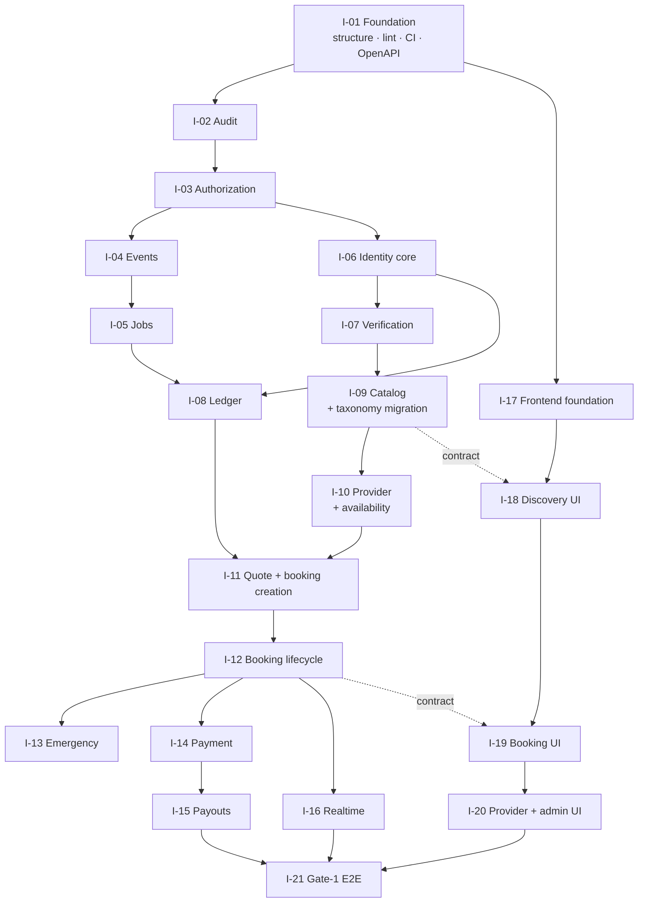

# IMAP 2.0 — Implementation Dependency Graph

**Status:** BLUEPRINT · **Phase:** 3 · **Date:** 2026-08-09

Derived from the architecture, not assumed from the brief's example ordering. Two dependencies below **differ** from that example, and the reasons are given in §3.

---

## 1. The graph



---

## 2. Why each edge exists

| Edge | Reason |
|---|---|
| I-01 → I-02 | Lint boundaries and CI must exist before the first module, or the boundaries decay while being created |
| **I-02 → I-03** | The authorization kernel records its denials. Building authorization first means its own decisions are unaudited during the window it is most likely to be wrong |
| I-03 → I-04 | Event consumers act as a system actor; that actor needs a kernel to be authorized against |
| I-04 → I-05 | Jobs are triggered by events and share the idempotency machinery |
| **I-03 → I-06** | Identity registers policies. Without a kernel it registers into nothing |
| I-06 → I-07 | Verification cases belong to principals |
| **I-05 → I-08** · **I-06 → I-08** | Ledger accounts are owned by accounts; reconciliation is a job. Both must exist |
| I-07 → I-09 | Capability *verification* is decided in identity (O-01); the catalogue defines the capabilities being verified |
| I-09 → I-10 | A provider declares capabilities from the catalogue and prices per service |
| **I-08 → I-11** · **I-10 → I-11** | A quote is a financial artefact against a provider price and an availability window |
| I-11 → I-12 | Lifecycle needs a booking to exist |
| I-12 → I-13 | Emergency lives in the booking module and R-1010 attaches a booking |
| I-12 → I-14 | Payment settles against `booking.completed` |
| I-14 → I-15 | Payouts distribute what payments captured |
| I-12 → I-16 | Realtime carries booking state |
| I-01 → I-17 | Frontend foundation needs the repo structure and CI |
| I-09 ⇢ I-18, I-12 ⇢ I-19 | **Contract-only** — the frontend builds against the OpenAPI spec, not the implementation |
| I-15, I-16, I-20 → I-21 | E2E needs the whole loop |

---

## 3. Two deviations from the brief's example order

The brief (§31) suggests `Environment → Database → Identity → Authorization → Audit → …` and says to derive the real graph rather than use it blindly. Two edges come out different.

### 3.1 Audit before authorization — not after

The example places Audit fifth, after Authorization. **This blueprint places it second, before everything.**

The kernel's most valuable output during construction is its denial record. If authorization ships first, every decision it makes in its least-tested period is unlogged. Worse, the argument for auditing at all is `CREDENTIAL-INCIDENT.md` §2 — a question that is permanently unanswerable *because the logging did not exist yet*. Repeating that ordering repeats that outcome on a smaller scale.

Audit has no dependencies. It can genuinely go first, so it does.

### 3.2 There is no separate "Database" phase

The example has `Database` as a phase between Environment and Identity. **Migrations are distributed across the phases that need them** (`DATABASE-IMPLEMENTATION-PLAN.md`), because:

* a schema built ahead of its code is a guess about what the code will need;
* M-11 (identity backfill) requires the identity model to be settled;
* M-17/M-18 (taxonomy) require a human mapping exercise that runs at I-09, not before;
* M-25 (opening balances) is **blocked on a business decision** and cannot be scheduled at all.

The compatibility migrations (M-03…M-05, retiring import-time DDL) are the exception and land in I-01, because every later phase touches modules that currently create their own tables.

---

## 4. Critical path

```
I-01 → I-02 → I-03 → I-04 → I-05 → I-08 → I-11 → I-12 → I-14 → I-15 → I-21
```

**Eleven phases.** Everything else has slack:

| Phase | Slack | Note |
|---|---|---|
| I-06, I-07 | joins before I-09 | |
| I-09, I-10 | joins before I-11 | **but carries the highest-risk migration** |
| I-13 | after I-12, before I-21 | |
| I-16 | after I-12, before I-21 | |
| I-17…I-20 | **parallel from I-01** | contract-driven |

**The frontend is the largest parallelisable block and it is on nobody's critical path.** Once the OpenAPI contract exists at I-01, `APP-JSX-MIGRATION.md` Steps 0–2 can proceed immediately — and Step 0 alone deletes 34% of `App.jsx`.

---

## 5. What can run concurrently

| Group | Concurrent | Constraint |
|---|---|---|
| A | I-02, I-17 | Both depend only on I-01 |
| B | I-06/I-07 and I-08 core | I-08 needs I-06's account model — the *model*, not the full module |
| C | I-09/I-10 and I-14 design | I-14 implementation still waits for I-12 |
| D | I-13, I-16 | Both after I-12, independent of each other |
| E | I-18/I-19/I-20 and all backend | Contract-driven |
| F | I-20 admin and everything | Separate build entry (`TARGET-REPOSITORY-STRUCTURE.md` §1.2) |

**With one developer the graph is a sequence.** Concurrency matters if a second person joins, and the frontend is where they should start — it is the largest block with no critical-path dependency.

---

## 6. Blocking conditions, and what they block

| Blocker | Blocks | Owner | Source |
|---|---|---|---|
| Development database still points at production | **everything** — the app refuses to start | project owner | `PHASE-3-READINESS.md` §6.1 |
| Migration `002` not applied to production | I-09 onward against production | project owner | §6.8 |
| Backup assumptions unverified | **any production migration** | project owner | §5.2 |
| TiDB verification outstanding | production migration execution | project owner | §5.1 |
| **Taxonomy mapping not signed off** | **I-09** | product + operations | `MIGRATION-STRATEGY.md` G2 |
| **Ledger opening balances not decided** | **M-25** (not I-08 itself) | business | G3 |
| D-009 commission rate unset | Gate-1 *launch*, not the build | business | `PHASE-3-READINESS.md` §7 |
| Hotline verification | I-13 exit | operations | R-1009 |
| CI absent | I-01 exit | engineering | §5.3 |

**Two distinctions worth keeping straight.** The ledger *code* (I-08) is not blocked; only the opening-balance *migration* is — build the ledger, populate it later. And the commission rate blocks launch, not construction: `PLATFORM_FEE_PCT=0` is a working configuration that produces no commission entries.

---

## 7. Cycles

**One cycle exists and it is deliberate:** booking ↔ finance.

```
booking  ──booking.completed──►  finance
booking  ◄──payment.captured──   finance
```

Both write directions are **event-only**; synchronous reads are permitted (V-08). Broken at implementation time by ordering: I-11 gives finance a quote to price against, I-12 gives it `booking.completed` to consume, and I-14 gives booking `payment.captured` to consume into a read model.

**A synchronous write in either direction is an architecture violation**, caught by the import-boundary lint rule — `modules/booking` cannot import `modules/finance` except through `index.js`, and `index.js` exposes no write.

---

## 8. Rollback direction

Each phase is reversible until the phase after it ships.

| Phase | Rollback | Point of no return |
|---|---|---|
| I-01…I-05 | revert; nothing user-facing | none |
| I-06/I-07 | switch reads back to `users` (M-13 reversible) | **M-34** drops the columns |
| I-08 | ledger unused until I-11 | **M-25** opening balances |
| I-09/I-10 | legacy taxonomy columns retained | **M-33** drops them |
| I-11…I-15 | old routes remain mounted under `/api/*` | `/api/*` returns 410 |
| I-16 | direct emission restorable | none |
| I-17…I-20 | old `App.jsx` in git | `App.jsx` deleted at Step 9 |

**Every point of no return is a data deletion, and every one lands a full release cycle after the step it finalises.** That is the deliberate shape: the code is reversible for as long as the data is.
