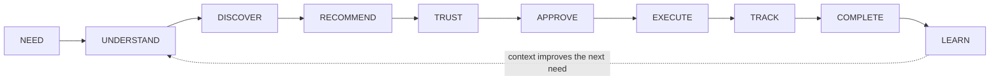
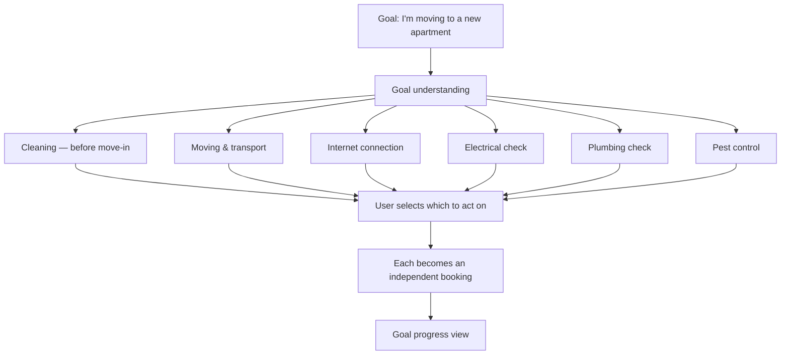
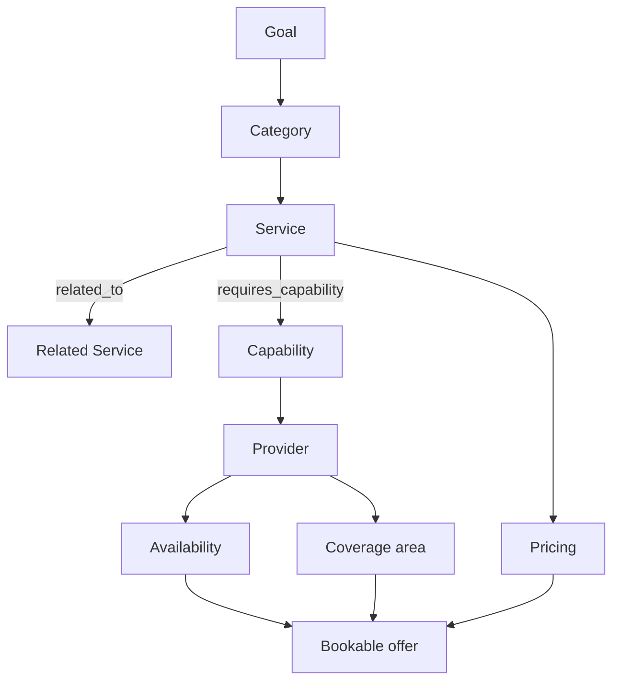

# IMAP 2.0 — Product Constitution

**Status:** PROPOSED — awaiting sign-off · **Phase:** 1 · **Date:** 2026-08-09
**Supersedes:** nothing (no product document existed before this — see `docs/audit/DOCUMENTATION-INVENTORY.md`)
**Evidence base:** `docs/audit/` (Phase 0 baseline audit, Phase 0.5 containment)

This is the highest-authority product document. Where any other document, ticket, design or implementation conflicts with this one, this one wins until it is explicitly amended through `PRODUCT-DECISIONS.md`.

---

## 0. How to read the status tags

Every claim in every Phase 1 document carries one of these. Nothing is presented as built unless it is.

| Tag | Meaning |
|---|---|
| **CURRENT** | Implemented and verified in the codebase today, with evidence from `docs/audit/` |
| **TARGET** | Committed for IMAP 2.0 and scheduled in `ROADMAP.md` |
| **FUTURE** | Desirable and architecturally accommodated, but not scheduled and not committed |
| **PROPOSED** | A recommendation made in this phase that needs an explicit decision before it becomes TARGET |
| **NEVER** | Explicitly rejected. See §11 Non-Goals |

---

## 1. Product identity

### 1.1 Definition

> **IMAP is an AI-powered real-world assistance platform that understands what people need, discovers the right services and trusted providers, and coordinates the complete journey from intention to execution.**

### 1.2 The one job

Everything IMAP builds must serve one job:

> **Help people successfully resolve real-world needs.**

A feature that does not measurably improve the rate, speed, cost or trustworthiness of need resolution is not an IMAP feature, regardless of how much engagement it produces.

### 1.3 What IMAP is not

IMAP is not *reducible to* any of these, though it contains capabilities from each:

| Not just… | Because |
|---|---|
| A service marketplace | A marketplace ends at the transaction. IMAP is accountable for the outcome. |
| A booking application | Booking is one step of ten in the lifecycle (§2). |
| A chatbot | Conversation is one input modality, not the product. |
| A super app | Breadth without coherence is what the Phase 0 audit found: 18 route modules, uniformly shallow, no prioritisation evidenced anywhere. |
| A social network | IMAP has no engagement objective. See §11. |
| An AI wrapper | The intelligence is only useful because it can reach a transactional, authorised, auditable execution layer. |

### 1.4 Where IMAP is today, honestly

**CURRENT.** IMAP is a working two-tier CRUD marketplace: a React SPA on GitHub Pages, an Express API on Render, TiDB for storage. It has 18 backend route modules covering auth, providers, bookings, payments, KYC, chat, reviews, wallet, loyalty, promos, SOS, blood, disaster and microloans. Phase 0.5 made its money paths server-authoritative and transactional, closed two account-takeover paths, secured the realtime layer, and made its emergency responses truthful.

> **Correction to the Phase 0 audit.** `BASELINE-AUDIT.md` states 19 backend route modules. The verified count is **18** (`backend/routes/`: admin, ai, auth, blood, bookings, chat, disaster, kyc, loans, payments, promos, providers, reviews, schedule, services, sos, upload, users). Phase 1 documents use 18. The audit file is not edited, because this phase may only write under `docs/product/` and `docs/ux/`. No conclusion in the audit depends on the difference.

It is not yet AI-native. AI cannot take any action; there is no service graph; there is no memory or context store; there is no trust model beyond a star rating and an unread `trust_score` integer. IMAP 2.0 is the work of becoming the thing in §1.1.

---

## 2. The product equation

The canonical lifecycle. Every surface, every metric, and every architectural decision maps to a stage of it.



| Stage | What it means | Owner | Today (CURRENT) |
|---|---|---|---|
| **NEED** | The user expresses a real-world problem, in their own words or by any modality | User | Only expressible as a category tap or a `LIKE '%q%'` keyword search |
| **UNDERSTAND** | IMAP converts the expression into a structured need: service(s), urgency, location, constraints | AI + Service Graph | Absent. No intent model exists |
| **DISCOVER** | Candidate services and providers are found | Search + Graph | `LIKE '%q%'` across five columns; no index can serve it |
| **RECOMMEND** | Candidates are ranked and explained | Matching | `ORDER BY rating DESC`; a rule-based scorer exists but is not on the booking path |
| **TRUST** | The user is given legible reasons to believe a provider will deliver | Trust Graph | Star rating + job count. `trust_score` is written once and read nowhere |
| **APPROVE** | The user makes an informed, explicit decision | UI (never AI alone) | 3-step booking modal. Price is now server-derived (Phase 0.5) |
| **EXECUTE** | Money and commitments move, atomically and authorised | Backend | Transactional and server-authoritative since Phase 0.5 |
| **TRACK** | The user can see real state at any moment | Realtime | Socket.io booking rooms, participation-verified since Phase 0.5 |
| **COMPLETE** | The work is finished and confirmed by the party entitled to confirm it | Backend + state machine | State machine added in Phase 0.5; completion OTP exists but is not enforced |
| **LEARN** | The outcome improves the next need for this user and for the network | Memory + Trust Graph | Absent |

**The MVP thesis (§ `PRD.md`) is to make one thin vertical slice of this loop genuinely work end to end, rather than to broaden any single stage.**

---

## 3. Product principles

These are binding. Violating one requires a recorded decision in `PRODUCT-DECISIONS.md`.

---

### P1 — Need over category

**TARGET.** A user must never be required to know the name of the service they need in order to get help.

```
REJECTED default:   Category → Subcategory → Service → Provider
IMAP default:       Need expressed → Understood → Service inferred → Providers matched
```

Worked example:

> User: *"My bathroom water isn't draining."*
> IMAP infers: `drainage-blockage` → primary service `plumbing.drain-clearing`, related `plumbing.pipe-repair`, `cleaning.bathroom-deep-clean`
> IMAP asks at most one disambiguating question, then shows matched providers with prices.

**Category browsing does not disappear.** It remains a first-class fallback for users who prefer it, for SEO, and for the many cases where the user *does* know exactly what they want. P1 changes the *default entry point*, not the available paths.

**Why this is not currently possible:** there is no `services` table. A "service" today is a free-text string on `providers.service_type_en` and separately on `bookings.service_name_en`, and three incompatible category taxonomies exist simultaneously — 12 rows in `schema.sql`, 8 in the seeder (which fails to insert, PK type mismatch), and 19 hardcoded in `frontend/src/constants/data.js`, which is what users actually see. P1 is blocked on the Service Graph (§6).

---

### P2 — AI and UI, not AI instead of UI

**TARGET.** IMAP is a hybrid product. Conversation and structured UI are peers.

| AI is responsible for | UI is responsible for |
|---|---|
| Understanding ambiguous input | Making the decision visible |
| Narrowing a large option space | Showing what was excluded and why |
| Explaining trade-offs in plain language | Presenting price, time, provider identity as inspectable facts |
| Drafting an action | Confirming the action |
| Summarising state | Being the authoritative display of state |

**Rule:** any AI-proposed action must be renderable as a structured object the existing UI can display and the user can inspect field by field. If it can only be expressed as prose, it must not be actionable.

**Rule:** the user must always be able to complete a core journey (search → book → pay → track) without using AI at all.

---

### P3 — AI must be actionable, and must never bypass authorization

**TARGET.** The value of IMAP's AI is that it reaches real execution. The constraint is that it reaches it through the same door as everyone else.

```
AI
 ↓
Tool                      (declared, schema-typed, versioned)
 ↓
Authentication            (the acting user's identity, never a service account)
 ↓
Authorization             (the same policy layer the HTTP API uses)
 ↓
Business Rules            (state machine, pricing, eligibility)
 ↓
Transaction               (atomic, idempotent)
 ↓
Database
 ↓
Event                     (auditable record of what happened)
 ↓
User-visible confirmation (derived from the event, not from the model)
```

**Non-negotiable consequences:**

1. There is no AI-only code path. A tool that writes must call the same service that the HTTP route calls.
2. AI acts **as the user**, with exactly the user's permissions. It never holds elevated rights.
3. Every AI-initiated write carries an idempotency key and is recorded in the audit log with `actor = user`, `via = ai`, `tool = <name>`, `confirmed_at = <timestamp>`.
4. A tool with no authorization check does not ship.

**Why this is stated so strongly:** the audit found that the one AI signal capable of gating an action — `/ai/fraud-check` — was called by the *client* and dismissable with a "Proceed Anyway" button, and that `/ai/dynamic-price` computed a price server-side, sent it to the browser, and then accepted whatever number the browser sent back. AI that only advises the client is decorative; AI that acts without the authorization chain is dangerous. §P3 is the line between them.

---

### P4 — AI must never lie

**TARGET, and already partially enforced (CURRENT).** This principle was made binding in Phase 0.5 and is restated here as permanent product law.

> **IMAP must never claim an external action was completed unless the server has verified it.**

#### 4.1 The state vocabulary

Every claim IMAP makes about the world uses exactly one of these nine states. Prose that does not map to one of them is not permitted in AI output or UI copy.

| State | Means | Server evidence required | Example copy (EN) | Example copy (BN) |
|---|---|---|---|---|
| **Suggested** | IMAP thinks this may fit. Nothing has been checked. | none | "This looks like a plumbing job." | "মনে হচ্ছে এটি প্লাম্বিং-এর কাজ।" |
| **Available** | Checked against provider state at a stated time | availability read, timestamped | "Rahim is available today, as of 2 minutes ago." | "রহিম আজ পাওয়া যাচ্ছেন — ২ মিনিট আগের তথ্য।" |
| **Requested** | We sent it. We do not know the outcome. | write committed, no acknowledgement | "Request sent. No response yet." | "অনুরোধ পাঠানো হয়েছে। এখনো উত্তর আসেনি।" |
| **Pending** | Waiting on a named party or system | row in a waiting state | "Waiting for Rahim to accept." | "রহিমের নিশ্চিতকরণের অপেক্ষায়।" |
| **Confirmed** | The other party agreed | state transition committed | "Rahim accepted for Friday 3pm." | "রহিম শুক্রবার বিকাল ৩টায় নিশ্চিত করেছেন।" |
| **Completed** | The work is done and confirmed by the entitled party | terminal state committed | "Service completed." | "সেবা সম্পন্ন হয়েছে।" |
| **Failed** | It was attempted and did not succeed | error recorded | "Payment failed. You were not charged." | "পেমেন্ট ব্যর্থ। আপনার টাকা কাটা হয়নি।" |
| **Unavailable** | The capability does not exist or is down | capability flag | "Automatic donor alerts aren't available yet." | "স্বয়ংক্রিয় ডোনার নোটিফিকেশন এখনো চালু হয়নি।" |
| **Unknown** | We genuinely do not know | absence of evidence | "I can't see your loan score from here." | "আমি এখান থেকে আপনার লোন স্কোর দেখতে পাচ্ছি না।" |

#### 4.2 Banned constructions

These must never appear unless the corresponding state is **Completed** with server evidence:

`"SOS dispatched"` · `"Payment completed"` · `"Provider contacted"` · `"Refund processed"` · `"Loan disbursed"` · `"Donor notified"` · `"Booking confirmed"` · `"Help is on the way"`

#### 4.3 Precedent

**CURRENT.** Phase 0.5 removed four live violations: a fabricated user credit score returned by the AI fallback to anyone who typed "loan"; `"SOS alert sent to admin & call center"` where no call centre existed; `"Request sent to available donors"` where a log line was written and nothing was sent; and a browser-generated "Demo OTP" presented as payment verification. `PHASE-0.5-SECURITY-REGRESSION.md` records the fixes. **The lesson is that this failure mode is not hypothetical for this product — it was the default.**

---

### P5 — Human control is proportional to consequence

**TARGET.** AI removes friction. It does not remove agency. See §4 for the formal action classification.

---

### P6 — Server is authoritative for all state that matters

**CURRENT (money) / TARGET (everything else).** The client may express intent. It may never assert fact.

Never client-authoritative: price, fee, provider earnings, wallet balance, payment success, refund amount, loan disbursement, booking status, verification status, trust score, availability.

**CURRENT evidence:** Phase 0.5 moved pricing into `backend/utils/pricing.js` (resolution order `providers.hourly_rate` → `categories.base_price` → fail closed at 409), added `backend/utils/money.js` rejecting negative/`NaN`/`Infinity`, and made every money path transactional with unique ledger references. 31 regression tests hold the line.

---

### P7 — Personalisation without manipulation

**TARGET.** IMAP may personalise recommendations, ordering, reminders and content. IMAP must not:

* manufacture urgency or scarcity that does not exist in the data
* hide materially better alternatives to favour a monetised one
* use sensitive context (health, emergency, financial distress, KYC) for commercial targeting
* optimise for session length, return frequency, or notification click-through as an end in itself
* rank paid placement without labelling it
* use dark patterns in cancellation, refund or unsubscribe flows

**Test:** if a personalisation change increases engagement but does not increase Resolved Needs (`KPI.md` §1), it is a regression and must be reverted.

---

### P8 — Truth in emergencies is a safety requirement, not a UX preference

**CURRENT (enforced) / TARGET (expanded).** Emergency domains (medical, blood, fire, rescue, security, disaster) are held to a stricter standard than the marketplace: verified sources only, truthful state always, explicit statement of limitations, and a visible route to the real emergency service (999 in Bangladesh) on every emergency surface.

---

### P9 — Privacy is a boundary, not a setting

**TARGET.** Personal context makes IMAP useful. It is also the thing most capable of harming users. See §5.3 for the access model. Defaults are minimal; expansion is opt-in, purpose-scoped, revocable, and logged.

---

### P10 — Bangladesh-first, globally extensible

**TARGET.** Every product decision is made for a Bangladeshi user first — Bangla-first language, BDT, bKash/Nagad/Rocket, local address hierarchy, mid-range Android on unreliable networks. Every *abstraction* is built so a second country does not require a rewrite. We build one country properly; we do not build a country-agnostic product that serves nobody well. See §9.

---

## 4. Action classification

**TARGET.** Every action IMAP can take belongs to exactly one tier. The tier determines whether AI may perform it, and what confirmation is required.

### Tier A — Automatic (AI may perform without confirmation)

Read-only, reversible, no money, no communication with third parties, no state visible to another person.

| Action | Notes |
|---|---|
| Search and filter services or providers | |
| Rank and re-rank results | Ranking basis must be inspectable |
| Summarise a booking, invoice, review or conversation | |
| Retrieve the user's own history | |
| Check availability | Result is stamped and stated as of a time |
| Estimate a price | Labelled **Estimated**, never **Confirmed** |
| Explain a policy, status or error | Must cite the actual policy |
| Draft a message, request or booking | Draft only — not sent, not submitted |
| Detect intent and propose a service | Labelled **Suggested** |

### Tier B — User-confirmed (AI may prepare; a human must approve)

Money, commitments, third-party contact, or anything another person will see.

| Action | Confirmation requirement |
|---|---|
| Create a booking | Explicit confirm with provider, time and **total price** visible on the confirm surface |
| Any payment | Explicit confirm with amount and method visible; re-confirm if the amount changes by any amount |
| Cancel a booking | Explicit confirm with the refund consequence stated |
| Request a refund | Explicit confirm |
| Send a message to a provider | User sees the exact text before it sends |
| Share precise location | Per-purpose, time-bounded, revocable |
| Submit a review | User edits and submits; AI may draft only |
| Apply a promo code | Confirm, with the resulting total shown |
| Register as a blood donor / release a donor's number | Explicit consent each time |
| Raise an emergency request | One deliberate action; never inferred from conversation |
| Redeem loyalty points | Confirm, with the conversion shown |

### Tier C — Never AI-autonomous (structurally impossible, not merely disallowed)

These must have no tool. Absence of capability, not policy.

| Action | Why |
|---|---|
| Change financial authority (fees, rates, payout rules) | Platform economics are not model output |
| Make a KYC or identity verification decision | Legal consequence; requires accountable human review |
| Permanently delete an account or its data | Irreversible |
| Suspend, ban, or downgrade a provider's trust standing | Punitive; requires human review and appeal |
| Disburse a loan or move platform funds | Regulated; see `PRODUCT-DECISIONS.md` D-011 |
| Dispatch an emergency response | Life safety; IMAP does not have this capability at all |
| Grant a role or permission | Privilege escalation |
| Write to the audit log | The log records; it is never authored |

**Engineering consequence for Phase 2:** the tool catalogue is partitioned by tier. Tier B tools return a *proposal object* and cannot commit. Tier C has no tool.

---

## 5. Personal AI

### 5.1 Definition

**TARGET.** *IMAP Personal AI* is the user-scoped assistant that carries context across sessions so the user does not repeat themselves.

### 5.2 What it may know

| Context | Purpose | Retention |
|---|---|---|
| Service history | Recommend, pre-fill, detect recurrence | Life of account |
| Saved and previously-used providers | "Rahim is available tomorrow" | Life of account |
| Stated preferences (budget band, language, time-of-day) | Ranking and filtering | Until changed |
| Active tasks and unfinished flows | Continuity (§ `BEHAVIORAL-DESIGN.md`) | Until resolved + 30 days |
| Area / neighbourhood (not precise coordinates) | Availability and ETA | Life of account |
| Recurring needs derived from history | Proactive reminders | Life of account |
| Recent conversation | Coherence within a task | 30 days rolling |

### 5.3 Access model — three tiers

**TARGET.** The assistant does **not** have blanket access to the user record.

| Tier | Contains | AI access |
|---|---|---|
| **Open** | Preferences, service history, saved providers, active tasks, area | Readable by default within the user's own session |
| **Guarded** | Precise location, contact details, message contents, payment method identifiers | Readable only for a declared purpose, in-session, logged, and stated to the user |
| **Sealed** | KYC documents and decisions, full financial ledger, health/blood/emergency records, dispute case files, trust-score internals | **Never** in the model context. AI may learn a boolean outcome via a tool (`kyc_status = verified`) but never the underlying data |

**Rules:**
1. A user can view everything IMAP remembers about them, in plain language, and delete any item.
2. Deleting a memory removes it from future context within one session boundary.
3. Sealed context never enters a prompt, a log line, or a third-party model call.
4. Any cross-user inference is aggregate-only and never re-identifiable.

**CURRENT:** none of this exists. `users.settings` holds five notification booleans that are written and never read; chat history lives only in browser state and is capped at the last 20 client-sent messages.

---

## 6. Goals and the Service Graph

### 6.1 Goals

**FUTURE** (architecturally accommodated from Phase 2; not built before the graph is proven).

A **Goal** is a real-world situation that implies several services.



**Rules:** a Goal never books anything by itself; each task is an ordinary Tier-B booking. A Goal is a container and a progress view, not an autonomous agent.

### 6.2 The Service Graph

**TARGET.** The single most important missing structure in the product. Everything in §3 P1, §6.1, matching, pricing, and provider capability depends on it.



Worked example:

```
AC Problem
├── Inspection          (diagnostic, low price, often precedes the others)
├── Servicing / cleaning
├── Gas refill          (requires certification)
├── Repair              (requires parts)
└── Electrical repair   (different capability — different provider may be needed)
```

**Required properties:**
* A service is a first-class entity with a stable id, bilingual names, a price model, and required capabilities.
* Services relate to each other (`related`, `precedes`, `alternative-to`, `part-of`).
* A provider declares *capabilities*, not one free-text string, and may hold many.
* Coverage is an explicit area, not free text.
* Availability is dated and has capacity; booking must consult it.

**CURRENT gap:** none of the above exists. `provider_schedule` holds free-text, dateless slot strings (`'সকাল ৯টা / 9:00 AM'`) that `POST /api/bookings` never reads — double-booking is structurally unpreventable today.

---

## 7. The Trust Graph

**TARGET.** Trust is a computed, explainable, multi-signal standing — never a single star average.

| Signal | Source | Gameable? | Mitigation |
|---|---|---|---|
| Identity verification | KYC decision | No | Human-reviewed (Tier C) |
| Capability / certification | Provider submission + review | Yes | Evidence required for regulated capabilities |
| Completed jobs | Booking terminal state | Yes (self-dealing) | Only count bookings with a distinct paying customer and settled payment |
| Customer satisfaction | Reviews | Yes | Only from a completed, paid, unrated booking by the actual customer — **CURRENT: already enforced correctly** |
| Repeat customers | Distinct customers with ≥2 completed bookings | Hard | Strong signal; weight highly |
| Reliability | Accept rate, on-time arrival | Partially | Measure over a window, not lifetime |
| Response time | Time to accept/decline | Yes (auto-accept) | Pair with completion rate |
| Cancellation behaviour | Provider-initiated cancellations after acceptance | No | Weighted heavily negative |
| Complaint history | Disputes, resolution outcome | No | Requires the dispute workflow |
| Platform tenure | Account age with activity | No | Weak signal, low weight |

**Rules:**
1. **Explainable.** A provider must be able to see exactly why their standing is what it is, and what would change it.
2. **Appealable.** Any negative determination has an appeal path to a human.
3. **Not a single number to users.** Users see a small set of legible facts ("47 jobs · 12 repeat customers · verified ID · usually replies within 1 hour"), not an opaque score.
4. **Never AI-adjudicated.** Trust changes are Tier C.
5. **Cold-start honesty.** A new provider is shown as new, not as untrusted and not as trusted.

**CURRENT:** `providers.trust_score INT` is written in exactly one place (`+30` when NID KYC is approved) and read nowhere. `rating` is a plain average. There is no dispute workflow, no appeal, no audit log.

---

## 8. Realtime and lifecycle truth

**TARGET.** Realtime exists to make state *true on the user's screen*, not to add motion.

Booking lifecycle (**CURRENT** — state machine implemented in Phase 0.5, `backend/utils/bookingState.js`):

```
pending ──► confirmed ──► active ──► completed   (terminal)
   │            │            │
   └────────────┴────────────┴──────► cancelled  (terminal)
```

Permitted actors per transition are enforced server-side: providers confirm/activate/complete; customers may cancel from `pending`/`confirmed`; only an admin may cancel work already `active`. Financial effects run exactly once, guarded by a conditional update and a unique ledger reference.

**TARGET additions:** `arrived` as an observable sub-state, provider-position visibility bounded to the active window only, and customer-held completion confirmation (the completion OTP exists in the schema today but nothing enforces it).

**Rule:** every realtime event must correspond to a committed state change. Optimistic UI is permitted only where a failure can be cleanly reverted and is shown to the user — the audit found admin actions rendering as successful with `.catch(e => console.warn(...))`.

---

## 9. Bangladesh-first

**TARGET.**

| Dimension | Commitment |
|---|---|
| Language | Bangla is the default. English is a peer, not the source language. Strings are authored in both. |
| Currency | BDT only at launch. Money is stored in minor units with an explicit currency field. |
| Payment | bKash, Nagad, Rocket, cards via SSLCommerz (**CURRENT**); cash-on-completion as a first-class method, not a fallback |
| Address | Division → District → Upazila/Thana → Area → landmark-based detail. Landmark-based directions are normal and must be supported as free text alongside structured fields. |
| Devices | Mid-range Android, 3G/patchy 4G. Budget: see `UX-CONSTITUTION.md` §7 |
| Trust | Phone number is the primary identity. NID is the primary verification document. Personal referral matters more than a star rating. |
| Providers | Often single operators with a phone, variable literacy, no fixed schedule. The provider app must work for someone who is on a rooftop with one hand free. |
| Emergency | 999 is the real emergency number and must be reachable from every emergency surface. |

**Extensibility (FUTURE, abstractions only — no second country before the first is working):** country, currency + minor units, locale, timezone, tax treatment, payment-method registry, address-format strategy, service-regulation rules per market. See `PRD.md` §9.

---

## 10. Current vs Target matrix

Evidence column cites Phase 0/0.5 findings.

| Capability | Current state | IMAP 2.0 target | Priority |
|---|---|---|---|
| Need expression | Category tap or `LIKE '%q%'` keyword search | Natural-language, voice and image need capture → structured need | **MUST** |
| Intent understanding | None | Intent model producing service + urgency + location + constraints | **MUST** |
| Service definition | Free-text string; 3 conflicting taxonomies (12 / 8 / 19) | `services` entity with stable ids, bilingual names, price model | **MUST** |
| Service relationships | None | Service Graph with typed edges | **MUST** |
| Provider capability | One free-text `service_type_en` | Many declared, some certification-gated | **MUST** |
| Availability | Free-text dateless slots, never consulted by booking | Dated slots with capacity; booking consults and holds | **MUST** |
| Coverage area | Free text; `latitude`/`longitude` exist and are never queried | Explicit service areas; geo-filtered discovery | **MUST** |
| Discovery ranking | `ORDER BY rating DESC` | Multi-signal ranking with an inspectable basis | **MUST** |
| Trust | Star rating; `trust_score` written once, read never | Trust Graph (§7), explainable and appealable | **MUST** |
| Pricing | Server-derived: `hourly_rate` → `base_price` → 409 | Service-level price models: fixed, from-price, inspection-then-quote | **MUST** |
| Booking state | 5-state machine, role-guarded, transactional | + `arrived`, + customer-confirmed completion | **MUST** |
| Payment | SSLCommerz; IPN sole crediting path; amount reconciled | + explicit quote→authorise→capture; refunds through the gateway | **MUST** |
| Wallet | Mutable `users.balance` column; `wallet_transactions` best-effort log | Provider earnings ledger; **no customer stored value** (D-010) | **MUST** |
| AI capability | Chat proxy (Gemini/OpenAI) + 8 rule-based scorers labelled "AI" | Tool-using assistant on the P3 chain | **MUST** |
| AI actions | None — AI cannot act at all | Tier A automatic, Tier B proposal + confirm, Tier C absent | **MUST** |
| AI truthfulness | Fabricating fallback removed in 0.5 | Nine-state vocabulary enforced in copy and tool output | **MUST** |
| Memory / context | None; chat lost on reload | Three-tier context with user-visible controls | **SHOULD** |
| Audit log | **None** | Every state change and AI action recorded | **MUST** |
| Realtime | Booking rooms, participation-verified | + arrival state, bounded location window | **SHOULD** |
| Emergency | Truthful, admin-routed, unverified-source labelled | Verified sources; explicit capability statement; no dispatch claim | **MUST** |
| Provider tools | Jobs, wallet, schedule, chat, basic analytics | Job management + earnings clarity + demand signal | **SHOULD** |
| Business/SME | None (`role` enum has 3 values) | Workspace with approvals and recurring services | **LATER** |
| Goals | None | Goal → tasks → progress | **LATER** |
| Short-form feed | None | Provider proof-of-work media on profiles; no standalone feed | **COULD** (D-006) |
| Microloans | Implemented; idempotent since 0.5 | **Removed from product scope** pending licensing (D-011) | **DO NOT BUILD** |
| Disaster alerts | User reports, labelled unverified | Replaced by links to official sources (D-012) | **DO NOT BUILD** |
| Internationalisation | None; `৳` hardcoded in ~100 places | Abstractions only; no second market | **FUTURE** |
| Revenue | None — `platform_fee` defaults to 0 | Commission on completed bookings | **MUST** |

---

## 11. Non-goals

What IMAP will not become, and why.

| Non-goal | Why |
|---|---|
| **An engagement-optimised social network** | The North Star is Resolved Needs. A user who resolves their need in 90 seconds and closes the app is a success. Time-on-app is not a goal and will not be reported as one. |
| **An entertainment-first short-video platform** | Content that does not lead to a resolved need is cost without benefit: moderation burden, safety risk, and a supply problem at cold start. See D-006. |
| **An autonomous financial agent** | Tier C exists precisely to make this structurally impossible. |
| **An unverified emergency information network** | The audit found seeded fabricated cyclone warnings served as live alerts. IMAP either has a verified source or says it does not. |
| **A generic AI chatbot** | An assistant that cannot execute is a worse search box. |
| **A giant menu-driven directory** | The current product is drifting here: 18 route modules, 19 hardcoded categories, uniformly shallow. Breadth is the failure mode we are correcting. |
| **A lender or deposit-taker** | Both are licensed activities in Bangladesh. See D-010, D-011. |
| **A gig-labour arbitrage platform** | Provider success is a first-class metric (`KPI.md` §3). A feature that grows GMV while lowering provider earnings-per-hour is a regression. |

---

## 12. Competitive positioning

IMAP has competitors. Pretending otherwise would make the strategy unfalsifiable.

| Product | What it solves well | What IMAP should learn | What IMAP must not copy |
|---|---|---|---|
| **Uber** | Reduces a complex dispatch to one tap; makes ETA and price legible before commitment | One-tap commitment; live state that is actually true; upfront price | Opaque surge; treating supply as interchangeable — home services are relationship-based and a named, repeat provider is the *product*, not a routing detail |
| **Airbnb** | Trust between strangers at high transaction value; strong listing quality standards | Multi-signal trust, verified identity, structured listings, review integrity | Fee opacity; a search UI that assumes the user already knows what they want |
| **Fiverr** | Productised, priced, comparable service packages | Fixed-scope packaged services with clear inclusions — directly applicable to "AC servicing" | Race-to-the-bottom pricing; heavy seller-side gamification |
| **TaskRabbit** | The closest direct analogue: local physical tasks, vetted taskers, time-based pricing | Task taxonomy design; vetting workflow; same-day availability model | Thin trust signals; a category tree the user must navigate |
| **Google Maps** | Local discovery with location, hours, reviews and directions in one glance | Hyperlocal relevance; "open now" as a first-class filter; review credibility | Being a directory that ends at a phone number — IMAP is accountable past the introduction |
| **Facebook (groups/marketplace)** | The *actual* incumbent for local services in Bangladesh — enormous supply, zero friction, real social proof through mutual connections | Why people trust it: a real person, a mutual acquaintance, a visible history. Ease of listing for a provider with no digital literacy | No accountability, no recourse, no verification, no transaction record. That gap is IMAP's opening |
| **YouTube / TikTok** | Demonstrating skill visually; discovery through short content | Before/after work as a trust artefact | The engagement loop, the recommendation objective, the infinite feed |
| **ChatGPT and general assistants** | Understanding messy natural language; explaining options | Intent extraction, disambiguation with one question not five, plain-language explanation | Answering without execution; confident fabrication — see P4 |

### 12.1 Differentiation thesis

> Facebook groups have the supply and the social trust but no accountability. Marketplaces have accountability but require the user to already know what they want. IMAP's position is **understanding + accountability**: express the problem in your own words, and get a named, verified provider at an agreed price with recourse if it goes wrong.

This is only defensible if **UNDERSTAND** (the intent layer) and **TRUST** (the trust graph) are genuinely good. Neither exists yet. Both are MUST.

---

## 13. Moat

Honest classification. None of these is a moat today.

| Asset | Status | What it needs |
|---|---|---|
| Personal context | **Potential** | Needs data + retention + demonstrated value; worthless until users return |
| Service Graph | **Potential — highest leverage** | Needs deliberate construction and local expertise. Hard to copy well because it encodes market-specific knowledge (what a Dhaka "AC servicing" actually includes) |
| Trust Graph | **Needs scale + data** | Needs transaction volume and dispute history. Strong once built — a provider's IMAP standing becomes portable reputation they will not abandon |
| Provider network | **Needs network effects** | Two-sided cold start. Local, city-by-city — no global effect |
| AI matching | **Potential, not defensible alone** | Models are commoditised; the *data* (graph + trust + outcomes) is the moat, not the model |
| Execution infrastructure | **Current, weak** | Payments, booking, realtime exist and now work correctly. Replicable — table stakes, not a moat |
| Behavioural intelligence | **Needs data** | Outcome data — which matches actually resolved the need — is the compounding asset |
| Local market knowledge | **Current, underexploited** | Bangla-first product, local categories, local payment methods, elderly mode. Real and already partly built |

**Conclusion:** the compounding assets are the **Service Graph** and **outcome data**. The roadmap should front-load both and treat the AI model layer as replaceable.

---

## 14. Prioritisation framework

Every capability across all Phase 1 documents is tagged:

| Tag | Meaning |
|---|---|
| **NOW** | In the MVP (`PRD.md` §3) |
| **NEXT** | Immediately after MVP, in the roadmap |
| **LATER** | On the roadmap, dependency-blocked |
| **NEVER** | Rejected — §11 or a recorded decision |

**Rule against overdesign:** a capability may only be **NOW** if the MVP promise (`PRD.md` §2) fails without it. Everything else is at best **NEXT**.

---

## 15. Amendment

This constitution changes only through a recorded entry in `PRODUCT-DECISIONS.md` with: the decision, why, alternatives considered, why they were rejected, and consequences. Silent amendment is not permitted.
