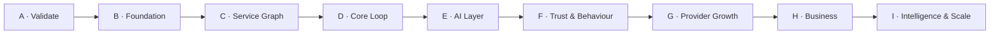

# IMAP 2.0 — Roadmap

**Status:** PROPOSED · **Phase:** 1 · **Date:** 2026-08-09
**Governed by:** `PRODUCT-CONSTITUTION.md` · **Scope:** `PRD.md` · **Decisions:** `PRODUCT-DECISIONS.md`

---

## 0. Shape of the plan

Nine phases. Each has an **objective**, **capabilities**, **dependencies** and **exit criteria**. A phase does not start until the previous phase's exit criteria are met.

**No dates.** IMAP has no delivery-velocity data, and inventing a schedule would be the same failure mode as the fabricated statistics the audit found. Phases are ordered and gated, not scheduled.



Preceding this roadmap, already complete:

| | |
|---|---|
| **Phase 0** | Baseline audit — `docs/audit/` |
| **Phase 0.5** | Security, financial and emergency containment — 12/12 P0 fixed, 19 P1, 31 regression tests |
| **Phase 1** | This document set |
| **Phase 2** | System, domain, data, AI and security architecture — **next, not started** |

---

## Phase A — Validate the thesis

**Objective.** Answer the three questions that determine whether IMAP 2.0 is worth building, before building it.

**Capabilities**

| Item | Notes |
|---|---|
| Provider interviews in the MVP categories | Commission acceptance, current acquisition cost, payout expectations, cash reality |
| Customer interviews across C1–C4 | How needs are described in Bangla; price sensitivity; what "trusted" means in practice |
| Language corpus | 300+ real need statements, labelled to a draft service taxonomy — becomes the R-101 evaluation set |
| Commission rate research | Job values per category; realistic take-rate ceiling |
| Legal review | D-010 (stored value), D-011 (lending), D-012 (emergency information liability) |
| Hotline verification | Confirm 999/10941/16321 against an official source — an open risk carried from Phase 0.5 |
| Launch area selection | 3–5 Dhaka areas with demand density and reachable supply |

**Dependencies.** None. Can start immediately.

**Exit criteria**
1. Providers in ≥2 MVP categories state a commission level they would accept, with reasons.
2. Cash-vs-digital payment split is measured, not assumed.
3. 300+ labelled need statements exist as a held-out evaluation set.
4. Legal positions on D-010 and D-011 are confirmed in writing.
5. `PERSONAS.md` assumptions are marked validated, revised or falsified.
6. Launch areas and MVP categories are fixed.

**Kill criteria — stop and reconsider if:** no provider segment accepts a viable commission, **or** cash is so dominant that commission cannot be collected under any mechanism in `BUSINESS-MODEL.md` §3.2.

---

## Phase B — Foundation

**Objective.** Make the platform observable, auditable and safely changeable. Nothing above this can be trusted without it.

**Capabilities**

| Item | Requirement |
|---|---|
| **Audit log** — every state change and admin action | R-1101 |
| Analytics event stream, distinct from application logs | `KPI.md` §10 |
| Funnel instrumentation including abandonment reasons | `KPI.md` §2 |
| Error tracking and alerting | R-1106 |
| Backend CI with tests gating deploy | R-1105 |
| Service and authorization layer extracted from route handlers | Prerequisite for D-002 |
| Redis for OTP and cache; remove in-process state | R-1107 |
| Object storage for identity documents; out of the primary DB | D-02 |
| Provider earnings ledger, append-only | R-607 |
| Gateway refund path | R-608 |

**Dependencies.** Phase 0.5 (complete).

**Exit criteria**
1. Every booking, payment, KYC and admin state change appears in the audit log with actor and before/after.
2. The North Star and the §2 funnel are computable from real data.
3. Backend deploys are gated on tests.
4. A second API instance can run without breaking OTP or cache.
5. Identity documents are in object storage; access is logged.
6. A refund can be issued to the original payment method and reconciles from the ledger.

**Why first.** The audit log is the single largest carried gap: without it, trust standing cannot be justified, disputes cannot be adjudicated, AI actions cannot be traced, and none of `KPI.md` §2–§5 can be computed. Every later phase depends on it.

---

## Phase C — Service Graph

**Objective.** Give IMAP a vocabulary. Nothing intelligent is possible without one (D-003).

**Capabilities**

| Item | Requirement |
|---|---|
| `services` entity: stable id, bilingual names, price model, required capabilities | R-201 |
| One server-owned taxonomy; delete the three conflicting ones | R-202 |
| Typed service relationships: `related`, `precedes`, `alternative-to`, `part-of` | R-203 |
| Provider capabilities, many per provider | R-204 |
| Explicit coverage areas; geo-filtered discovery | R-206 |
| Dated availability with capacity; booking consults and holds | R-207 |
| Three price models: fixed, from-price, inspection-then-quote | R-305 |
| Indexed search replacing `LIKE '%q%'` | R-307 |
| Migration of existing providers onto capabilities | — |

**Dependencies.** Phase A (categories fixed), Phase B (migrations, ledger).

**Exit criteria**
1. Exactly one taxonomy exists; `frontend/src/constants/data.js` no longer defines categories.
2. Every MVP-category provider has ≥1 capability and ≥1 coverage area.
3. Double-booking is impossible — demonstrated by a concurrency test.
4. Every service in the MVP categories has a working price model.
5. Search returns correct results with an index, at the N-02 latency target.

---

## Phase D — Core loop

**Objective.** Make the loop in `USER-JOURNEYS.md` J1 work end to end **through the structured path**, with no dependency on AI. This is **Gate 1 - Core Loop Release**: a shippable product, but not yet the MVP, because the MVP promise (`PRD.md` section 2) includes understanding, which lands in Phase E.

**Capabilities**

| Item | Requirement |
|---|---|
| Multi-signal ranking with an inspectable basis | R-301, R-302 |
| Trust facts on provider profiles | R-402, R-404, R-408 |
| Complete price before approval; quote flow for inspection-priced services | R-304, R-306 |
| `arrived` state; customer-confirmed completion | R-504, R-505 |
| Cash-on-completion as a first-class path with commission accrual | R-606, `BUSINESS-MODEL.md` §3.2 |
| Commission applied at a non-zero rate | R-609 |
| Cancellation policy stated and enforced | R-506 |
| Task continuity across reload and session | R-801 |
| Real empty and error states; remove all remaining client fallback data | `docs/audit/UX-GAPS.md` §2 |
| URL routing and deep links | `INFORMATION-ARCHITECTURE.md` |
| Accessibility A-01…A-09 on the core loop | `PRD.md` §7 |
| Provider onboarding, approval queue, earnings clarity | R-901, R-904 |
| New-provider allocation policy | `USER-JOURNEYS.md` J4 |
| Customer phone verification for in-home services; provider sees it before accepting | R-410 |
| Provider in-booking emergency | R-1010 |

**Dependencies.** Phases B and C.

**Exit criteria — Gate 1**
1. All nine conditions of `PRD.md` §11 Gate 1 hold.
2. J1, J2, J4, J5 demonstrable unassisted on a mid-range Android over 3G, in Bangla, via the structured path.
3. Commission is collected and reconciles from the ledger.
4. No fabricated data remains in any user-facing surface.
5. The Phase 0.5 regression suite passes, extended to the new money and state paths.

---

## Phase E — AI layer

**Objective.** Make IMAP AI-native: understanding at the front, tool-based action behind the authorization chain.

**Capabilities**

| Item | Requirement |
|---|---|
| Intent understanding: need → structured service | R-101, R-103, R-104 |
| Voice input reaching the intent pipeline | R-102 |
| Model/provider abstraction | R-708 |
| Tool catalogue partitioned by tier | R-703 |
| Tier A tools (read, rank, explain, estimate, check availability) | Constitution §4 |
| Tier B proposal + confirmation flow | R-712 |
| Audit logging of AI actions | R-705 |
| Nine-state vocabulary enforced in tool output and copy | R-704 |
| Sealed-context enforcement | R-706 |
| Prompt-injection defences | R-711 |
| Evaluation suite in CI | R-710 |
| Per-user cost limits | R-709 |

**Dependencies.** Phase B (authorization layer, audit log), Phase C (taxonomy to classify into), Phase D (a working loop for AI to accelerate), Phase A (the labelled evaluation set).

**Exit criteria — Gate 2, the MVP release**
1. All five conditions of `PRD.md` §11 Gate 2 hold, and Gate 1 still holds.
2. Intent accuracy ≥85% top-3 on the held-out set.
3. Tool selection ≥90%; **zero** Tier-C invocations; **zero** unevidenced Completed claims.
4. Every AI-assisted journey degrades cleanly to its Gate-1 equivalent (D-007).
5. Every AI write appears in the audit log with actor, tool and confirmation.
6. AI cost per resolved need is measured and within budget.

**Explicitly not in this phase.** Goals, memory beyond task continuity, proactive assistance, multimodal beyond voice + photo attachment.

---

## Phase F — Trust and behavioural experience

**Objective.** Make trust computed and explainable, and make the product feel like it knows the user.

**Capabilities**

| Item | Requirement |
|---|---|
| Trust Graph: multi-signal, explainable, appealable | R-402, R-405, R-406, R-407 |
| Dispute workflow with states, evidence, SLA, held funds | R-1102, J8 |
| Provider proof-of-work media on profiles | R-409 (D-006) |
| Personal context, tiered Open/Guarded/Sealed | R-803 |
| User-visible memory controls; view and delete | R-804, R-805 |
| Service history informing recommendations | R-802 |
| Repeat-provider surfacing on home | J2 |
| Proactive assistance under strict limits | `BEHAVIORAL-DESIGN.md` |
| Data export and account deletion | R-807 |
| Photo attached to a need, shown to the provider | R-106 |
| Comparison view | R-309 |

**Dependencies.** Phases B (audit log), D (outcome data), E (AI context).

**Exit criteria**
1. A provider can see their standing and what changes it; appeals reach a human.
2. A disputed booking reaches a recorded resolution with funds correctly held and released.
3. Repeat rate is measurable and improving.
4. A user can view and delete everything IMAP remembers about them.
5. Proactive messages stay within the limits in `BEHAVIORAL-DESIGN.md`, verified by measurement.

---

## Phase G — Provider growth

**Objective.** Make IMAP the place providers grow their business, not just a lead source. Directly addresses the disintermediation risk.

**Capabilities**

| Item | Requirement |
|---|---|
| Demand signal: unmet requests by area and category | R-906 |
| Customer history for repeat customers | R-908 |
| Optional provider subscription | `BUSINESS-MODEL.md` §3.3 |
| Pricing guidance | R-907 |
| Multi-technician providers (teams) | `PERSONAS.md` P3 |
| Provider-side AI copilot inside the subscription | `BUSINESS-MODEL.md` §3.8 |

**Dependencies.** Phases D and F.

**Exit criteria**
1. Provider 90-day retention and net earnings-per-hour both improving.
2. Disintermediation rate measured and not worsening.
3. Subscription (if launched) is optional, does not affect quality-neutral ranking, and providers who buy it demonstrably earn more.

---

## Phase H — Business / SME

**Objective.** Open the higher-value, lower-disintermediation B2B segment.

**Capabilities:** organisation entity with seats and roles · approval workflows with budget limits · recurring service schedules · consolidated invoicing · spend analytics · business subscription · labelled premium placement if supply density justifies it (`BUSINESS-MODEL.md` §3.4).

**Dependencies.** Phases D, F, G. Requires that bookings never assumed payer = requester = beneficiary (`USER-JOURNEYS.md` J6).

**Exit criteria:** an organisation can raise, approve, execute and invoice a service without staff intervention; recurring services run without re-entry; invoices satisfy an accountant.

---

## Phase I — Advanced intelligence and scale

**Objective.** The compounding assets (Constitution §13) and geographic expansion.

**Capabilities:** goals → tasks → progress (R-208) · multimodal (photo classification R-107, documents) · demand forecasting · second city · internationalisation abstractions activated (`PRD.md` §9) · native apps if retention justifies · referral to a licensed lender (D-011 alternative 2) · insurance/warranty partnerships.

**Dependencies.** Everything prior. **Multi-city requires the single-city unit economics to work.**

**Exit criteria:** goals produce measurably better multi-service resolution than independent bookings; a second city reaches liquidity faster than the first (proving the playbook is transferable, not accidental).

---

## Priority matrix

| Capability | MUST (MVP) | SHOULD | COULD | FUTURE | DO NOT BUILD |
|---|:---:|:---:|:---:|:---:|:---:|
| Audit log | ● | | | | |
| Service Graph | ● | | | | |
| Provider capabilities + coverage | ● | | | | |
| Dated availability with holds | ● | | | | |
| Multi-signal ranking | ● | | | | |
| Complete price before approval | ● | | | | |
| Customer-confirmed completion | ● | | | | |
| Commission collection | ● | | | | |
| Cash-on-completion path | ● | | | | |
| Provider earnings ledger | ● | | | | |
| Gateway refunds | ● | | | | |
| Intent understanding | ● | | | | |
| AI tool layer (Tiers A/B) | ● | | | | |
| Nine-state truthfulness | ● | | | | |
| AI evaluation in CI | ● | | | | |
| Accessibility on the core loop | ● | | | | |
| Real empty/error states | ● | | | | |
| URL routing | ● | | | | |
| Trust Graph | | ● | | | |
| Dispute workflow | | ● | | | |
| Personal context + memory controls | | ● | | | |
| Repeat-provider surfacing | | ● | | | |
| Proactive assistance | | ● | | | |
| Provider demand signal | | ● | | | |
| Proof-of-work media | | | ● | | |
| Comparison view | | | ● | | |
| Provider subscription | | | ● | | |
| Provider teams | | | ● | | |
| Business workspace | | | | ● | |
| Goals | | | | ● | |
| Multimodal beyond voice/photo | | | | ● | |
| Second city / i18n activation | | | | ● | |
| Native apps | | | | ● | |
| Lender referral | | | | ● | |
| Short-form feed | | | | | ● |
| Customer stored value | | | | | ● |
| Own-book lending | | | | | ● |
| First-party disaster alerts | | | | | ● |
| Automated donor notification | | | | | ● |
| Lead fees | | | | | ● |
| Unlabelled paid ranking | | | | | ● |

---

## Handling of existing features during the transition

The current product has 18 route modules. The MVP needs far fewer. Nothing is deleted silently.

| Module | Disposition | Rationale |
|---|---|---|
| `auth`, `users`, `providers`, `bookings`, `payments`, `reviews`, `chat`, `kyc`, `upload` | **Evolve** | Core loop |
| `services` | **Rebuild** as the Service Graph API | Phase C |
| `schedule` | **Rebuild** as dated availability | Free-text slots are unusable |
| `admin` | **Evolve** + add audit log, dispute queue, approval queue | Operations depend on it |
| `ai` | **Split** — chat rebuilt behind the tool layer; the rule-based scorers relocate to `ranking`/`risk` services and stop being called AI | Phase E |
| `promos` | **Freeze** | Validated but never applied to a price. Rebuild when discounting is a real requirement |
| `sos` | **Freeze, plus one addition** | Frozen except for provider in-booking emergency (R-1010), a Gate-1 safety requirement (`PERSONAS.md` P2) |
| `blood` | **Freeze in its Phase 0.5 truthful state** | D-013 |
| `disaster` | **Reduce to signposting** | D-012 |
| `loans` | **Disable** | D-011 — requires a licence |

**"Freeze" means:** stays deployed, keeps its Phase 0.5 truthfulness guarantees, receives security fixes only, and gains **no new capability**.

**Freeze does not exempt a module from the truthfulness and safety bar.** R-1001-R-1005 apply to every emergency surface at Gate 1: 999 prominence, the capability statement, no unevidenced claims, and Sealed handling of emergency data. Those are copy, layout and data-handling requirements, not new features, and `USER-JOURNEYS.md` J3 remains in acceptance.

---

## Critical path

```
Phase A validation
   └─► Phase B audit log + authorization layer + ledger
          └─► Phase C Service Graph
                 └─► Phase D core loop  ══► MVP RELEASE
                        └─► Phase E AI layer
                               └─► Phase F trust + behaviour
                                      └─► Phases G / H / I
```

**Longest pole:** the Service Graph (Phase C). It is unglamorous data modelling that gates everything intelligent, and it is the most likely place for the plan to be shortcut. It must not be.

**Most likely failure mode:** starting Phase E because AI is the exciting part, before Phase C gives it a vocabulary and Phase B gives it an authorization layer. That produces a demo, not a product — and it is precisely how the current AI layer came to exist.
