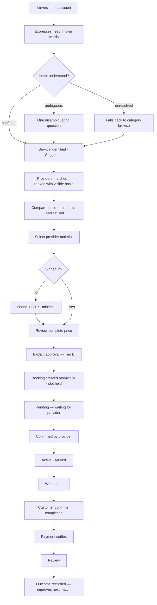
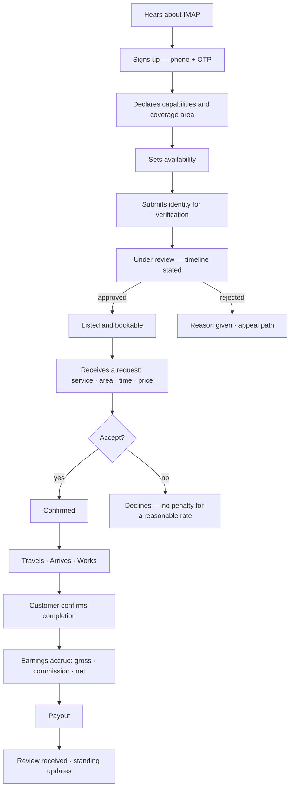

# IMAP 2.0 — User Journeys

**Status:** PROPOSED · **Phase:** 1 · **Date:** 2026-08-09
**Governed by:** `PRODUCT-CONSTITUTION.md` · **Personas:** `PERSONAS.md` · **Requirements:** `PRD.md`

Journeys are written as **what happens and what must be true**, not as screens. Screen-level flows are in `docs/ux/USER-FLOWS.md`.

Each step is tagged **CURRENT** (works today) · **TARGET** (MVP) · **LATER** · **FUTURE**.

---

## J1 — Consumer: first need to resolution

The MVP's defining journey. Persona: C1 Nusrat. Language: Bangla.



### Step detail

| # | Step | What must be true | Status |
|---|---|---|---|
| 1 | **Arrive** | Landing works with no account and no AI. Discovery is browsable before signup | CURRENT |
| 2 | **Express need** | Free-form Bangla/English, typed or spoken. No category required (R-101, R-102) | TARGET |
| 3 | **Understand** | Need → structured service + urgency + area. Result labelled **Suggested** until the user accepts it (P4) | TARGET |
| 4 | **Disambiguate** | At most one question (R-103). Never an interrogation | TARGET |
| 5 | **Fall back** | If intent fails, say so plainly and show categories (R-104). Never guess silently | TARGET |
| 6 | **Discover** | Filter by capability, coverage area, availability window (R-303) | TARGET |
| 7 | **Rank** | Multi-signal, with an inspectable "why this order" (R-301, R-302) | TARGET |
| 8 | **Trust facts** | Legible facts, not a score: jobs completed, repeat customers, verification performed, typical response time (R-402) | TARGET |
| 9 | **Price** | Complete price for *this* service before selection. One of fixed / from / inspection-then-quote (R-304, R-305) | TARGET |
| 10 | **Sign in** | Only at the point of commitment. Phone + OTP. Not before browsing | CURRENT (position must move later in the flow) |
| 11 | **Approve** | Provider, time, total, cancellation policy on one surface. Explicit action. Tier B | TARGET |
| 12 | **Execute** | Booking, slot hold, ledger entry — one transaction (R-503) | CURRENT (slot hold is TARGET) |
| 13 | **Pending** | State is **Pending**, not "Confirmed". Expected response time shown | TARGET |
| 14 | **Confirmed** | Provider accepts → state changes → customer notified | CURRENT |
| 15 | **Track** | Real states only. Location visible only while active, only for this booking (R-504) | CURRENT (arrived is TARGET) |
| 16 | **Complete** | Customer confirms. Provider cannot self-complete (R-505) | TARGET |
| 17 | **Pay** | Cash: recorded at completion. Digital: captured on gateway confirmation (R-605, R-606) | CURRENT (digital); TARGET (cash path) |
| 18 | **Review** | Only the paying customer of a completed, unrated booking (R-403) | **CURRENT — correctly enforced today** |
| 19 | **Learn** | Outcome updates trust signals and the user's context | TARGET |

### Failure paths — first-class, not edge cases

| Failure | Required behaviour | Status |
|---|---|---|
| No provider available | Say so. Offer: notify me, widen the area, or try a different time. **Never** show an unavailable provider as available | TARGET |
| Provider declines | Immediate notification with alternatives ready. Nothing charged | TARGET |
| Provider does not respond | Auto-expire with a stated timeout. Nothing charged. Alternatives offered | TARGET |
| Provider does not arrive | Customer can report. Booking → dispute. Money held, not settled | TARGET |
| Price changes on site | Provider raises a **Quote**. Work does not proceed until the customer approves. Original amount stands if they decline | TARGET |
| Payment fails | State **Failed**, explicit "you were not charged", retry offered. Booking survives | CURRENT |
| Customer cancels | Policy applied as stated at booking. Refund state visible | CURRENT (policy display is TARGET) |
| Network drops mid-flow | Progress preserved; resumes where it stopped (R-801) | TARGET |
| AI unavailable | Entire journey completable via category + filters (D-007) | TARGET |

---

## J2 — Consumer: repeat need

Persona: C2 Rahim. **The retention journey — and the one the current product handles worst.**

```
Opens IMAP
  → Home shows: active tasks, and "Karim (your electrician) is available Thursday"
  → One tap to rebook the same service with the same provider
  → Price shown; if it changed since last time, the change is stated
  → Approve → Confirmed
```

| Requirement | Status |
|---|---|
| IMAP remembers which providers this user used and for what | TARGET (R-802) |
| Home surfaces the known provider before unknown ones | TARGET |
| Rebooking is one tap from home | TARGET |
| A price change since the last booking is stated explicitly, never absorbed silently | TARGET |
| If the known provider is unavailable, IMAP offers substitutes **and says the preferred one is unavailable** | TARGET |
| Recurring needs (AC servicing before summer) produce at most one reminder per cycle, dismissible permanently | TARGET (P7 — no engagement spam) |

**Why this matters commercially.** Repeat bookings have near-zero acquisition cost and are the strongest trust signal in the graph (Constitution §7). `KPI.md` §2 tracks repeat rate as a primary metric.

---

## J3 — Consumer: emergency

Persona: any. Strictest journey in the product.

```
User taps Emergency
  → IMAP shows 999 first, one tap to call        ← before anything else
  → IMAP states plainly what it can and cannot do
  → Optional: record a request → routed to a verified admin channel
  → State shown truthfully: Received / Acknowledged / In progress
  → Never: "Dispatched", "Help is on the way"
```

| Requirement | Status |
|---|---|
| 999 is the most prominent element on every emergency surface (R-1001) | TARGET |
| Capability statement precedes any input field (R-1002) | CURRENT |
| Request is recorded and routed to a DB-verified admin room (R-1004) | CURRENT |
| Response states how many admins are actually reachable | CURRENT |
| `dispatched` does not exist as a state (`PRD.md` §4.9) | CURRENT |
| Emergency data is Sealed — never in AI context (R-1005) | TARGET |
| A provider can raise an emergency mid-booking | TARGET — **the P2 Shirin safety requirement** |

**Blood sub-journey (D-013).** Registry is opt-in. Contact release is one donor at a time, authenticated and logged. Requests are recorded and admins notified. The response says `donors_notified: 0` and directs the user to a hospital blood bank and to 999 — because that is the truth. **CURRENT.**

**Disaster sub-journey (D-012).** Signposting to official sources only. No first-party alerts. **PROPOSED.**

---

## J4 — Provider: application to first job

Persona: P1 Karim. **The supply journey — if this fails, nothing else matters.**



| Requirement | Status |
|---|---|
| Onboarding completable in <10 min on a mid-range phone (R-901) | TARGET |
| Provider declares capabilities, not one free-text string (R-204) | TARGET |
| **Not listed until approved** (D-005, R-401) | CURRENT (`is_approved`) |
| Review timeline is stated and honoured; the claim must be true | TARGET — **the audit found this claim was false** |
| Rejection gives a reason and an appeal path (R-407) | TARGET |
| Request shows service, area, time and **price** before accepting (R-902) | TARGET |
| Accept/decline is one tap (R-903) | CURRENT |
| Declining at a reasonable rate carries no penalty | TARGET |
| Earnings show gross, commission and net per booking (R-904) | TARGET — **CURRENT: a bare balance number** |
| Payout timing is stated and met | TARGET |
| Provider sees their standing and how to change it (R-406) | TARGET |

**Known cold-start problem.** A new provider has no jobs, no reviews and no repeat customers, so multi-signal ranking will place them last. Without a deliberate new-provider allocation they never get a first job.
**Resolution (PROPOSED):** a bounded share of matched requests is reserved for approved-but-unrated providers, shown to the customer as "new to IMAP · identity verified" (R-408). Bounded, disclosed, and never presented as a top pick.

---

## J5 — Provider: steady state

```
Opens app once or twice a day
  → Sees today's jobs
  → Toggles availability in one action
  → Accepts what fits
  → Sees this week's earnings and what is owed
  → Occasionally: "3 unmet AC requests in your area this week"
```

| Requirement | Status |
|---|---|
| Availability manageable in <30 s (R-905) | TARGET |
| Today's schedule is the first thing shown | TARGET |
| Earnings clarity: per booking and per period (R-904) | TARGET |
| Demand signal: unmet requests by area and category (R-906) | NEXT (R-906) |
| Customer history for repeat customers (R-908) | NEXT |
| CRM, invoicing, marketing | FUTURE (R-909) |

---

## J6 — Business / SME ⟶ LATER

Documented so Phase 2 does not foreclose it. **Not in the MVP** (D-014).

```
Organisation onboarded → Workspace with seats and roles
  → Staff raises a need → Approver approves within a budget limit
  → Service executed → Invoice issued to the organisation
  → Spend analytics per site and category
```

**The one thing that must not be foreclosed:** a booking must not assume payer = requester = beneficiary. If Phase 2 models these as one identity, B2B requires a rewrite. This is the single load-bearing constraint from this journey.

---

## J7 — AI-assisted journey (overlay on J1)

How AI changes J1 without changing its guarantees.

| J1 step | Without AI (always available) | With AI | Tier |
|---|---|---|---|
| Express need | Category tap or keyword search | Natural language, voice, photo | — |
| Understand | User selects the category | Intent → service, one question max | A |
| Discover | Filters | Pre-applied filters, explained | A |
| Rank | Sort control | Multi-signal ranking + "why this order" | A |
| Compare | Side-by-side table | Plain-language trade-off summary | A |
| Check availability | Availability calendar | "Karim can come today at 4" — stamped, **Available** | A |
| Estimate | Price shown on the card | "Around ৳800–1,200 for this" — **Estimated**, never **Confirmed** | A |
| Book | Fill and submit | AI prepares a **proposal**; user approves on the same structured surface | **B** |
| Pay | Choose method and pay | AI cannot pay. It prepares; the user confirms | **B** |
| Track | Status page | Proactive update on a real state change | A |
| Follow up | Notification | "Your booking needs confirmation" | A |
| Review | Write it | AI drafts; user edits and submits | **B** |

**Invariants:**
1. Every AI-proposed action is a structured object the user inspects field by field (P2, R-712).
2. Nothing in Tier B commits without an explicit user action. No timeout-into-acceptance, no pre-selected confirm.
3. Every claim carries one of the nine states with its evidence (P4).
4. AI failure degrades to the non-AI column — never to a dead end (D-007).

---

## J8 — Dispute

Currently absent as a workflow; required for the trust model.

```
Customer or provider raises an issue on a booking
  → Case created with the booking, evidence and a stated SLA
  → Money is HELD, not settled
  → Both parties can add evidence
  → Human reviewer decides: refund_full | refund_partial | no_action | provider_penalty
  → Outcome is executed (refund via gateway, ledger adjustment)
  → Outcome feeds the Trust Graph
  → Either party may appeal once
```

| Requirement | Status |
|---|---|
| Disputes have states, evidence and an SLA (R-1102) | NEXT — **CURRENT: a `complaints` row with a status field** |
| Money is held during an open dispute | TARGET |
| Resolution links to an actual refund | TARGET |
| Outcome affects trust standing | TARGET |
| Every decision is audit-logged with a reason (R-1103) | NEXT |
| Trust penalties are Tier C — never AI | TARGET |

---

## Journey-level acceptance

The MVP is not done until each of these can be demonstrated end to end, unassisted:

| Journey | Gate | Demonstration |
|---|---|---|
| **J1** | Gate 1 | New user, Bangla, mid-range Android, 3G: need → completed → reviewed, via the structured path |
| **J2** | Gate 1 | Returning user rebooks a known provider in one tap |
| **J3** | Gate 1 | Emergency surface makes no claim IMAP cannot evidence; 999 reachable in one tap; a provider can raise an emergency mid-booking (R-1010) |
| **J4** | Gate 1 | New provider: signup → approved → first job → paid |
| **J5** | Gate 1 | Provider manages a day's work in under 2 minutes of app time |
| **J1 (AI)** | Gate 2 | The same journey started from a free-form Bangla need statement |
| **J7** | Gate 2 | Every AI-assisted step degrades cleanly to its Gate-1 equivalent |
| **J8** | Phase F | A disputed booking reaches a recorded resolution with money correctly held and released. At Gate 1 this is a manual, audit-logged admin process |

Gates are defined in `PRD.md` §11. J6 is explicitly **not** part of either gate.
