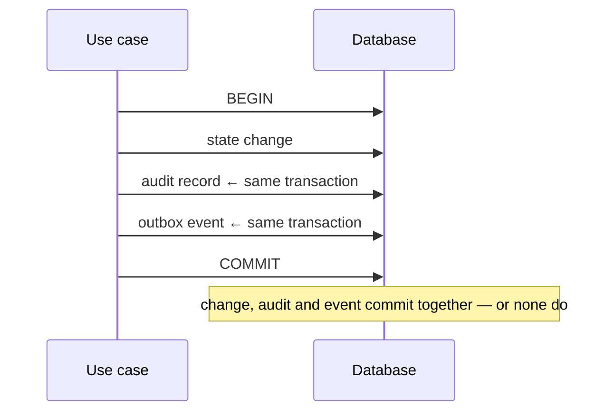

# IMAP 2.0 — Audit Log Architecture

**Status:** PROPOSED · **Phase:** 2 · **Date:** 2026-08-09
**Decision:** AD-009 · **Requirement:** R-1101, R-1103, R-705

---

## 1. Why this is the highest-priority missing component

There is **no audit log**. It was the largest single gap in the Phase 0 audit and it blocks:

* **Trust** — a standing that cannot be justified cannot be appealed (D-004)
* **Disputes** — no evidence of what happened
* **AI accountability** — D-002 requires every AI action be traceable
* **Metrics** — most of `KPI.md` §2–§5 is computed from state changes
* **Incident response** — the `admin123` credential published in the repository *may* have been used against a live database, and **that question is currently unanswerable**

That last point is the clearest argument. An audit log does not prevent an incident; it is the difference between knowing what happened and guessing.

---

## 2. The core decision (AD-009)

> **The audit record is written inside the same database transaction as the change it records.**



**Why not asynchronous.** Deriving audit from the event stream sounds elegant and fails for the exact case that matters: a consumer that crashes leaves a state change with no record, and that gap is discovered during an investigation. An audit record that can be lost while the change succeeds is not an audit record.

**Cost.** Write amplification on every mutation, and `audit_log` becomes one of the largest tables. Both are accepted and mitigated (§7).

---

## 3. Record

```
audit_id          UUIDv7
occurred_at       timestamp (UTC)
correlation_id    ties to request, logs, events, tool calls

actor_principal   who — null only for genuine system actions
actor_account     acting as (AD-017)
actor_role        role at the time, not looked up later
actor_via         "http" | "ai" | "job" | "system" | "ops"
on_behalf_of      set when support acts for a user

action            "booking.confirm_completion"
resource_type     "booking"
resource_id
resource_owner    denormalised for investigation queries

outcome           "permitted" | "denied" | "failed"
before            json — changed fields only
after             json — changed fields only
reason            required for admin overrides and punitive actions

ip                where policy requires
user_agent        where policy requires
tool_name         when actor_via = "ai"
ai_task_id        when actor_via = "ai"
```

### 3.1 Rules

| Rule | Reason |
|---|---|
| **Changed fields only**, never whole rows | Prevents the log becoming an uncontrolled second copy of the database |
| **No Sensitive, Highly Sensitive, Financial-detail or Emergency content** | The log is widely readable within operations; sensitive values must not travel with it |
| Actor role recorded **at the time** | Roles change; the record must reflect what was true |
| `reason` mandatory for overrides and punitive actions | R-1103 — a suspension with no stated reason is unappealable |
| Denials are recorded for sensitive actions | Attempted access matters as much as successful access |
| `correlation_id` on every record | Ties one user action across HTTP, events, jobs and tool calls |

### 3.2 What is recorded instead of sensitive values

| Instead of | Record |
|---|---|
| Identity document contents | `document_accessed`, doc id, reason |
| Message body | `message_sent`, conversation id, length |
| Emergency description | `emergency_request_viewed`, request id, reason |
| Payment card details | Never touched — the gateway holds them |
| Password / OTP | Never, in any form |
| Precise coordinates | `location_released`, purpose, duration |
| Ledger amounts on non-financial actions | Reference to the ledger transaction |

---

## 4. What is audited

### Always

| Domain | Actions |
|---|---|
| **Identity** | Registration, authentication success and failure, session revocation, membership grant/revoke, role change, closure |
| **Verification** | Submission, decision (with reason), document access (with reason), expiry, revocation |
| **Provider** | Application, approval, rejection, listing, pause, suspension (with reason) |
| **Booking** | Every state transition with actor and reason |
| **Money** | Every payment, capture, refund, payout, commission accrual, ledger transaction, and every adjustment |
| **Trust** | Signal-driven standing change, manual override, appeal outcome |
| **Emergency** | Request creation, acknowledgement, view, donor contact release |
| **Catalogue** | Service create, publish, deprecate, retire; edge changes |
| **Config** | Commission rate, feature availability, routing policy, quota |
| **AI** | Every tool invocation, every proposal, every confirmation, every execution (R-705) |
| **Admin** | Every mutating operations action, with reason |
| **Data rights** | Export, deletion request, deletion execution |

### Denials worth recording

Failed authentication · authorization denials on sensitive resources · **Tier-C tool invocation attempts** (a security alert) · idempotency conflicts on financial operations · rate-limit breaches on auth and payment.

### Not audited

Reads of public data · ordinary list queries · health checks · static assets. Auditing everything makes the log unusable, which is its own failure mode.

---

## 5. AI actions (R-705, D-002)

Every AI action produces a chain the log can reconstruct end to end:

```
correlation_id: 01J8Z...

1  ai.conversation.message     via=ai   principal=U   (intent received)
2  ai.tool.invoked             via=ai   tool=searchProviders          outcome=permitted
3  ai.tool.invoked             via=ai   tool=getAvailability          outcome=permitted
4  ai.proposal.created         via=ai   tool=proposeBooking           task=T1
5  ai.proposal.confirmed       via=http principal=U                   task=T1
6  booking.requested           via=ai   tool=proposeBooking  task=T1  resource=B1
7  outbox: booking.requested                                          event=E1
```

**Step 6 carries both `via=ai` and the principal.** The user is accountable for the action; the AI is recorded as the mechanism. That distinction is what makes "did the assistant do something the user did not intend?" an answerable question.

`ai.task.completed` references the domain event id that proves it — the structural expression of "no event, no claim" (D-008).

---

## 6. Immutability

| Property | Implementation |
|---|---|
| **Append-only** | No `UPDATE`, no `DELETE`. Enforced by database grants: the application role has `INSERT` and `SELECT` on `audit_log`, nothing else |
| No application delete path | There is no use case, no endpoint, no tool |
| **Tier C** | Writing to the audit log is not an AI capability, at any tier |
| Tamper evidence | Periodic hash-chaining over ordered batches, anchored in cold storage. Detects modification; does not prevent a database administrator with direct access — that residual risk is named, not hidden |
| Retention outlives the subject | An account closure does not erase audit records; it removes the identity data those records point to (`DATA-ARCHITECTURE.md` §7) |

**Stated honestly:** an audit log inside the same database as the data it audits is compromised by full database compromise. Mitigation is export to append-only cold storage (§7), not a claim that the primary log is tamper-proof.

---

## 7. Storage and lifecycle

| Stage | Behaviour |
|---|---|
| **Write** | Primary database, in-transaction |
| **Hot** | 90 days in the primary table, indexed for investigation |
| **Warm** | Exported daily to append-only object storage, partitioned by date |
| **Cold** | Compressed archive; retention by class (financial follows statutory retention; the rest by policy) |
| **Partitioning** | Monthly by `occurred_at`, so pruning is a partition drop, not a mass delete |
| **Growth** | Monitored. Changed-fields-only payloads keep rows small; a growth spike usually means someone started logging whole rows |

### Indexes

| Query | Index |
|---|---|
| "What happened to this booking?" | `(resource_type, resource_id, occurred_at)` |
| "What did this admin do?" | `(actor_principal, occurred_at)` |
| "Trace this request" | `(correlation_id)` |
| "Who read identity documents?" | `(action, occurred_at)` |
| "All AI actions in this task" | `(ai_task_id, occurred_at)` |

---

## 8. Access

The audit log contains a record of every sensitive action; reading it is itself sensitive.

| Role | May read |
|---|---|
| `trust_safety` | Trust, verification, provider, dispute records |
| `finance` | Financial and payout records |
| `support` | Booking and messaging records for a case they are assigned |
| `platform_owner` | All |
| `emergency_responder` | Emergency records only |
| Everyone else | **Nothing** |
| The subject | Their own actions, via data export (R-807) — **not** others' actions on them, which may contain investigatory content |

**Audit access is itself audited.** A read of the audit log writes an audit record. Without this, the most sensitive read in the system is the only unrecorded one.

---

## 9. Using it

| Use | Query |
|---|---|
| Dispute resolution | Full booking timeline with actors and reasons |
| Trust appeal | Every signal and decision that produced a standing |
| Incident response | All actions by a principal or session in a window |
| Compromised-credential investigation | Every authentication and action from an identity — **the question that is unanswerable today** |
| AI incident | Full tool chain by `correlation_id` |
| Financial reconciliation | Ledger transactions cross-referenced with the actions that caused them |
| Compliance | Who accessed which identity document, when, and why |
| Metric verification | State-change counts as ground truth for `KPI.md` |

---

## 10. Anti-patterns forbidden

| Anti-pattern | Why |
|---|---|
| Asynchronous audit | A crashed consumer loses the record for the exact change that matters |
| Auditing after commit | Same failure, narrower window |
| Whole rows in `before`/`after` | An uncontrolled second copy of the database |
| Sensitive values in payloads | The log is widely readable in operations |
| A delete or update path | Then it is not an audit log |
| AI writing audit records | Tier C |
| Auditing reads of public data | Makes the log unusable |
| Looking up the actor's role at read time | Roles change; the record must reflect what was true |
| Unaudited audit access | The most sensitive read left unrecorded |
| Optional `reason` on punitive actions | An unappealable decision |
| Application-role `DELETE` grant on the table | Immutability must be enforced by grants, not discipline |

---

## 11. Implementation order

Phase B, before anything that depends on it (`ROADMAP.md`).

1. `audit_log` table, partitioned, with grants restricted to `INSERT`/`SELECT`.
2. `withTransaction` audit helper — the transaction wrapper already exists from Phase 0.5.
3. Each use case writes its audit record as it is extracted (`MIGRATION-STRATEGY.md` §4, step 4).
4. Admin and ops actions first — highest risk, lowest volume, and where `reason` matters most.
5. Financial actions next.
6. AI tool calls at Phase E, before any Tier B tool ships.
7. Daily cold-storage export.
8. Investigation queries and the operations read surface.

**Exit criterion (Roadmap Phase B):** every booking, payment, KYC and admin state change appears in the audit log with actor and before/after.
