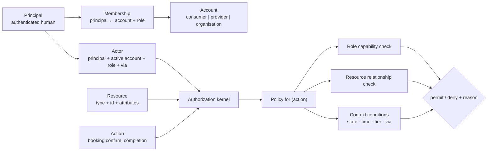
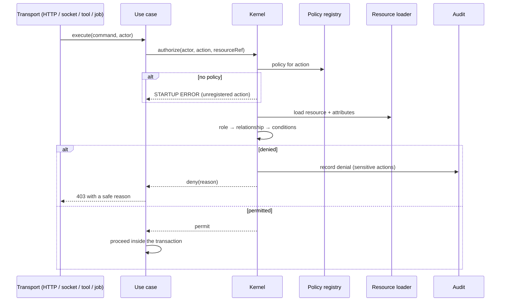

# IMAP 2.0 — Authorization Architecture

**Status:** PROPOSED · **Phase:** 2 · **Date:** 2026-08-09
**Decisions:** AD-017 (accounts + memberships), AD-003 · **Product law:** Constitution §4, D-002

---

## 1. Problem

The audit found **three independent authorization implementations**: `requireRole()` for flat role checks, inline `if` blocks inside handlers, and a `bookingAccess` helper added in Phase 0.5. There was no single place to answer "who may do what", and the socket layer had no check at all.

The target is one kernel with one entry point.

```
authorize(actor, action, resource) → permit | deny(reason)
```

---

## 2. Model — RBAC + resource ownership + context

Pure RBAC cannot express "the customer of *this* booking". A full policy engine is more power than the product needs and makes "who can do what" harder to audit, not easier. The chosen middle is **roles for capability, resource rules for scope, context for conditions**.



### 2.1 The actor

```
Actor {
  principal_id      who
  account_id        acting as (AD-017)
  role              their role in that account
  via               "http" | "ai" | "job" | "system"
  session_id
  correlation_id
}
```

`via` matters: an AI-initiated action is the *same* actor with the same rights, but it is recorded differently and some policies add conditions on it (§6).

---

## 3. Policies

Every action has exactly one policy. **A use case with no registered policy throws at startup** — this is the structural guarantee that nothing ships unguarded.

```
policy "booking.confirm_completion" {
  resource      booking
  roles         [customer, admin:support]
  relationship  actor.principal_id == booking.customer_id  OR  role is admin
  conditions    booking.state == "awaiting_confirmation"
  tier          B                       # AI may propose, never commit
  audit         required
  reason        required for admin override
}
```

| Element | Purpose |
|---|---|
| `resource` | What is being acted on. **A policy with no resource is rejected at registration** — this is what prevents role-only checks |
| `roles` | Capability. Necessary, never sufficient |
| `relationship` | Scope. The check the audit found missing on sockets |
| `conditions` | State, time, verification level, context tier |
| `tier` | A/B/C from Constitution §4 |
| `audit` | Whether the decision is recorded |
| `reason` | Whether a human must state why (admin overrides always do) |

### 3.1 Representative policies

| Action | Roles | Relationship | Conditions |
|---|---|---|---|
| `booking.observe` | customer, provider, admin | participant of this booking | — |
| `booking.request` | customer | owns the quote | quote unexpired; provider listed |
| `booking.accept` | provider | assigned provider | state = pending |
| `booking.confirm_completion` | **customer**, admin | booking's customer | state = awaiting_confirmation |
| `booking.cancel` | customer, provider, admin | participant | state ∈ {pending, confirmed}; `active` → **admin only** |
| `payment.initiate` | customer | booking's customer | booking not already paid |
| `refund.approve` | finance, support | — | reason required |
| `payout.execute` | finance | — | **not the approver of the same claim** (separation of duties) |
| `provider.list` | — | — | **Trust-granted eligibility only.** No self-listing (D-005) |
| `provider.suspend` | trust&safety | — | reason required; **Tier C** |
| `verification.decide` | trust&safety, operations | — | reason required; **Tier C** |
| `verification.read_document` | trust&safety | assigned to the case | reason required; access logged |
| `emergency.respond` | emergency_responder | — | — |
| `donor.release_contact` | any authenticated | — | consent active; logged (D-013) |
| `catalog.publish` | operations | — | — |
| `context.read_guarded` | self, ai(as self) | own context | active grant for the declared purpose |
| `audit.write` | **nobody** | — | **Tier C — the log is never authored** |

---

## 4. Decision flow



**Order matters.** Role is checked first because it is cheap; the resource is loaded only if the role could plausibly permit. Denial reasons returned to the caller are **safe** — never "this booking belongs to principal X".

---

## 5. Enforcement points

| Point | How |
|---|---|
| **HTTP** | Every endpoint maps to an action; the use case calls the kernel |
| **Socket** | `join_room` and every data-carrying event authorize against the resource. Membership is recorded only after a permit (the P0-7 fix) |
| **AI tools** | The tool runtime authorizes **as the acting user**, at proposal and again at execution (D-002) |
| **Jobs** | Run as `via: "system"` with an explicit, narrow system actor — never a wildcard |
| **Admin/ops** | Same kernel, distinct roles (`DOMAIN-ARCHITECTURE.md` §6), reason mandatory |

**One kernel, five callers.** There is no path to state that bypasses it.

---

## 6. AI authorization (D-002)

```
AI Read     → Tier A tool, actor's own permissions
AI Prepare  → Tier B proposal; no write permission needed to propose
AI Confirm  → user's explicit action
AI Execute  → the SAME permission an HTTP caller needs
AI Escalate → does not exist
```

| Rule | Enforcement |
|---|---|
| AI never holds a permission the user lacks | The actor is the user; `via` is the only difference |
| **No AI service account** | An elevated service account turns every injection into privilege escalation |
| Authorization runs twice | Proposal and execution |
| Tier C has no tool | Absence of capability |
| Every AI-authorized action is audited with `via: "ai"` and the tool name | R-705 |

---

## 7. Roles

| Role | Scope | Notes |
|---|---|---|
| `customer` | Own consumer account | Default |
| `provider` | Own provider account | Via membership |
| `org_member` / `org_approver` / `org_admin` | Organisation account | LATER |
| `support` | Platform | Read bookings, message participants, raise cases. **Cannot** read identity documents or move money |
| `finance` | Platform | Reconciliation, refunds, payouts. **Cannot** change trust standing or read identity documents |
| `trust_safety` | Platform | Verification decisions, suspensions, appeals. **Cannot** move money |
| `operations` | Platform | Catalogue, provider approval queue. **Cannot** move money or decide verification |
| `emergency_responder` | Platform | Emergency queue, donor contact release. **Nothing** in marketplace or finance |
| `platform_owner` | Platform | Configuration and role grants. **Cannot** read identity documents; **cannot** act inside a case they raised |

**Separation of duties, enforced by policy, not convention:**
* The approver of a refund is not the executor of the payout.
* The raiser of a trust case is not its decider.
* An appeal is decided by someone other than the original decider.
* No role grants itself another role (Tier C).

---

## 8. Resource ownership

The check the audit found missing everywhere.

| Resource | Ownership |
|---|---|
| Booking | Customer, assigned provider, admin |
| Quote | The customer it was issued to |
| Payment | The paying customer, finance |
| Conversation | Booking participants |
| Provider profile | The provider's account members |
| Verification case | The subject, trust&safety |
| Ledger account | The owning account (read), finance |
| Context item | The principal it is about |
| Emergency request | The raiser, emergency_responder |
| Donor consent | The donor |
| Audit record | **Nobody owns it.** Read-only to authorized roles |

**Rule:** `404` and `403` are deliberately indistinguishable for resources the actor may not see, so the API cannot be used to enumerate ids (`API-ARCHITECTURE.md` §4.1).

---

## 9. Verification-gated actions

| Action | Requires |
|---|---|
| Book an in-home service | Customer **phone-verified** (R-410) |
| Be listed as a provider | Identity verified + human approval (D-005) |
| Offer a certification-gated service | Capability verified with evidence |
| Request a payout | Identity verified |
| Release donor contact | Authenticated + consent active |

---

## 10. Anti-patterns forbidden

| Anti-pattern | Why |
|---|---|
| Role check without a resource | The audited defect. A policy without a resource is rejected at registration |
| Multiple authorization implementations | Three existed; there will be one |
| Trusting a role claim in a token | Roles are read from the database — the Phase 0.5 socket fix |
| Authorizing at the transport layer only | Bypassed by any other transport |
| An AI service account | Injection becomes escalation |
| A use case with no policy | Fails at startup |
| Deny reasons that leak resource details | Enumeration |
| One `admin` permission | Six distinct roles |
| Ownership inferred from the request | It is loaded from the resource |
| Skipping re-authorization at AI execution | A revoked permission must take effect |
| Hardcoding role names in domain code | Domain asks the kernel; it does not inspect roles |

---

## 11. Testing

| Test class | Requirement |
|---|---|
| **Policy unit tests** | Every policy: one permit case, one deny-by-role, one deny-by-relationship, one deny-by-condition |
| **Registration test** | Every registered action has a policy; every policy has a resource. Fails the build otherwise |
| **Cross-actor tests** | For every resource type: a non-owner is denied on every action |
| **Transport parity** | The same action denied over HTTP is denied over socket and over an AI tool |
| **Tier tests** | No Tier B tool can commit; no Tier C tool is registered |
| **Separation of duties** | Same-actor approve-and-execute is denied |

The Phase 0.5 suite already covers the socket and booking cases; this extends the same pattern to every policy.
