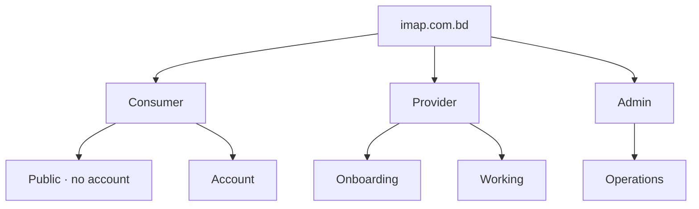

# IMAP 2.0 — Information Architecture

**Status:** PROPOSED · **Phase:** 1 · **Date:** 2026-08-09
**Governed by:** `UX-CONSTITUTION.md`

---

## 1. Starting position

**CURRENT.** IMAP has no information architecture that can be inspected. Navigation is a `page` key in React state inside a 5,538-line file, with roughly 30 page keys and a modal stack. There are no URLs.

Consequences observed in the audit:

* No deep linking — a provider, booking or promo cannot be shared
* No browser back/forward
* No SEO beyond the landing page, while the site markets "500+ services" to search engines
* The IA cannot be reviewed, tested, or handed to a designer, because it exists only as implicit state

**Introducing real routing is an MVP requirement** (`ROADMAP.md` Phase D). It is a prerequisite for sharing, for SEO, for analytics that can attribute a funnel step to a place, and for the continuity model in `BEHAVIORAL-DESIGN.md` §2.

---

## 2. Structural model

Three separate products under one brand, with different navigation, different density and different assumptions.



**Rule.** A user is in exactly one product at a time. Switching is explicit and visible. The current app mixes consumer and provider surfaces inside the same shell, which is why provider features feel bolted on.

---

## 3. Consumer IA

### 3.1 Primary navigation — four items, permanently

| Item | Purpose | Route |
|---|---|---|
| **Home** | "What can IMAP help me with right now?" | `/` |
| **Activity** | Everything in flight and everything past | `/activity` |
| **Services** | Browse — the always-available fallback | `/services` |
| **Account** | Profile, payments, saved providers, privacy, help | `/account` |

**Four, not five or six.** The current app has ~30 destinations reachable from a shell; most are pages that should be sections inside one of these four.

**Ask IMAP is not a nav item.** It is the primary control *on* Home and persistently reachable, because it is the product's entry point, not a destination (`PRODUCT-CONSTITUTION.md` §P1).

### 3.2 Home composition

Ordered by priority. Sections that have no content are **absent**, not empty placeholders (U1).

```
┌────────────────────────────────────┐
│  Ask IMAP                          │  ← always first, always present
│  "What do you need help with?"     │     text · voice · photo
├────────────────────────────────────┤
│  Active                            │  ← only if something is in flight
│  Karim · AC servicing · Confirmed  │
│  Thursday 3:00 PM                  │
├────────────────────────────────────┤
│  Continue                          │  ← only if a resumable task exists
│  You were comparing 3 electricians │
├────────────────────────────────────┤
│  Quick actions                     │  ← user's most-used; popular if new
├────────────────────────────────────┤
│  Your providers                    │  ← only if the user has history
├────────────────────────────────────┤
│  Browse services                   │  ← always present, always last
└────────────────────────────────────┘
```

**Never on Home:** a feed, promotional banners, fabricated statistics, engagement badges, notification counts for non-actionable events. **A new user's home is small.** That is correct — it is a tool, not a magazine.

### 3.3 Route map

| Route | Auth | Purpose | Notes |
|---|---|---|---|
| `/` | Public | Home | |
| `/ask` | Public | Need expression, full surface | Deep-linkable with a pre-filled need |
| `/services` | Public | Category browse | **SEO-critical** |
| `/services/:slug` | Public | Service detail: what's included, price range, providers | **SEO-critical** |
| `/providers` | Public | Results / search | Filter state in the URL |
| `/providers/:id` | Public | Provider profile | **SEO-critical**, shareable |
| `/book/:providerId/:serviceId` | Public → auth at approve | Booking flow | Auth required only at the final step (U4) |
| `/activity` | Auth | Bookings, all states | |
| `/activity/:bookingId` | Auth | Booking detail: status, chat, price, actions | Shareable between the two participants only |
| `/account` | Auth | Profile hub | |
| `/account/payments` | Auth | Methods and history | |
| `/account/saved` | Auth | Saved providers | |
| `/account/privacy` | Auth | What IMAP remembers; delete controls | R-804, R-805 |
| `/account/help` | Auth | Support, disputes | |
| `/emergency` | Public | 999 first, capability statement, request | `USER-JOURNEYS.md` J3 |
| `/emergency/blood` | Public / auth for donor list | Registry (D-013) | |
| `/emergency/disaster` | Public | Signposting to official sources (D-012) | |

**Not routes:** wallet top-up (D-010), loans (D-011), promos page (frozen), portfolio, referral, loyalty, analytics, calendar, favourites, settings-as-a-page, nearby-as-a-page. Most were separate destinations in the current app; they belong inside Account or inside the flow that needs them.

### 3.4 Consumer surface count

| Product area | Surfaces |
|---|---|
| Home + Ask | 2 |
| Discovery (services, service detail, results, profile) | 4 |
| Booking (flow, confirmation) | 2 |
| Activity (list, detail) | 2 |
| Account (hub + 4 sections) | 5 |
| Emergency (3) | 3 |
| **Total** | **18** |

Down from roughly 30. Fewer surfaces, each doing one job (U5).

---

## 4. Provider IA

Different assumptions: used many times a day, often one-handed, often outdoors, on a cheap phone.

| Item | Purpose | Route |
|---|---|---|
| **Jobs** | Today first, then upcoming, then requests awaiting response | `/provider` |
| **Schedule** | Availability — editable in under 30 seconds (R-905) | `/provider/schedule` |
| **Earnings** | Gross, commission, net, payout status (R-904) | `/provider/earnings` |
| **Profile** | Capabilities, coverage, proof-of-work media, standing | `/provider/profile` |

Plus onboarding at `/provider/apply` (public) and `/provider/apply/status`.

**Design consequences:**
* Availability toggle reachable from every provider surface — the most frequent action.
* An incoming request is a full-surface decision with service, area, time and price, not a small notification.
* Earnings always shows the commission line. The provider must never have to compute their own take.
* No chat-first navigation; messages live inside a job.

---

## 5. Admin IA

| Item | Purpose |
|---|---|
| **Queues** | Provider approvals · KYC · disputes · emergency requests |
| **Search** | Find a user, provider, booking or payment |
| **Records** | Full detail with the audit trail attached |
| **Reports** | Metric dashboard (`KPI.md`) |

**Requirements:** every mutating action records a reason and appears in the audit log (R-1101, R-1103); nothing is optimistically rendered as successful; identity documents load per record with the access logged (R-1101, D-03).

---

## 6. Content hierarchy on key surfaces

### 6.1 Provider card (results)

```
1  Name + photo
2  Service + price for the requested service      ← the decision drivers
3  Trust facts: jobs · repeat customers · verification
4  Earliest availability
5  Area
6  One proof-of-work image (if any)          <- NEXT (R-409); absent at Gate 1
7  Why this order (expandable)
```

### 6.2 Provider profile

```
1  Identity: name, photo, what was verified
2  Services offered, with prices
3  Trust facts, with volume context
4  Proof-of-work gallery
5  Reviews (most recent first, with the service named)
6  Coverage areas
7  Availability
8  Book
```

### 6.3 Booking approval — the highest-stakes surface

Everything on one screen. No progressive disclosure of price. No scrolling to find the total.

```
1  Provider: name, photo
2  Service: exactly what is included
3  When
4  Where
5  PRICE:  service ৳X · platform fee ৳Y · TOTAL ৳Z      ← never hidden
6  Payment method
7  Cancellation policy — in full, not a link
8  [ Confirm booking ]                                   ← single primary action
```

### 6.4 Booking detail

```
1  Current state, in words, from the nine (U2)
2  Provider identity and contact
3  When and where
4  Price and payment state
5  Timeline of what has happened
6  Actions available in this state
7  Messages
8  Help / raise an issue
```

---

## 7. Search and discovery IA

Two entry points into one result set.

```
Need expression ──┐
                  ├──► Structured query (service · area · time · constraints) ──► Results
Category browse ──┘
```

**Both produce the same result surface**, differing only in how the query was formed. Results always show which filters are applied and allow each to be removed — including filters the AI applied on the user's behalf (U3).

**URL carries the state.** `/providers?service=ac-servicing&area=mirpur&when=today` — shareable, back-button-correct, analytically attributable.

---

## 8. Navigation rules

| Rule | Detail |
|---|---|
| Depth | No surface is more than 3 levels from Home |
| Back | Always works; browser back and in-app back agree |
| Deep links | Every public surface is linkable; auth-required links return the user to where they were after signing in |
| Modals | Only for a decision about the current context; never for a destination; always focus-trapped (U3, §3 laws) |
| Tabs | Only within a surface, never as primary navigation |
| Breadcrumbs | Not used — depth ≤3 makes them unnecessary |
| Cross-product | Consumer ↔ Provider switching is explicit and visible, never automatic |

---

## 9. SEO and shareability

The current product markets "500+ services" and a 4.8 rating over 10,000 reviews in structured data while having no crawlable service or provider pages and no real ratings. That must be reversed on both sides.

| Surface | Indexable | Requirement |
|---|---|---|
| `/services/:slug` | Yes | Real service content: what's included, real price range, real provider count |
| `/providers/:id` | Yes | Real profile; `noindex` until approved |
| `/` and `/services` | Yes | Honest claims only |
| `/activity`, `/account`, `/provider/*`, `/admin/*` | No | Private |

**Rule:** structured data reflects only real, computed values. If there is no rating, no rating is published (`KPI.md` §9.4).

---

## 10. Migration from the current structure

| Current | Becomes |
|---|---|
| ~30 page keys in `App.jsx` state | 18 consumer routes, 6 provider routes |
| Splash → auth on load | Public home; auth at the point of commitment (U4) |
| Wallet, loyalty, referral, promos, portfolio, analytics, calendar, favourites, settings as separate destinations | Sections inside Account, or removed (D-010, D-011) |
| Provider surfaces inside the consumer shell | A separate provider product |
| Ant Design admin inside the same bundle | A separate admin bundle, never loaded by consumers (`UX-CONSTITUTION.md` §7) |
| No URLs | Real routes; URL carries filter and flow state |
| Category list from `constants/data.js` | Service Graph from the API (R-202) |

**Sequencing note.** Routing must land before or with the core-loop work in Phase D, because continuity, analytics attribution and shareability all depend on it — retrofitting URLs after the flows are rebuilt would mean rebuilding them twice.
