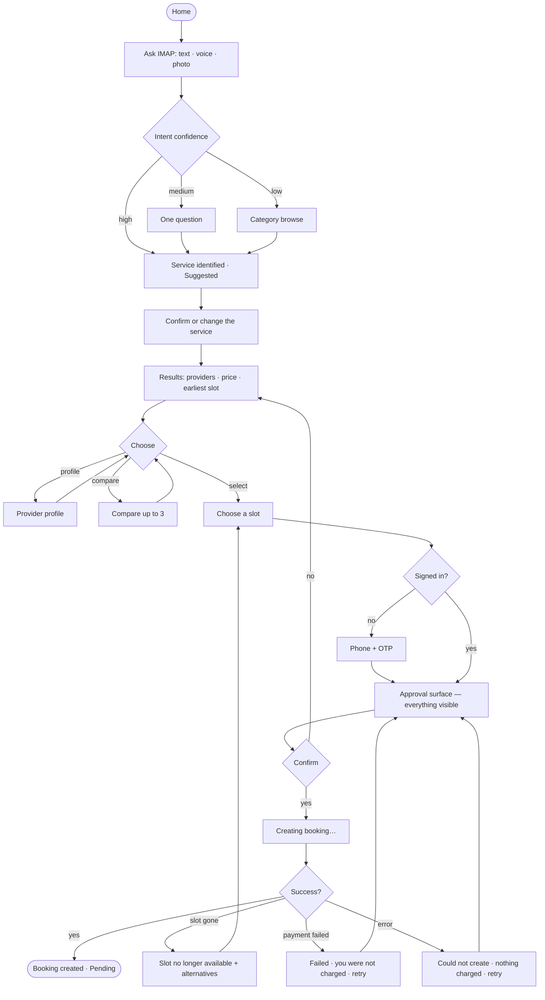
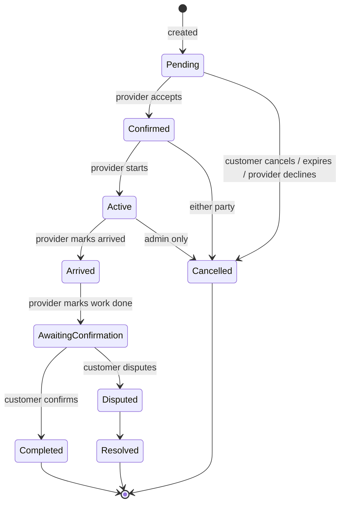
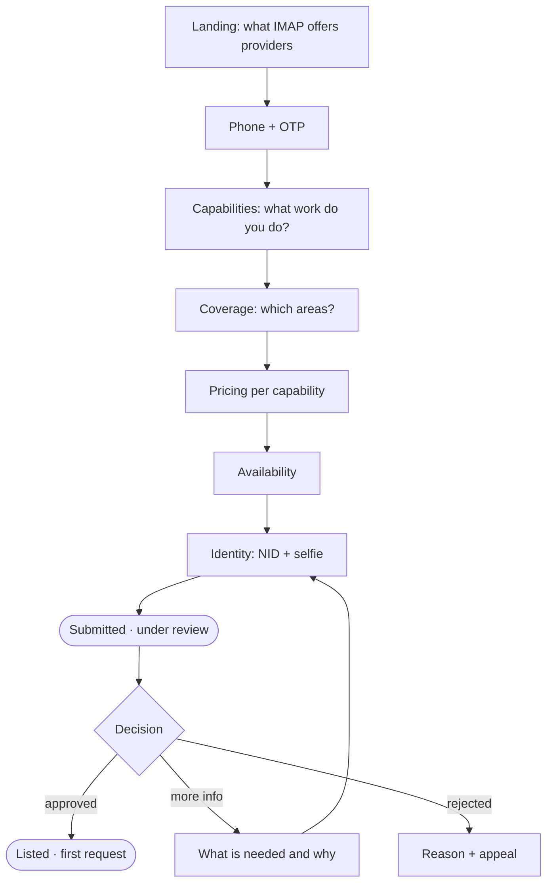

# IMAP 2.0 — User Flows

**Status:** PROPOSED · **Phase:** 1 · **Date:** 2026-08-09
**Governed by:** `UX-CONSTITUTION.md` · **Journeys:** `docs/product/USER-JOURNEYS.md` · **IA:** `INFORMATION-ARCHITECTURE.md`

Screen-level flows. Every flow specifies its **full**, **degraded** and **empty/error** states (U10). No visual design — that is Phase 3.

---

## F1 — Need to booking (the core flow)



### Screen specifications

**A · Ask IMAP**

| | |
|---|---|
| Primary | A single input: "What do you need help with?" |
| Modalities | Type · voice (mic) · photo (attach) |
| Secondary | "Or browse services" — always visible, never hidden behind the AI |
| Full | Input + a few example needs in Bangla |
| Degraded (AI down) | Input becomes keyword search; a one-line note says AI is unavailable; browse is promoted |
| Empty | This surface is never empty — it is an input |
| Rule | Voice starts on tap, never on load. Photo is optional and never required |

**B/C · Understanding**

| | |
|---|---|
| High confidence | Skip the question. Show the service as **Suggested**, with a one-tap "not this?" |
| Medium | **Exactly one** question, with 2–4 concrete options plus "something else" (R-103) |
| Low | Say plainly "I'm not sure what service this needs" and show categories (R-104). **Never guess silently** |
| Rule | The user can always override the inferred service. It is a suggestion, not a classification imposed on them |

**G · Results**

| | |
|---|---|
| Each card | `INFORMATION-ARCHITECTURE.md` §6.1 |
| Filters | Visible and individually removable — **including filters AI applied** (U3) |
| Order | Explained: "Sorted by: available today, then distance, then completed jobs" |
| Full | Providers with real prices and real availability |
| Degraded | Availability unknown → say "availability not confirmed", never assume available |
| **Empty** | **No fabricated results, ever.** "No providers available for AC servicing in Mirpur today." Options: notify me · widen area · different day · browse related services |
| Error | "Couldn't load providers" + retry. Never fallback data (U1) |

**N · Approval — the highest-stakes surface**

| | |
|---|---|
| Content | Single screen, no scroll to reach the total (`INFORMATION-ARCHITECTURE.md` §6.3) |
| Price | Service · platform fee · **TOTAL**, itemised |
| Policy | Cancellation terms in full, not a link |
| Action | One primary button. **Never pre-selected, never auto-advancing, never a countdown** |
| Rule | If the price changed since the results page, say so explicitly before the user can confirm |
| AI variant | Identical surface. An AI-prepared proposal renders into the same fields (U3, R-712) |

**R · Booking created**

| | |
|---|---|
| State | **Pending** — never "Confirmed". The provider has not accepted yet |
| Content | What happens next, expected response time, what happens if there is no response |
| Actions | View booking · cancel · message |
| Rule | No confetti, no "Success!" — this is a request, not an outcome |

---

## F2 — Booking lifecycle (post-creation)



**Customer view per state**

| State | Headline | Visible | Actions |
|---|---|---|---|
| Pending | "Waiting for Karim to accept" | Expected response time | Cancel · message |
| Confirmed | "Karim will arrive Thursday 3:00 PM" | Provider identity, address, total | Cancel (policy shown) · message · reschedule |
| Active | "Karim is on the way" | Live location **only during this window** | Message · call · emergency |
| Arrived | "Karim has arrived" | — | Message · emergency |
| Awaiting confirmation | "Karim marked the work complete" | What was done | **Confirm** · raise an issue |
| Completed | "Service completed" | Final price, payment state | Review · receipt · rebook |
| Cancelled | "Booking cancelled" | Who cancelled, refund state | Rebook · view refund |
| Disputed | "Issue under review" | Case state, SLA, held funds | Add evidence · message support |

**Rules**
1. The provider cannot move to Completed. Only the customer confirms (R-505). Admin override is audit-logged with a reason.
2. Location is visible **only** between Active and Arrived, only for this booking, only to the customer (P0-7 containment).
3. Every state change notifies the customer once — not repeatedly.
4. "Awaiting confirmation" auto-expires to Completed after a stated period, and the period is stated **at the time it starts**, not retroactively.

---

## F3 — Repeat booking

```
Home → "Your providers" → Karim → [Book again]
  → Service pre-filled from last time
  → Price shown; if it changed, the change is stated explicitly
  → Slot picker
  → Approval surface (full price, unchanged rules)
  → Pending
```

Target: **three taps** from home to the approval surface.

| State | Behaviour |
|---|---|
| Provider available | One-tap path as above |
| Provider unavailable | "Karim isn't available Thursday" + his next free slot + alternatives. **Never silently substitute another provider** |
| Provider no longer listed | Say so plainly, offer alternatives in the same service and area |
| Price changed | "৳850 — was ৳800 in March" before the approval step |

---

## F4 — Provider onboarding



| Requirement | Detail |
|---|---|
| Duration | <10 minutes on a mid-range phone (R-901) |
| Resumable | Every step saved; resumable for 30 days (`BEHAVIORAL-DESIGN.md` §2.1) |
| Language | Bangla default, minimal text, large targets |
| Capability picking | Visual, from the Service Graph — not free text (R-204) |
| Pricing help | Show the range other providers charge for the same service in the same area |
| Identity capture | Camera-first with on-device guidance; no typing an NID number if it can be read |
| Review status | Honest and specific. **If review takes 48 hours, say 48 hours and mean it** — the audit found this claim was false while the provider was already listed |
| Rejection | Specific reason, what to fix, and how to appeal (R-407) |

---

## F5 — Provider working day

```
Open → Jobs
  ├─ Today (default view)
  ├─ Upcoming
  └─ Requests awaiting response  ← badged only when action is required
```

**Incoming request** is a full surface, not a toast:

```
New request · expires in 12 minutes
  AC servicing · Mirpur, Kazipara
  Thursday 3:00 PM
  You earn: ৳720  (৳800 − ৳80 commission)     ← net is primary
  Customer: Nusrat R. · 4 previous bookings on IMAP
  [ Accept ]   [ Decline ]
```

| Rule | Detail |
|---|---|
| Net earnings are the primary number | Never make the provider compute their own take |
| Decline is free | No penalty for declining at a rate that does not work |
| Expiry is visible | And the request disappears when it expires — it does not linger as a false opportunity |
| Availability toggle | Reachable from every provider surface in one tap |

---

## F6 — Emergency

```
Any surface → Emergency
  ↓
┌──────────────────────────────────────┐
│  🚨  Call 999                        │  ← largest element, one tap
│      Police · Fire · Ambulance       │
├──────────────────────────────────────┤
│  What IMAP can do                    │
│  • Record your request               │
│  • Alert the on-duty admin team      │
│  What IMAP cannot do                 │
│  • Dispatch emergency services       │
│  • Guarantee a response time         │
├──────────────────────────────────────┤
│  [ Record an emergency request ]     │
└──────────────────────────────────────┘
```

| Rule | Detail |
|---|---|
| 999 is first and largest, before any input field (R-1001) | |
| The capability statement precedes the form (R-1002) | |
| Response states the truth: recorded, how many admins are reachable, dispatch unavailable | **CURRENT** |
| No state called "dispatched" exists (`PRD.md` §4.9) | |
| Zero exclamation marks; no urgency styling not backed by data | `UX-CONSTITUTION.md` §4.4 |
| Provider variant | A provider mid-booking can raise an emergency; the active booking and location are attached (the P2 Shirin safety requirement) |

**Blood (D-013)**

```
Blood → [Find donors]  requires sign-in
  → Donor list: name · group · area · masked number (017••••••01)
  → [Show number] → authenticated, logged, one donor at a time
  → Demo rows are labelled "DEMO DATA — not a real donor" when present
[Request blood] → recorded → "Recorded. donors_notified: 0.
                              Automatic donor alerts are not available yet.
                              Contact a hospital blood bank, or call 999."
```

**Disaster (D-012)** — signposting only. Official sources, verified hotlines, no first-party alerts, no red warning styling on unverified community reports.

---

## F7 — AI-assisted booking (overlay on F1)

```
User: "kal shokale AC servicing lagbe, Mirpur"
  ↓
AI (Tier A):  understands · searches · checks availability · estimates
  ↓
AI presents a PROPOSAL — rendered as the same structured card as F1·N:
  ┌────────────────────────────────────────┐
  │  Suggested booking                     │  ← labelled as a proposal
  │  Karim Hossain · AC servicing          │
  │  Tomorrow 9:00 AM · Mirpur             │
  │  ৳800 + ৳0 fee = ৳800 total            │
  │  Why Karim: available tomorrow ·        │
  │  47 jobs · ৳150 below average          │
  │  [ See 4 other providers ]              │  ← alternatives always reachable
  │  [ Confirm booking ]  [ Change ]        │
  └────────────────────────────────────────┘
  ↓
User confirms  →  Tier B tool executes  →  event  →  confirmation from the event
```

| Invariant | Detail |
|---|---|
| The proposal is a structured object, not prose (R-712) | |
| Alternatives are always one tap away — AI must never present a single option as the only one (P7) | |
| Confirm is never pre-selected and never auto-advances | |
| The confirmation message is derived from the committed event, never from the model (P4) | |
| If the tool fails, the user sees **Failed** with what was and was not done | |
| At any point the user can drop into F1 and do it manually (D-007) | |

---

## F8 — Dispute

```
Booking detail → [Raise an issue]
  → What went wrong? (structured options + free text)
  → Evidence (photos optional)
  → Submitted · case number · stated SLA
  → Funds HELD — visible to both parties
  → Both parties can add evidence
  → Human decision: refund_full | refund_partial | no_action | provider_penalty
  → Outcome executed (gateway refund / ledger adjustment)
  → One appeal available to either party
```

| Rule | Detail |
|---|---|
| Money is held, not settled, while open | |
| Both parties see the same case state and SLA | |
| The decision states a reason | |
| The outcome feeds the Trust Graph | |
| Every step is audit-logged (R-1101, R-1103) | |
| **Never AI-decided** (Tier C) | |

---

## F9 — Sign-in

```
[Any action requiring an account]
  → Phone number
  → OTP
  → Done · returns to exactly where the user was
```

| Rule | Detail |
|---|---|
| Position | At commitment, never on load (U4) |
| Return | The user lands back on the surface and step they left |
| Password | Optional, set later. **An account with no password cannot password-login** (P0-1 containment) |
| Google | Available only when a real client id is configured; otherwise the button is absent, not fake (P0-2 containment) |
| Other social providers | Removed — the client used to invent its own identity (D-002 lineage) |
| OTP | Never displayed on screen. The dev-only "Demo OTP" is gone |

---

## Cross-flow state rules

| Situation | Behaviour |
|---|---|
| Network lost mid-flow | Progress preserved; a banner states offline; nothing financial is queued |
| App backgrounded mid-flow | Resumes exactly where it was |
| Session expired mid-flow | Re-authenticate, return to the same step, nothing lost |
| Two devices | Server-held state; both reflect the same truth |
| AI unavailable | Every flow completable structurally (D-007) |
| Provider acts while the customer is looking | Live update with a visible change, never a silent replacement |
| Price changes between screens | Stated explicitly before the user can confirm — never absorbed silently |

---

## Flow acceptance

Each flow is accepted only when:

1. Full, degraded and empty/error states are all specified and implemented (U10).
2. It is completable by keyboard and by screen reader (A-01, A-02).
3. It is completable in Bangla on a mid-range Android over 3G.
4. Every displayed number traces to a server value (U1).
5. Every state claim maps to one of the nine states with its evidence (P4).
6. It survives interruption and resumes (U7).
7. It is completable without AI (D-007).
